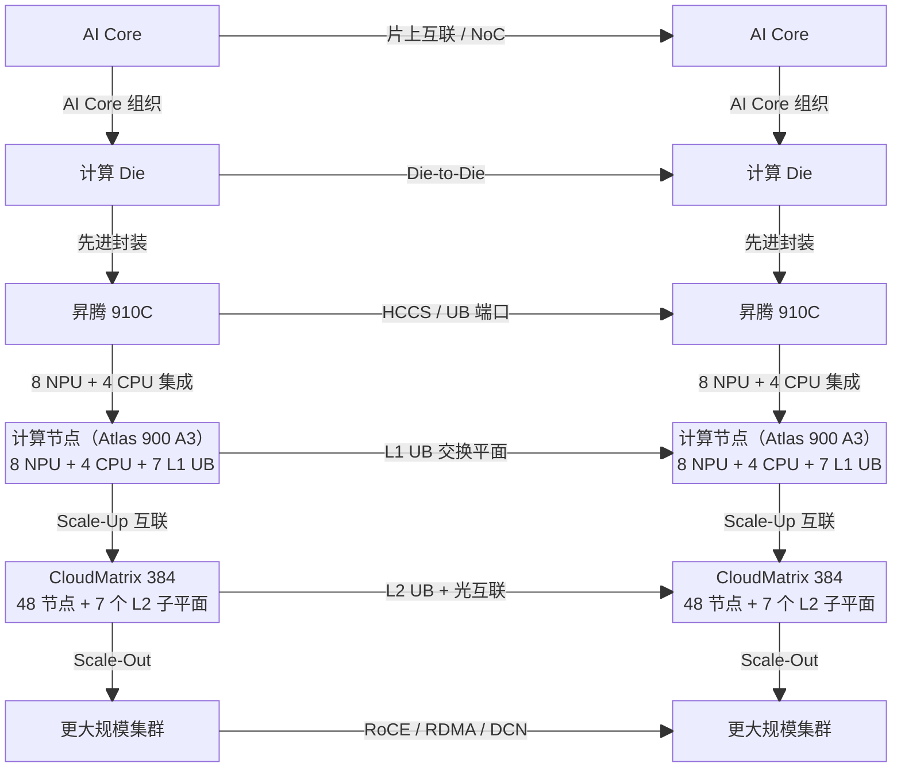

# 华为超节点

## 产品概述

华为是国内较早将 AI 集群从"八卡服务器"推进到"超节点"形态的厂商之一。其产品演进大致经历了三个阶段：第一阶段是以 Atlas 800 为代表的服务器级训练系统，核心特征是基于昇腾 910A 和 HCCS 的节点内高速互联；第二阶段是 Atlas 800T A2 等面向昇腾 910B 的 8 卡系统，继续沿用节点级高带宽互联，并逐步完善软件栈与交付体系；第三阶段则是 CloudMatrix 384，将互联范围从单节点扩展到多柜一体化超节点，把 Scale-Up 域从传统的 8 卡或 16 卡级别提升到 384 NPU 级别。【归纳】

从这条演进路径可以看出，华为超节点路线并不以单卡性能领先为主要特征，而是通过昇腾 NPU、鲲鹏 CPU、自研 HCCS/UB 灵衢互联以及云侧调度软件，把更多强耦合通信尽量保留在高带宽域内。CloudMatrix 384 是这一路线第一次较完整落地到超节点形态的代表性产品，其后续方向则是继续沿着更大 Scale-Up 域和更高层级互联能力演进，向千卡甚至万卡级别的系统扩展。

按产品代际梳理，华为超节点路线可以概括如下：

| 产品 | 芯片 | Scale-Up 规模 | 互联协议 | 形态 | 时间 |
|:-----|:-----|:-------------|:---------|:-----|:-----|
| Atlas 800（训练集群） | 昇腾 910A | 8 卡/节点 | HCCS v1 | 服务器级 | 2020 |
| Atlas 800T A2 | 昇腾 910B | 8 卡/节点 | HCCS v2 | 服务器级 | 2023 |
| CloudMatrix 384 | 昇腾 910C | 384 NPU | UB 灵衢 1.0 | 超节点级 | 2024 曝光，2025 商用落地 |
| 下一代 CloudMatrix | 昇腾 950（预期） | 千卡到万卡级 | UB 灵衢 2.0 | 超节点/集群级 | 2025+ |

## 代表产品与系统规格

CloudMatrix 384 的规格可以先从其三级组织方式理解，再展开到系统参数。与单机八卡服务器不同，CM384 的基本思路是把芯片、节点和超节点三个层级组织为同一个连续的高带宽域：芯片层负责提供计算与本地存储能力，节点层负责将 8 个 NPU 与 CPU、交换芯片组织为单层 UB 平面，超节点层再通过多柜互联将 48 个计算节点组合为一个二层 UB 域。【事实】

从系统结构上看，CloudMatrix 384 可以分为芯片级、计算节点级和超节点级三层：

| 层级 | 组织方式 | 关键特征 |
|:-----|:---------|:---------|
| 芯片级 | 昇腾 910C | 以达芬奇 AI Core 为核心，配套高带宽 HBM 和多路高速互联通道 |
| 计算节点级 | 8 NPU + 4 CPU + 7 个 L1 UB 交换 | 节点内形成单层 UB 平面，承担本地高带宽协同 |
| 超节点级 | 48 个计算节点 + 7 个 L2 UB 子平面 | 通过 12 个计算柜和 4 个通信柜形成二层 UB 互联 |

如果对照 [架构分析](index.md) 中的系统分层蓝图，CloudMatrix 384 可以进一步画成从 AI Core 到超节点的对应关系：

/// caption
图：CloudMatrix 384 的分层结构示意。横向表示同层互联，纵向表示从下一层组合到上一层的系统构成关系。该图基于公开资料抽象，侧重说明结构关系而非芯片引脚或交换端口级实现细节。
///

/// caption
图：CloudMatrix 384 结构示意图之一。图中展示了计算节点、交换平面与整机级互联之间的对应关系。
///

/// caption
图：CloudMatrix 384 结构示意图之二。图中展示了多计算柜与通信柜共同构成二层 UB 互联平面的方式。
///

在这一组织方式基础上，CloudMatrix 384 的主要系统级参数可概括如下：

| 参数 | CloudMatrix 384 |
|:-----|:----------------|
| 计算芯片 | 昇腾 910C × 384 |
| 主机芯片 | 鲲鹏 CPU × 192 |
| 系统算力 | 约 300 PFLOPs（BF16/FP16） |
| 单芯片算力 | 800 TFLOPS 级（BF16/FP16） |
| HBM 容量 | 128 GB/芯片，系统总计 49.2 TB |
| HBM 带宽 | 3.2 TB/s/芯片，系统总计 1229 TB/s |
| Scale-Up 互联 | UB 灵衢 + HCCS |
| 单 NPU 互联带宽 | 392 GB/s 级 |
| 系统互联带宽 | 269 TB/s（双向） |
| 机柜形态 | 12 个计算柜 + 4 个通信柜 |

按现有拆解资料，CloudMatrix 384 的一个计算节点通常由 8 个昇腾 910C、4 个鲲鹏 CPU 和 7 个 L1 UB 交换芯片组成。每个计算节点向上接入 7 个二层 UB 子平面，形成一对一映射关系。由此形成的多柜一体化超节点方案，与单柜高密度方案相比，更强调在更大规模上维持统一的高带宽域，而不是单卡指标最大化。

## 技术架构

### 昇腾 910C 与达芬奇架构

CloudMatrix 384 的底层算力载体是昇腾 910C。现有资料通常将其描述为双 Die 封装的 AI 加速器，核心基于达芬奇（Da Vinci）架构，支持 FP32、FP16、BF16、INT8 等多种精度，并延续了昇腾系列以 Cube、Vector、Scalar 为核心的 AI Core 设计。

/// caption
图：昇腾达芬奇架构示意。该图用于说明 AI Core、片上存储与数据搬运单元之间的基本组织关系。
///

从计算组织方式看，达芬奇架构的特点不是照搬通用 GPU 的 SM 结构，而是将矩阵计算、向量计算、标量控制和多级片上缓冲分开设计：

- Cube 单元负责矩阵乘加，是大模型训练和推理中的主力计算路径。
- Vector 单元负责向量和逐元素运算，承担归一化、激活函数、数据变换等操作。
- Scalar 单元负责流程控制和指令调度，类似一个小型控制处理器。
- 存储层次包括 L0/L1 Buffer、Unified Buffer 和片外 HBM，用于在算力密度和数据供给之间做平衡。

这类架构的特点是对矩阵运算路径做了较强专用化，能够在 BF16/FP16 等 AI 主流精度上提供较高吞吐；相应地，软件栈也需要围绕其存储层次和算子编译方式做针对性优化，因此对编译器、算子库和运行时的依赖更强。

在理解了 CloudMatrix 384 的整体规格后，其关键差异主要落在两个技术支点上：一是昇腾 910C 所代表的 NPU 架构与封装组织方式，二是从 HCCS 演进到 UB 灵衢所形成的多层 Scale-Up 互联体系。

昇腾由于其架构的特殊性，目前昇腾AICore并没有提供类似GPU的Load/Store等同步的内存语义访问模式，而是提供了其他形式的内存语义实现方式，以适应AI场景大块的数据访问。以昇腾910为例，昇腾AICore中的AIC或AIV核可以通过下发MTE（memory transfer engine）指令，实现对远程memory的数据访问，对远程memory的访问是基于UB协议实现的。MTE本质上来讲不是一个同步的Load/Store语义，而是一个由AICore发起的异步大块数据搬移的类Load/Store语义，并通过内部硬件流水管线，实现访存和计算的异步并发。

### 从 HCCS 到 UB 灵衢

华为的超节点互联并不是一步到位形成的，而是经历了从 HCCS 到 UB 灵衢的演化：

| 层级 | 技术 | 作用 |
|:-----|:-----|:-----|
| 芯片间/板级互联 | HCCS | 昇腾早期的高速缓存一致性互联，主要支撑 8 卡节点内协同 |
| 节点内 Scale-Up | UB 灵衢 | 总线级互联，支持内存语义和消息语义，单跳时延约 150-200 ns |
| 跨柜互联 | UB 灵衢 + 光模块 | 用于把多柜计算节点组织成统一超节点，距离可扩展到 200 m 以上 |
| Scale-Out | RoCE/RDMA | 连接更大规模集群，承担超节点外的横向扩展 |

在本书的分析框架里，UB 灵衢的意义不只在于带宽或时延指标本身，更在于它试图把传统服务器互联提升为一种面向 AI 计算的总线级互联：既保留网络的可扩展性，又尽量保留总线世界里的低时延、统一编址和远端内存访问能力。这与 [互联协议](./04-protocols.md) 中对 Scale-Up 协议演进的判断是一致的。【归纳】

HCCS 主要解决节点内或板级的高带宽互联问题，而 UB 灵衢进一步将这种能力扩展到多节点、多柜环境，使超节点范围内的资源池化成为可能。对应到 CloudMatrix 384，系统不是通过单一中心交换平面来完成全部通信，而是通过 L1/L2 两级交换与分子平面设计，把更大规模的计算资源维持在同一个低时延域中。这一点与 [系统架构](./07-server-architecture.md) 中对多柜超节点的描述是一致的：当单柜空间、供电和布线达到上限后，系统需要通过多柜协同和专用通信柜继续扩大 Scale-Up 域。

## 软件生态与运行栈

在硬件之外，CloudMatrix 384 的可用性很大程度上取决于昇腾软件栈的完整度。华为超节点并不是孤立交付硬件，而是与一整套从底层编译、集合通信到训练推理框架和云侧调度平台共同出现。按层次划分，其软件栈大致如下：

| 层次 | 关键组件 | 作用 |
|:-----|:---------|:-----|
| 底层计算与编译 | CANN、HCCL | 提供算子、图编译、运行时、通信和驱动 |
| 框架层 | MindSpore、torch_npu、TorchAir、ONNX Runtime EP | 承接 MindSpore 和主流开源框架接入 |
| 训练层 | MindSpeed、MindSpeed-LLM、MindSpeed-MM、MindSpeed-RL | 支撑大模型训练、分布式并行、多模态和强化学习 |
| 推理层 | MindIE、MindIE-LLM、MindIE-Turbo、MindIE-Motor | 支撑大模型推理、推理加速和服务化部署 |
| 云侧运行管理 | ModelArts | 负责资源调度、网络管理、实例生命周期和平台化服务 |

<!-- MatrixResource、MatrixLink、MatrixCompute、MatrixContainer、 -->

相比 NVIDIA 的 CUDA/NCCL/TensorRT 体系，华为的软件栈已经形成较完整的层次结构，但生态成熟度仍是其主要约束之一。CANN、HCCL 和算子编译链路在昇腾原生场景下已具备可用性，MindIE、MindSpeed 也在持续补齐大模型训推工具链；但在编译器自动优化、算子覆盖度、社区活跃度和第三方框架兼容性上，整体仍存在差距。这也是 CloudMatrix 384 在实际部署中通常与华为云、ModelArts 以及整套交付服务一体出现的重要原因：系统能力的兑现高度依赖软硬件协同和工程化交付。

## 部署与验证情况

截至 2025 年，CloudMatrix 384 已在多个智算中心公开落地或披露部署，包括芜湖、贵安、乌兰察布以及中国电信粤港澳大湾区（韶关）等站点。这表明该系统已不再停留于展示型样机，而是进入了工程化交付阶段。【事实】

这些部署案例之所以重要，不只是因为装机本身，还因为它们提供了少量可观察的系统性能数据。现有公开材料主要集中在大模型推理和通信密集型场景。以 DeepSeek R1 等模型为例，披露数据通常强调以下几点：

- Prefill 阶段单 NPU 吞吐可达 6688 tokens/s 级。
- Decode 阶段单 NPU 吞吐约 1943 tokens/s，TPOT 可压到 50 ms 左右。
- 在更严格的低时延约束下，单 NPU 吞吐仍可维持在 538 tokens/s 左右。
- 在 MoE 或大规模并行场景中，系统级收益高于仅按单卡理论算力线性外推的结果，表明超节点互联在一定程度上降低了通信损失。

这些数字本身并不能直接与 NVIDIA 形成严格的一一对应比较，因为测试模型、精度、并行策略和软件栈往往不同；但它们至少说明一点：CloudMatrix 384 的系统表现并不主要来自单卡峰值，而更多来自在更大 Scale-Up 域内维持较高有效利用率。

## 与 NVIDIA 的对比

从系统工程角度看，CloudMatrix 384 与 NVIDIA GB200 NVL72 代表了两种不同的超节点哲学：前者偏向"规模换效率"，后者偏向"单卡密度 + 高带宽交换"。【归纳】

| 维度 | 华为 CloudMatrix 384 | NVIDIA GB200 NVL72 |
|:-----|:---------------------|:-------------------|
| 计算芯片数量 | 384 个昇腾 910C NPU | 72 个 Blackwell GPU |
| 系统算力 | 约 300 PFLOPs（BF16/FP16） | 180 PFLOPs（FP16/BF16） |
| Scale-Up 域规模 | 384 NPU | 72 GPU |
| 系统 HBM 容量 | 49.2 TB | 13.8 TB |
| 系统 HBM 带宽 | 1229 TB/s | 576 TB/s |
| Scale-Up 带宽 | 269 TB/s（双向） | 130 TB/s（双向） |
| 物理形态 | 16 柜超节点 | 单柜 NVL72 |
| 系统总功耗 | 约 559 kW | 约 145 kW |
| 软件栈 | CANN / HCCL / MindIE / MindSpeed | CUDA / NCCL / TensorRT |

如果只看系统总量，CloudMatrix 384 在算力总量、HBM 总容量和 Scale-Up 域规模上采取了更大规模的组织方式；相应代价也比较明确：功耗更高、单卡互联带宽较弱、软件生态成熟度不足。NVIDIA 的优势主要体现在单卡密度、工具链成熟度和标准化交付能力；华为的可比优势则体现在将更多卡、更大显存和更强的本土化供应链整合进同一个系统。

这意味着二者并不是简单的"谁全面优于谁"。在受出口管制、本土化替代和大规模推理部署约束更强的场景中，CloudMatrix 384 具有现实可用性；在追求开发效率、迁移成本和单卡效率的场景中，NVIDIA 仍然更占优势。

## 小结

综合来看，华为超节点路线的核心特征可以概括为四点：

1. **通过更大的 Scale-Up 域补偿单卡差距**：384 NPU 级超节点将系统竞争点更多转向整域利用率而非单卡峰值。
2. **通过全栈自研提高可控性**：昇腾、鲲鹏、HCCS、UB 灵衢、CANN、MindIE 和云侧管理软件共同构成供应链与交付闭环。
3. **通过多层总线和跨柜光互联提升扩展性**：CloudMatrix 384 的多柜组织方式，是其区别于单柜超节点的重要工程特征。
4. **以更高系统复杂度和功耗换取规模优势**：这也是其最现实的代价，决定了它更依赖软件协同、交付工程和特定应用场景来兑现价值。

从优劣势看，这一路线的优势在于更大的 Scale-Up 域、更强的本土化可控性，以及将芯片、互联、软件栈和云侧交付打包为完整系统的能力；其约束则主要体现在能效、单卡互联带宽、软件生态成熟度以及开发者迁移成本上。因此，华为路线并不是复制 NVLink/NVSwitch 的单柜高密度模式，而是形成一条更偏向"更大高带宽域 + 全栈可控"的实现路径。其后续上限，取决于 UB 灵衢在扩大规模时能否维持利用率与可靠性；其主要约束，也仍集中在软件生态成熟度、能效和工程复杂度上。

