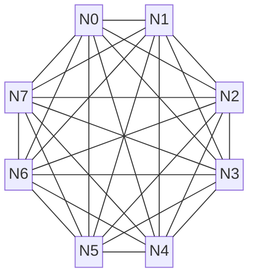

# 拓扑与组网

本章介绍 Scale-Up 域的互联拓扑设计，包括关键指标定义、常见拓扑分析与性能对比。

---

互联拓扑定义了计算节点（或GPU）间的物理连接方式与逻辑结构，它直接决定了整个系统的通信性能，包括带宽、延迟、扩展性和成本。在超节点架构中，选择合适的拓扑是构建高效、无阻塞通信域的基石。当前主流技术路径为电子分组交换（Electronic Packet Switching，EPS），而光学电路交换（Optical Circuit Switching，OCS）作为前沿方向也备受关注。我们首先以最为常见的 **Full Mesh 拓扑** 为例来分析 GPU 的互联拓扑，以及互联拓扑有哪些关键性质。【归纳】

## 拓扑关键指标

为了能够定量比较不同的互联拓扑，需要引入一些关键指标：

* **网络直径（Network Diameter）**：$D(G) = \displaystyle\max_{u, v \in V} d(u, v)$，指网络中任意两个节点间的最短路径长度，刻画了最坏情况下的通信延迟。Full Mesh 拓扑中任意两个节点直接连接，因此 **网络直径为1**。在 Spine-leaf 拓扑中，任意两个节点间的通信最多只需经过"上行-下行"三跳（Leaf-Spine-Leaf），因此 **网络直径为3**。
* **二分带宽（Bisection Bandwidth）**：指当网络被切成两半时，连接这两半部分的总通信能力。它反映了网络在最坏通信场景下的最大数据传输能力。在 Full Mesh 拓扑中，一半网络有 $N/2$ 个节点，每个节点有 $N/2$ 条链路连接到另一半网络，因此 Full Mesh 拓扑的二分带宽为 $\dfrac{N}{2} \times \dfrac{N}{2} \times B = \dfrac{N^2}{4} B$。在 Fat-Tree 拓扑下，一半网络有 $N/2$ 个节点，每个节点都能与另一半网络全速率通信，因此 Fat-Tree 拓扑的二分带宽为 $\dfrac{N}{2} B$。
* **径向扩展度（Radix Scalability）**：指在给定交换芯片 radix 条件下的最大无阻塞集群规模 $N_{max}$。它衡量了在给定交换芯片端口数（$R_{switch}$）和终端设备接口数（$R_{dev}$）的条件下，一个拓扑理论上能构建的最大无阻塞集群规模。Full Mesh 拓扑下，互联规模 $N_{max} = R_{dev} + 1$，Fat-Tree 拓扑下 $N_{max} = R_{switch}^3 / 4 R_{dev}$。
* **平均最短路径长度（ASPL）**：$\sum_{u,v} d(u,v) / N(N-1)$ 反映网络延迟的整体水平。

## 常见拓扑

### 全互联（Full Mesh）

**Full Mesh（全互联）**，或称全连接（All-to-All），是理论上最理想的通信拓扑结构。网络中的每一个节点都与其他所有节点建立直接的点对点连接。

Full Mesh 拓扑具备如下特点：

* 理论最优延迟（直径 1）与最高二分带宽 $\dfrac{N^2}{4}B$
* 端口数平方增长，适合 8/16 以内的小规模 HBD 或板级互联

### Clos（多级交换网络）

**Clos 网络架构**是一种多级交换网络结构，由 Charles Clos 在 1953 年提出。其核心思想是通过将大规模交换任务分解为多个小交换机模块，并按输入层（Input）、中间层（Middle）和输出层（Output）分级互联。设交换机端口数为 $k$，网络层数为 $L$，以标准无收敛组网计算，CLOS的拓扑规模 $N = k^L$。Clos网络架构主要优势在于：

- **经济可行**：通过大量相同规格的低成本交换机构建网络，避免依赖少数昂贵设备，显著降低建设和运营成本。
- **高容错性**：具有多条等价路径，当任意一条链路或交换机故障时，流量可以被重新路由到其他路径，不会导致单点失效。
- **可扩展性**：可以通过增加 Spine 交换机或增加网络层级来平滑地扩展集群规模。

当前，主流的 Clos 网络架构主要有Spine-leaf架构和Fat-tree架构。

**Spine-leaf（叶脊）**是一种全互联、扁平化的Clos网络架构。典型的Spine-leaf网络架构一般只有两层，由"脊交换机"（Spine Switches）和"叶交换机"（Leaf Switches）组成。Leaf 交换机汇聚服务器流量，并上联至所有 Spine 交换机；Spine 交换机与所有 Leaf 形成全网格互联，但 Spine 层内部通常不直接互连。这种结构保证了任意两个不同叶交换机下的节点通信最多只需经过"上行-下行"三跳（Leaf-Spine-Leaf）。在Spine-leaf的扁平化架构中，节点间通信路径短，跨叶节点的通信通常仅三跳，因此实现了低延迟和高带宽。

**Fat-Tree（胖树）** 是一种对称的三层Clos网络架构，其核心设计思想是：从网络边缘（终端节点）向核心（根方向）上行时，链路带宽逐级增加，确保任意两个节点间的通信都拥有充足的带宽资源。在典型的 $k$-ary Fat-Tree 中，所有交换机均为 $k$ 端口设备，整个网络由三层组成：核心层（Core layer）、汇聚层（Aggregation layer）和边缘层（edge layer）。网络包含 $k$ 个 分区（pod），每个分区内部由 $k/2$ 个边缘交换机和 $k/2$ 个汇聚交换机构成；整个网络的核心层共有 $(k/2)^2$ 个核心交换机。每个边缘交换机使用 $k/2$ 个端口连接服务器，另 $k/2$ 个端口上联至汇聚层；汇聚交换机再通过 $k/2$ 条上行链路连接核心层。Fat-Tree 通过精心设计上行与下行链路的带宽比例（收敛比），可以为 All-to-All 等复杂通信模式提供接近线速的聚合带宽，实现理论上的无阻塞通信。

NVIDIA 的 DGX SuperPOD 架构本质上就是一个精心设计的Spine-leaf网络：

* **第一级**：在单个节点内部，多颗 NVSwitch 芯片构建了一个单级的、逻辑上完全无阻塞的全互联网络（Full Mesh），将域内所有 GPU 全互联起来。
* **第二级**：第一级的 NVSwitch 再通过第二级的 NVSwitch 进行互联，形成一个 32 卡的 Scale-Up 通信域。

/// caption
图 1: CLOS（胖树）拓扑结构示意图
///

## 新型拓扑

### Dragonfly

**Dragonfly 拓扑** 是一种为超大规模计算设计的、旨在降低网络直径和成本的拓扑结构[^dragonfly]。它将路由器（交换机）和与之相连的计算节点组织成"组"（Group）。组内，路由器之间实现全互联（All-to-All）。组间，通过长距离的"全局链路"进行稀疏连接。Dragonfly 拓扑具备如下特点：

* **低网络直径**：任意两个节点间的通信路径非常短，通常最多只需一跳组内路由和一跳全局路由。
* **成本效益**：相比于同等规模的全连接胖树，Dragonfly 所需的全局链路和交换机端口更少，成本更低。

Dragonfly 的挑战在于，全局链路相对稀疏，就像一个城市的主干道有限。如果路由策略不佳，所有流量都涌向少数几条主干道，就会造成严重的拥堵。因此，它必须依赖智能的、能感知全局负载的路由算法，动态地为数据包规划"行车路线"，才能发挥其低延迟和成本优势。

### Dragonfly+

**Dragonfly+ 拓扑** 是 Dragonfly 网络拓扑的增强版，是一类结合了分层交换与直连优势的分组直连网络，旨在超大规模部署中实现性能与成本的平衡[^dragonfly+]。它将网络划分为多个电交换组（Group），组内采用标准的CLOS结构设计以保证本地高带宽，组间则通过全局链路实现全互联。这种架构去除了纯 CLOS 顶层的庞大核心交换机，代之以更灵活的组间直连，典型应用如谷歌的 Jupiter 架构。Dragonfly+ 具备如下特点：

- **低且稳定的时延表现**：端到端通信的最大跳数为 3 跳（组内→组间→组内）。相比传统三层 CLOS 架构，它减少了一跳交换时延，且由于组间 1 跳直连，时延一致性更好，适合 AllReduce 与 All-to-All 等流量模式。
- **显著的成本与能效收益**：作为性能与成本的折中方案，它比 CLOS 减少了一层网络设备与模块。网络成本优于 CLOS（但劣于 Torus），且通过减少交换设备，网络功耗相比 CLOS 可降低 25%~50%。
- **灵活的规模扩展性**：设 xPU 端口数为 $p$，交换机端口数为 $k$，组内网络层数为 $L$。在标准无收敛组网下，其组网规模 $(N = k^L \times p)$。通过增大网络层级、提升端口数或 xPU 接入数，可实现超大规模互联。
- **高可靠与容错能力**：借鉴了 Mesh 拓扑的路径多样性，具备极强的抗故障能力。多链路或交换机故障可通过路由机制恢复，避免了单点故障导致的大面积瘫痪。

#### 关键挑战

Dragonfly+ 的核心挑战在于路由复杂度。虽然组间直连缩短了物理直径，但为了充分利用有限的全局带宽，需交换机侧支持高速流量转发与智能的 1~2 跳路由控制。其设计核心是“组内电互联、组间光互联”，通过电链路降低成本、电交换机提高灵活性，并可结合 OCS（光电路交换）在多任务场景下动态调整带宽利用率，从而在超大规模场景下达成直径、成本与时延的最优平衡。

/// caption
图 2: Dragonfly+拓扑结构示意图
///

### 3D Torus

**Torus 拓扑** 是一种规则的格状拓扑，在多维（如2D、3D、6D）网格的每个维度上都带有"环绕式"连接[^torus]。每个节点都与其在各个维度上的"邻居"直接相连。Torus 拓扑具备如下特点：

* **优异的局部性**：非常适合具有邻近通信模式的科学计算应用（如气象模拟、流体力学），因为相邻节点间通信延迟极低。
* **二分带宽较低**：将其切成两半时，横跨切面的链路数量相对较少，这意味着其全局 All-to-All 通信性能不如胖树。
* **扩展性受限**：高维 Torus 布线复杂，扩展成本高。理论上Torus拓扑组网规模在不限制网络直径约束下可无限扩展。但实际应用中采用64 Cube电缆互连的基本单元结合OCS提高算卡利用率，此时组网规模受限于OCS端口数量，设OCS的端口数为 $R$，3D-Torus的拓扑规模 $N = 64 \times R$。

/// caption
图 3: 3D-Torus拓扑结构示意图
///

### SlimFly

**SlimFly 拓扑**：作为 Dragonfly 的演进，SlimFly 是一种在给定交换机端口数下，能够以更少的网络直径和接近最优的二分带宽连接更多节点的拓扑结构[^slimfly]。它在理论上被证明是构建超大规模网络最高效的拓扑之一，但其不规则的连接方式对物理布线和路由算法设计提出了极高挑战，目前更多处于学术研究和前沿探索阶段。

/// caption
图 4: Slimfly拓扑结构示意图
///

## 拓扑性能对比

对于以 All-to-All 和 All-Reduce 为主导通信模式的 AI 大模型训练而言，胖树拓扑因其优越的全局带宽特性与确定的网络直径而成为事实上的标准选择。但另一方面，Fat-Tree 所能达到的互联规模也受限于交换机容量。在超节点继续演进的过程中，对互联拓扑的探索也尤为重要：【归纳】

| 拓扑       |                                             径向扩展度 |               网络直径 |                二分带宽 |
| ---------- | -----------------------------------------------------: | ---------------------: | ----------------------: |
| Full Mesh  |                                          $R_{dev} + 1$ |                      1 |      $\dfrac{N^2}{4} B$ |
| Spine-leaf |                      $\dfrac{R_{switch}^2}{2 R_{dev}}$ |                      3 |        $\dfrac{N}{2} B$ |
| Fat-Tree   |                      $\dfrac{R_{switch}^3}{4 R_{dev}}$ |                      5 |        $\dfrac{N}{2} B$ |
| Dragonfly  |                     $\dfrac{R_{switch}^4}{81 R_{dev}}$ |                $\le 3$ | $\approx \dfrac{N}{2}B$ |
| Torus      |                                                 无上界 | $D \cdot \dfrac{k}{2}$ |                         |
| Slim Fly   | $\dfrac{32}{243} \times \dfrac{R_{switch}^3}{R_{dev}}$ |                    2–3 |    设计为接近满二分带宽 |

## 交换与控制技术

### NVSwitch

NVSwitch 是 NVIDIA 推出的实现节点内 GPU 之间高速互联的芯片，属于交换芯片（Switch ASIC）中的GPU专用交换芯片。它能够在单机或机柜级域内构建 GPU 全互连（all-to-all / non-blocking）通信网络，使网络直径达到 1，从而每个节点都可以直接与任意其他节点通信，无需经过中间交换节点。该架构特别适用于 32、72 或 144 节点的 Scale-Up 系统，可最大化节点间带宽利用率，显著降低通信延迟，并有利于大规模并行计算任务的高效调度与执行。【事实】

NVSwitch 的性能会随着 NVLink（NVIDIA 开发的片间互联协议）的代际升级而提升。性能提升主要体现在两方面：一是增加每个 GPU 可用的 NVLink 数量（link fan-out），二是提高单条 NVLink 的传输速率。下表中带宽均采用“GB/s（双向）”口径，这是 NVIDIA 官方常用的聚合带宽表示方法，等于单方向带宽的 2 倍（1 GB/s ≈ 8 Gb/s）。本表中：+ 表示来自官方白皮书 / 数据手册 / Keynote；* 表示根据公开演讲、产品图片、拓扑描述或带宽反推的推测/半推测值；未标记默认为公开资料已多点交叉验证。

| 代际  |  GPU架构  | 发布（约） | NVLink版本 | 每Link Lane数 | 每Lane速率 （Gbps） | 每Link双向带宽 （GB/s） | 每GPU Link数   | 每GPU聚合双向带宽(GB/s) | 典型单机/底板 GPU  数 | 可扩展最大NVLink域（官方宣称） | 备注                                                         |
| :---: | :-------: | :--------: | :--------: | :-----------: | :-----------------: | ----------------------- | -------------- | ----------------------- | --------------------- | ------------------------------ | ------------------------------------------------------------ |
| 第1代 |   Volta   |    2018    |    2.0     | 8* |   25+    | 50+          | 6+  | 300+         | 16+        | 16+                 | 16‑GPU DGX‑2 NVSwitch 拓扑；Lane 数依据公开拆解/布线推测     |
| 第2代 |  Ampere   |    2020    |    3.0     | 4* |   50+    | 50+          | 12+ | 600+         | 8+         | 16+                 | HGX A100（8-GPU板）官方聚合 600GB/s；Lane 数由 Link 速率与功耗折中推测 |
| 第3代 |  Hopper   |    2022    |    4.0     | 4* |   100+   | 100+         | 18+ | 1800+        | 8+         | 256+                | NVLink 4.0 单 GPU 900GB/s(单向450)→双向1800；最大 NVL256 由官方架构介绍 |
| 第4代 | Blackwell |    2025    |    5.0     | 4* |   200+   | 200+         | 18+ | 3600+        | 72+        | 576+                | NVLink 5.0 进 Keynote 公布速率；NVL72 / 576 为 GTC 公布 + 对 NVLink Fabric 分层规模推测 |

说明：

（1）“每 Link 双向带宽”遵循 NVIDIA 常用口径（聚合双向）。

（2）Lane 数由于官方文档通常未直接公布，表中以 * 标示；其值通过已知总带宽、单 Lane 速率与历代封装约束反向推断。如未来出现官方差异数据，应以官方为准。

（3）“最大 NVLink 域”指官方在对应代际提及的（或 Keynote 展示的）最大可支持互联规模；Blackwell 576 带 * 为推测（推断自 72×GB200 NVL72 单元 × 互联分层聚合）。

（4）Volta 时代 NVLink 2.0 在 NVSwitch 中实现的 Fan-out、Lane 数量公开资料缺少直接原始表格，使用多来源拆解/演讲交叉验证。

### 以太网 / InfiniBand 交换 ASIC

在大规模 AI/HPC 集群中，单机节点内部的 NVSwitch 已能提供高带宽、低延迟的 GPU 互连，但跨节点、跨机架的通信仍然是性能瓶颈。为了解决节点间数据交换的挑战，**Ethernet Switch ASIC** 和 **InfiniBand (IB) Switch ASIC** 被广泛应用于集群网络互连中。它们通过高端口数、高 radix 的设计能够直接连接更多上游和下游节点，从而实现大径向扩展，在大规模节点集群中显著降低网络跳数和延迟，实现高带宽。同时，为了在高扩展性下维持链路的有效利用率和避免热点拥塞，这类交换芯片在设计时必须考虑合理的收敛比，即上游端口与下游端口的连接比例需要与网络拓扑匹配，以在性能和资源利用之间取得平衡。Ethernet ASIC 通常基于标准以太网协议，支持 TCP/IP 与 RoCE，而 InfiniBand ASIC 则提供低延迟、高带宽和 RDMA 支持，二者共同构成了现代节点间高性能互连的关键基础。

为了确保不同厂商设备间的互联互通，光互联论坛（OIF）制定了通用电气接口（CEI）规范，对电气接口的物理形态、电压、频率以及信号调制方式等进行了标准化。例如，CEI-56G/112G/224G 等规范定义了单通道（per-lane）在 56Gbps、112Gbps、224Gbps 速率下的接口标准，其中广泛使用了 PAM4（4-Level Pulse Amplitude Modulation）等高级调制技术来提升数据速率。这些规范被 PCIe、CXL、NVLink 和以太网等主流互联协议广泛采纳或参考，作为其物理层设计的基础。目前CEI规范的主要节点如下：

| 规范系列 | 发布年份（约） | 单通道速率(Gbps) | 调制方式 |                 典型应用/参考协议                 |
| :------: | :------------: | :--------------: | :------: | :-----------------------------------------------: |
| CEI-28G  |     ~2011      |        28        |   NRZ    | 100G 以太网 (4x25G), PCIe 4.0/5.0, InfiniBand EDR |
| CEI-56G  |     ~2017      |        56        |   PAM4   |   200G/400G 以太网, PCIe 6.0, NVLink 4.0 (H100)   |
| CEI-112G |     ~2022      |       112        |   PAM4   |        800G 以太网, CXL 3.0, 下一代 NVLink        |
| CEI-224G |       -        |       224        |   PAM4   |          1.6T/3.2T 以太网, 未来高速互联           |

说明：NRZ (Non-Return-to-Zero) 每符号传输 1 bit 数据，PAM4 (Pulse Amplitude Modulation 4-level) 每符号传输 2 bit 数据，在相同波特率下可实现双倍数据速率。

在交换芯片内部，SerDes（Serializer/Deserializer，串行器/解串器）负责并行数据与串行信号之间的转换。SerDes在发送端将芯片内部的并行数据转换为高速串行信号，在接收端将串行信号转换为并行数据。**Broadcom Tomahawk**是Ethernet ASIC的一种具体实现，其演进与光互联论坛制定的通用电气接口（CEI）规范紧密相关：

| 交换容量（Tbps） | SerDes 速率（每Lane） | CEI 代际对应 |   代表芯片（发布年）   |            可支持的典型4-Lane端口（示例）            |
| :--------------: | :-------------------: | :----------: | :--------------------: | :--------------------------------------------------: |
|      3.2 T       |        25G NRZ        |   CEI-28G    |    Tomahawk (2014)     |                  32 x 100G (4x25G)                   |
|      6.4 T       |       25G NRZ         |   CEI-28G    |   Tomahawk 2 (2016)    |                  64 x 100G (4x25G)                   |
|      12.8 T      |       50G PAM4        |   CEI-56G    |   Tomahawk 3 (2018)    |                  64 x 200G (4x50G)                   |
|      25.6 T      |       100G PAM4       |   CEI-112G   |   Tomahawk 4 (2020)    |                  64 x 400G (4x100G)                  |
|      51.2 T      |       100G PAM4       |   CEI-112G   |   Tomahawk 5 (2022)    |                 128 x 400G (4x100G)                  |
| 102.4 T |       200G PAM4       |   CEI-224G   | 下一代（≈2025+）       | 128 x 800G (4x200G) 或 64 x 1.6T（8x200G，非4-Lane） |

说明：上表中的“4-Lane 端口”指由 4 个 SerDes 通道组成的逻辑端口，在常见的国产GPU厂商中比较常见此种配置。例如，一个 100G 端口由 4x25G 组成，一个 400G 端口可由 4x100G 组成。随着 SerDes 速率翻倍，单芯片的总交换容量和端口速率也随之翻倍，这是网络技术演进的核心驱动力。

### 光学电路交换（OCS）

**Optical Circuit Switching (OCS)** 利用可重配置光开关在源节点和目标节点之间建立直接光学通道，实现高速数据传输而无需经过电子报文交换。OCS 与传统 **Ethernet 或 InfiniBand Switch ASIC** 互为补充：交换芯片提供节点间高速电子报文交换和高端口数互连，而 OCS 则在全局层面增强带宽和拓扑灵活性，为大规模数据中心提供额外的互连能力。

作为全局链路重构手段，OCS 可以动态调整网络中的光路连接，在大规模拓扑如 Dragonfly 或 3D Torus 中显著提升网络弹性和稀疏化效果。通过在热点链路或稀疏互连之间建立直接光学通道，OCS 不仅减少了跳数和延迟，还为高带宽密集型任务提供灵活的链路调度能力，使网络能够更高效地应对流量波动和节点故障。

### 路由与拥塞控制

路由与拥塞控制是高性能数据中心的核心机制，它通过自适应和最短路径路由策略，在保证低延迟的同时动态调整数据流向，以应对流量变化和网络热点。在节点和交换机级别的局部拥塞感知下，网络可以实时监控链路和队列状态，优化流量分布，提高整体带宽利用率。

同时，分级流控机制使网络在多层拓扑中能够精细管理不同层级的流量，避免上层或下层节点过载；故障绕行功能则在链路或节点出现故障时自动选择备用路径，保证网络连通性和任务可靠性。通过这些手段，路由与拥塞控制不仅提升了网络性能，还增强了大规模拓扑（如 Dragonfly、Fat-tree 或 3D Torus）在动态负载和故障情况下的弹性。

### 专用 Fabric

**专用 Fabric** 是一种系统级互连架构，它不仅仅是交换芯片或网络拓扑，而是将节点、交换硬件、网络拓扑、通信协议和控制机制有机整合形成的高性能互连体系。其核心目标包括支持 GPU/CPU 之间的低延迟、高带宽通信，实现从单节点 Scale-Up 到跨机架 Scale-Out 的可扩展性，并能够动态应对热点和链路故障，保证网络弹性，同时支持自适应路由、拥塞感知和分级流控，提升系统可控性和负载均衡能力。

Fabric 的组成涵盖多个层次：在硬件层，节点内互连（如 NVSwitch/NVLink）提供 GPU 内部高带宽通信，节点间交换芯片（Ethernet/InfiniBand ASIC）实现机架级数据交换，光交换（OCS）用于动态重构全局链路、增强网络弹性；在拓扑层，不同的物理与逻辑连接方式（如 Dragonfly、SlimFly、3D Torus、Fat-tree）决定网络直径、延迟和带宽利用率；在控制与协议层，路由算法、拥塞管理和异常处理共同确保大规模集群的高性能、可扩展与可靠性。通过硬件、拓扑和控制机制的紧密整合，专用 Fabric 为 AI/HPC 集群提供了低延迟、高带宽且弹性强的系统级互连基础。

## 从堆叠链路到弹性稀疏

* Full-mesh 在小规模时代表"极致延迟"，但端口平方增长不可持续
* Fat-tree 是之前工业界的默认解法，但在万卡级面临成本与收敛比挑战
* 新一代探索（Dragonfly/SlimFly/OCS+Torus）希望用"更少的全局链路 + 可重构交换"换取接近满二分带宽和低直径，让拓扑从"静态堆叠"转向"弹性稀疏化" 【研判】

## 参考文献

[^dragonfly]: [Technology-Driven, Highly-Scalable Dragonfly Topology (IEEE)](https://ieeexplore.ieee.org/abstract/document/4556717)

[^dragonfly+]: [Dragonfly+: Low Cost Topology for Scaling Datacenters](https://ieeexplore.ieee.org/document/7885210)

[^torus]: [Understanding Torus Network Performance through Simulations](http://datasys.cs.iit.edu/reports/2014_GCASR14_paper-torus.pdf)

[^slimfly]: [Slim Fly: A Cost Effective Low-Diameter Network Topology](https://arxiv.org/pdf/1912.08968)