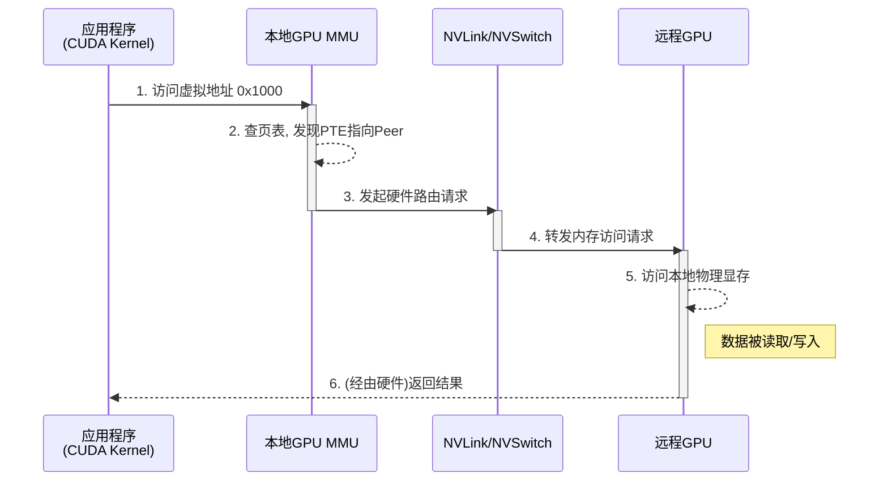
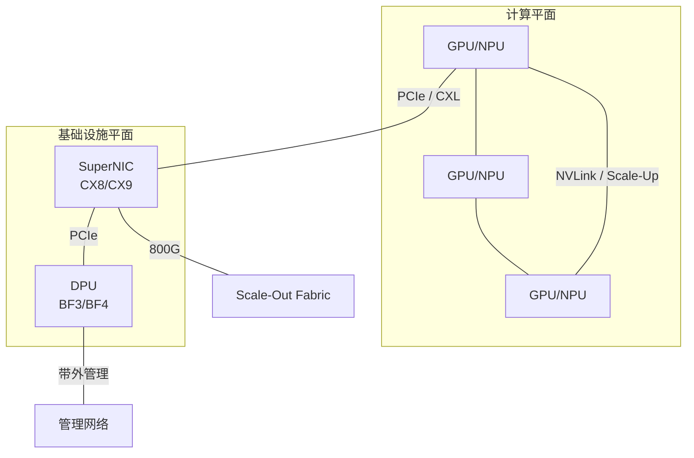

# 系统架构

前几节从电气接口、互联协议和网络拓扑三个层面，自底向上地构建了超节点的物理互联基础。本节转向一个更关键的问题：**为什么只有当这些物理互联能力被进一步组织成统一内存能力，它们才会从“链路存在”变成“系统能力成立”？** 未来大规模 AI 基础设施的竞争，越来越不是单颗芯片峰值性能的竞争，而是远端资源能否以接近本地资源的方式被组织、调度、隔离和恢复的竞争。

如果说前几节回答的是超节点为什么能形成高带宽域（HBD），那么本节回答的是这个高带宽域为什么还需要继续向系统层推进。仅有更高的链路带宽和更低的交换时延，并不会自动变成可交付的系统能力；只有当远端显存被纳入统一的寻址与路由语义、当开放互联开始承担资源组织而不仅是设备接入、当网络与存储等基础设施负载从主计算路径中剥离出去，HBD 的物理优势才有可能被上层软件稳定承接。也正是在这个意义上，统一内存能力、Compute Fabric 和计算平面与基础设施平面的分离，共同构成了从“物理互联”走向“系统能力”的转化层。【归纳】

这里真正要回答的，是为什么超节点必须把远端资源组织成近似本地资源的系统能力：为什么远端资源必须被纳入统一内存能力，为什么开放互联必须从外设通道演进为算力网络，为什么基础设施平面必须独立出来以保护主计算路径。只有这些条件同时成立，超节点才不是“互联更快的设备集合”，而是一个可编程、可管理、可持续演进的系统对象。至于这些能力如何在软件中被具体实现，则留给下一章继续展开。

## 访存体系

软件系统架构的根本决定因素是内存模型。Wulf 与 McKee 早在 1995 年即指出处理器与内存之间的速度鸿沟——"内存墙"——将成为系统性能的根本瓶颈[^memwall]。三十年后的超节点语境下，这一瓶颈已从单处理器访存扩展到机柜级分布式访存：传统操作系统内核围绕 CPU 访存权限进行设计，PCIe 引入的 MMIO（Memory Mapped I/O）机制决定了内核驱动的编程范式——设备寄存器被映射到统一的地址空间，通过内存访问指令进行控制。这一节之所以重要，是因为超节点要把机柜级的分布式资源组织成一个可联合优化的工程边界，第一步不是"链路更快"，而是**远端资源能否被稳定地纳入同一访存与路由语义中**。

超节点的出现从根本上改变了这一范式。通过 NVLink/NVSwitch 等高速互联技术构建的 HBD 通信域，远程 GPU 显存能够以接近本地访问的性能被直接访问。为实现高效通信，HBD 域上正在构建一个**绕过（Bypass）CPU 和操作系统内核**的、由 GPU 主导的通信架构：

1. **从 CPU 中心到 GPU 中心**：跨 GPU 的内存访问不再需要 CPU 作为中介，而是由 GPU 的 MMU 直接发起，由硬件（如 NVSwitch）进行路由。
2. **从内核态仲裁到用户态直通**：上层应用通过统一虚拟地址（UVA）操作远程数据，地址翻译和路由完全在硬件层面透明完成，内核仅在初始设置和资源管理时介入。

### 现代 GPU 访存体系

NVIDIA 超节点的软件架构与其单节点内部的 GPU 访存体系一脉相承，均围绕 **UVA（Unified Virtual Addressing）** 技术构建[^cudauva]。与传统 CPU 类似，现代 GPU 配备了完整的内存管理单元（MMU），负责虚拟地址到物理地址的转换。UVA 将 GPU 显存、CPU 内存等不同物理内存统一映射到单一的虚拟地址空间中。

**发现与连接建立**：系统中的 GPU 通过物理总线（NVLink 或 PCIe）互相发现，建立对等连接并分配唯一的 Peer ID。

**Aperture 选择与地址映射**：驱动程序分配 UVA 地址，并根据连接类型选择不同的 Aperture 通道：

- **本地显存（VID Memory）**：同一 GPU 内的内存访问
- **对等内存（Peer Memory）**：通过 NVLink 直接访问远程 GPU 显存
- **系统内存（SYS Memory）**：通过 PCIe 访问 CPU 主存
- **Fabric 内存**：NVSwitch 环境下的专用地址空间

**硬件透明的远程访存**：当 CUDA Kernel 访问虚拟地址时，GPU MMU 自动完成地址翻译和路由。硬件 MMU 提供 4–5 级页表，支持 4K–128K 页大小。MMU 页表条目中同时标识地址类型（内存或 I/O）以及是否支持缓存一致性。

/// caption
GPU 访问 UVA 地址的端到端流程
///

UVA 在节点内实现的编程透明性与硬件高效性，为构建更大规模、跨节点的统一地址空间奠定了范式基础。总体趋势是：CPU 与 OS 内核正从"关键数据路径"中解放出来，转而扮演"控制平面"角色，通过配置虚拟地址与 MMU 来管理访存与通信，而非直接参与每一次操作。只有当高频数据路径从通用软件栈中剥离出去，HBD 的低时延和高带宽优势才有机会在更大尺度上被兑现。

### NVSwitch 全局地址空间

传统的 UVA 和 PCIe P2P 机制的边界仅限于单个 PCIe Root Complex（RC），无法原生支持跨物理服务器节点的直接访存。PCIe 节点内的访存体系存在如下特点：

1. 主存、设备控制寄存器和设备内置存储（如显存）通过 PCIe RC 映射到统一的 MMIO 地址空间；
2. 内核态下，设备驱动通过 MMIO 地址操作设备寄存器，实现设备初始化、控制与中断处理；
3. 用户态下，可将设备存储直接映射到用户地址空间实现 bypass 内核的直接读写——GPUDirect RDMA[^gpudirectrdma] 即将部分显存映射到用户态再交给 RDMA 网卡访问，RDMA 网卡的 doorbell 寄存器也可映射给 GPU 实现 IBGDA（GPU 异步 RDMA 数据发送）[^ibgda]。

在传统 AI 算力服务器上，上述技术架构已成为事实标准。但在超节点中，PCIe 通信域无法纳管其他节点的设备，因此也无法提供跨节点的统一访存地址空间。

超节点通过 NVSwitch Fabric 将“节点内”的 P2P 模型扩展至整个机柜乃至更大的高带宽域[^nvswitch]。对本章而言，更值得把握的不是某个实现细节，而是它揭示出的系统要求：一旦远端显存要在软件上表现为“可直接使用的系统资源”，系统就必须为 HBD 内的资源建立统一的寻址、路由和管理机制，而不能再停留在“设备之间能互相收发数据”的层面。Fabric Manager[^fabricmanager] 和 NVSwitch 所代表的，正是这种从“互联存在”走向“资源可组织”的系统跃迁。

以 GB200 NVL72 为代表的机柜级系统已经说明，这种统一资源组织不是抽象概念：当 72 颗 GPU 被纳入同一 HBD 域时[^nvl72]，系统面对的核心问题不再只是链路够不够快，而是这些分散显存能否在逻辑上被组织成一个可被软件稳定承接的整体。

NVSwitch Fabric 全局地址空间代表了专有 Scale-Up 协议的一条高集成路径：以硬件交换为核心，把统一寻址、低时延路由和机柜级访存域绑定在同一体系中。它证明了一个关键判断：**超节点的能力边界外移，不只是链路速率提升，更是地址空间、路由机制和访存语义在更大物理尺度上的统一。** 对多数不具备封闭垂直整合能力的参与者而言，问题随之变成：能否在开放标准生态下，沿另一条路径逼近这一系统能力。【归纳】

## PCIe 与 CXL

NVSwitch Fabric 提供了一种专有的统一访存解法。而在开放标准一侧，PCIe 及其承载的 CXL（Compute Express Link）协议，正从传统的通用外设通道演进为支撑超节点 Scale-Up 的高速算力网络（Compute Fabric）。这一演进路径之所以关键，不只是因为它更开放，更因为对于多数不具备 NVLink 生态和封闭全栈整合能力的参与者而言，它是当前最现实的开放标准互联底座之一，也是把"系统级联合优化"落到产业协同和量产供应链上的主要抓手。【归纳】

如前文所述，PCIe 总线访存体系的核心挑战在于如何突破单一 PCIe Root Complex（RC）的物理边界，实现跨节点的统一地址空间。闭源生态中，NVSwitch 提供了一种专有解法；而在开放标准阵营，PCIe 及其承载的 CXL 正通过物理层与链路层的重构，逐步从通用外设通道演进为支撑超节点 Scale-Up 的高速算力网络。

### 代际演进与内存池化

PCIe 的技术演进始终围绕两条主线：**物理层效率提升**与**资源解耦能力增强**。前者决定"带宽墙"能被推多远，后者决定这些新增带宽能否真正转化为可编排的系统资源。

| 代际 | 单通道速率 | x16 双向带宽 | 关键架构变化 |
|:-----|:----------|:-----------|:-----------|
| PCIe 1.0–2.0 | 2.5–5 GT/s | 8–16 GB/s | 8b/10b 编码，25% 传输开销 |
| PCIe 3.0 | 8 GT/s | 32 GB/s | 128b/130b 编码，开销降至 1.5% |
| PCIe 4.0 | 16 GT/s | 64 GB/s | 确立早期多 GPU 服务器的互联基础 |
| PCIe 5.0 | 32 GT/s | 128 GB/s | 开放备选协议（Alternative Protocol），为 CXL 奠基 |
| PCIe 6.0 | 64 GT/s | 256 GB/s | **PAM4 调制 + FLIT 机制 + 低延迟 FEC**——架构重大转折[^pcie6] |
| PCIe 7.0 | 128 GT/s | 512 GB/s | 2025 年发布，x16 双向带宽达 PCIe 4.0 的 8 倍 |
| PCIe 8.0 | 256 GT/s | 1 TB/s | 规范定义阶段，目标双向 x16 达 1 TB/s |

PCIe 6.0 是架构的重大转折点：首次引入 PAM4 四电平脉冲幅度调制以实现 64 GT/s 速率，为解决 PAM4 带来的信噪比下降问题，强制引入固定大小的 FLIT（流量控制单元）机制与三路交织 FEC，FEC 纠错延迟低于 10 ns，预期故障率约 5×10⁻¹⁰ FIT[^pcie6]。

在 PCIe 物理层之上，CXL 协议引入了 `CXL.mem` 和 `CXL.cache` 子协议，使系统不仅能传输数据，还能维持硬件级缓存一致性。CXL 3.1（2023 年 11 月发布）已支持多级 Fabric 交换与内存池化，允许超节点内的计算资源与内存资源实现物理分离与动态重组[^cxl31]。微软的 Pond 系统在 CXL 内存池中实现了 DRAM 成本降低 7% 且性能仅下降 1–5%[^pond]——这是 PCIe/CXL 路线区别于传统总线的核心能力跃迁。

### PCIe/CXL Switch

在开放标准路线中，Switch 是 PCIe/CXL 系统化落地的关键承载层。它位于多个主机端口与下游 GPU、NIC、存储及内存扩展设备之间，负责在交换域内完成事务转发、访问隔离与路径组织，使大量设备间通信能够在本地交换结构内闭合，而不必频繁回到上游 Root Complex。由此，系统中的设备关系不再局限于点到点直连，而是被组织为一个可扩展的局部互联域，从而支撑多主机接入、设备对等访问、资源池化以及故障域切分等能力。对 PCIe 而言，这一层为 peer-to-peer、Multi-host、NTB 等机制提供了稳定的硬件承载；对 CXL 而言，则是在此基础上进一步向统一地址、内存共享和 fabric 级资源组织演进。因此，Switch 的意义不在于单纯增加连接数量，而在于将原本分散的链路能力收敛为一种可管理、可隔离、可扩展的系统互联能力。[^cxl-4-whitepaper]

### Multi-host 与 NTB

传统 PCIe 架构遵循严格的单根（Single-Root）树状拓扑，由单一 CPU 掌控所有下游设备的枚举与资源分配。超节点需要打破这一限制，通过高基数（High-Radix）PCIe Switch 构建的非阻塞交换矩阵，实现多主机与多设备的对等协同：

- **Multi-host（多主机协同）**：允许物理上独立的多个 CPU 节点同时连接到同一个 PCIe 交换网络。通过硬件层面的虚拟化与资源分区，交换矩阵内的 GPU、智能网卡等资源可被动态分配给不同的宿主 CPU，或在多个主机间实现共享，提升资源利用率与调度弹性。
- **NTB（Non-Transparent Bridge，非透明桥）**：传统 PCIe 规范不允许两个 RC 直接互连（会导致地址空间枚举冲突），NTB 在物理链路上扮演网关角色，将超节点划分为多个独立的 PCIe 域。它隔离不同域的地址广播，同时通过硬件地址转换窗口（Translation Window）允许跨域 DMA 直接读写——既隔离了故障域，又实现了底层物理直连访存。

这两种机制使 PCIe 在机柜级构建"多主机共享加速器池"成为可能，为不依赖 NVSwitch 的开放架构超节点提供了基础能力。更重要的是，它们把原本以单机为边界的总线语义，开始推进到以 HBD 为边界的资源组织语义中，这正是开放生态下"把更多设计变量纳入同一工程边界"的具体体现。

### PCIe 的 Scale-Up 应对

尽管 PCIe 已具备通用底座能力，但面向大模型 Scale-Up 场景，新兴互联协议在设备接入数量与峰值带宽上展现出优势：

- **NVLink** 提供极高的单节点双向带宽（1.8 TB/s 级），专用 Mesh 拓扑在梯度同步场景下有效带宽利用率极高；
- **UALink** 专为 AI 优化，200 GT/s 速率、93% 有效峰值带宽，单 Pod 内可支持 1024 个加速器互联[^ualink]；
- **轻量化以太协议**（ESUN/SUE/Eth-X 等）通过定制极短的 AI 报头并结合底层重传，将以太网的组网规模优势引入 Scale-Up 域。

PCIe 标准正从两个方向应对：**纵向加速带宽翻倍周期**（PCIe 7.0/8.0），**横向推进高基数交换**。支持 160 lane、320 lane 及更高基数的交换芯片（如 Astera Labs Scorpio 系列）使超节点网络拓扑能从多跳树状向单跳全连接演进，有效控制长尾延迟。此外，PCIe 也在推进光学互联标准（PCIe over Optical），通过标准化光电转换支撑更大规模的跨机架无损互联。

### 总线语义与网络语义的权衡

PCIe 总线与以太网协议各自具有鲜明的技术特征，系统架构选型的本质是对协议语义、流控机制以及物理扩展边界的工程权衡：

| 维度 | PCIe/CXL 总线语义 | 以太网/RDMA 网络语义 |
|:-----|:-----------------|:-------------------|
| **数据路径** | 原生 Load/Store 语义，硬件事务层完成地址映射，零拷贝、百纳秒级延迟 | Message Passing 语义，数据经打包/路由/解包，RDMA 绕过内核但仍有微秒级协议栈开销 |
| **流控与可靠性** | 硬件链路状态机 + AER，FLIT 模式下轻量 FEC + Link Retraining 提供确定性延迟；缺乏全网端到端拥塞控制 | 成熟的 PFC/ECN 无损网络机制 + 软件定义路由，支撑万节点鲁棒运行；PFC 调优复杂且存在拥塞扩散风险 |
| **扩展边界** | 优势区间集中在单机柜或短距离铜缆范围，Switch/Retimer 供应链成熟，机柜内 TCO 较低 | 跨机架 Scale-Out 的事实标准，端口基数和光学互联生态极强 |
| **最佳适用域** | 机柜内 Scale-Up：显存共享、低延迟 P2P | 跨机架 Scale-Out：大规模集合通信、弹性组网 |

这一权衡表不存在绝对优劣，而是指向了超节点架构的核心设计决策：**Scale-Up 域内选择总线语义以获取极致延迟，Scale-Out 域选择网络语义以获取规模弹性，关键在于两者的边界如何划定以及如何衔接。** 这个边界划定本身就是系统架构设计的核心任务，因为它决定了哪些通信可以被稳定留在 HBD 内，哪些通信必须交给更大尺度的网络去承接。

### 协议与物理层解耦

综合带宽需求、技术成熟度、供应链稳定性与上市时间，在 2026–2027 年的时间窗口内，基于 PCIe 6.0/7.0 及 CXL 构建总线型算力网络仍是一种工程可靠的选择——它在保证极低互联延迟的同时，规避了非标协议的系统集成风险，面向百卡规模的 Scale-Up 集群具备显著工程优势。

展望 2028 年及更远未来，超节点互联架构可能出现**总线逻辑语义与物理层（PHY）的全面解耦**。随着底层高速 SerDes 技术（224G/448G）的演进，总线型与以太型协议的物理界限将逐渐抹平。具备先进 Load/Store 内存语义的协议（如 UALink 或下一代 CXL），将可以直接运行在标准化的 Ethernet PHY（IEEE 802.3dj）之上[^ualink]——既复用网络物理层在长距离、高信号完整性上的红利，又保留总线协议的零拷贝、极低延迟访存特性。

另一条融合路径则更为激进：将 PCIe 交换、网卡和以太网交换功能在**硅片级**进行融合，从硬件层面进一步压缩协议边界。公开资料中的 ACF-S（Accelerated Compute Fabric SuperNIC）可以被视为这一方向的代表性例子之一[^enfabrica]。这里更值得强调的，不是某家厂商的具体产品参数，而是它所揭示的系统判断：当链路速率继续提升后，新的瓶颈会越来越集中到多级交换、协议转换和数据搬运路径本身，因此架构优化也会自然向“更少层级、更短路径、更统一语义”的方向推进。

这两条趋势——协议-PHY 解耦与硅片级融合——看似路径不同，实则指向同一目标：**在开放标准框架下，逐步逼近专有 Scale-Up 协议的延迟与带宽性能**，同时保留以太网生态在规模、供应链和运维方面的优势。它们仍然服务于同一条叙事主线：继续把更多关键通信留在高带宽域内，并以更低的系统开销把这种能力兑现为可复制的工程实践。

## 资源编排

前两节讨论了超节点内加速器之间如何实现统一访存与高速互联。但一个完整的超节点还需要解决另一组问题：网络协议处理、存储 I/O、安全隔离、遥测监控和运维管理。对白皮书主线而言，这一层的重要性在于：**即便物理互联和统一地址空间已经建立，如果基础设施负载仍压在主计算路径上，系统能力边界也无法被稳定兑现为真实 Goodput。**【归纳】

现代超节点的解法是**平面分离**：将系统划分为**计算平面**（主计算路径，GPU/NPU 专注于训练与推理）和**基础设施平面**（独立硬件承担网络、存储、安全与管理），两者通过 PCIe/CXL 在物理上共存于同一节点，但在逻辑上彼此隔离。它的本质不是"多放几块卡"，而是通过职责拆分减少控制面和服务面对数据面的侵入，把更多系统资源重新让渡给训练和推理本身。

进一步看，所谓“平面分离”并不只是把管理流量单独拉一张网那么简单。在超大规模系统里，至少会自然分化出三类互不等价的流：一类是对时延与同步最敏感的参数面，一类是承载训练数据与中间结果搬运的数据面，另一类是面向管理、服务接入与运维编排的业务面。三者在时延容忍度、流量形态、可中断性和故障影响范围上都不同，因此也不应被同一种协议语义、同一种布线逻辑和同一种调度策略粗暴对待[^ultra-report-sys-planes]。

/// caption
双平面架构：计算平面（GPU 间 Scale-Up 互联）与基础设施平面（SuperNIC/DPU 承担 Scale-Out 与管理）通过 PCIe/CXL 衔接
///

### SuperNIC

SuperNIC 是超节点与外部世界的高速通信出口。放在全文主线中看，它的价值不只是"网卡更快"，而是把原本会侵入 GPU/CPU 的网络协议处理、集合通信和数据搬运尽可能下沉到独立硬件路径中，从而守住计算平面的有效吞吐。

如果从系统架构角度再往前推一步，SuperNIC 的真正意义还在于它为“参数面尽量留在高带宽域内、数据面和业务面尽量在外部平面消化”提供了出口条件。没有这类清晰的出口与分层，机柜内部的高带宽域就很容易被训练数据传输、服务访问流量和运维控制流反复侵入，最终把原本应服务于同步与协同的低时延资源，消耗在并不需要进入主计算路径的负载上[^ultra-report-sys-planes]。

以 NVIDIA ConnectX 系列为例，CX8（面向 Blackwell 平台）和 CX9（面向 Rubin 平台）代表了当前 SuperNIC 的能力前沿：

| 指标 | ConnectX-8 | ConnectX-9 |
|:-----|:----------|:----------|
| 以太网速率 | 2×400 Gb/s（双口） | 单口 800 Gb/s 或 2×400 Gb/s |
| 峰值吞吐 | 800 Gb/s | 1.6 Tb/s |
| 主机接口 | PCIe 6.0 x16（首款量产 PCIe 6.0 设备） | PCIe 6.0 x16 |
| 在网计算（SHARP） | 基准水平 | 约 9 倍于 CX8 |
| 能效比 | 基准水平 | 约 3 倍于 CX8 |
| 目标平台 | Blackwell 超节点 | Rubin 超节点 |

SuperNIC 在超节点中的关键功能包括：

1. **RDMA 与 RoCEv2 全线速卸载**：硬件实现零拷贝、乱序重排、拥塞控制，GPU/CPU 无需参与网络协议处理；
2. **SHARP 网络内计算**：将 AllReduce、All-to-All 等集合通信操作下沉到网卡与交换机硬件，在 128 节点 HDR InfiniBand 系统上 AllReduce 延迟可降低 2.1 倍[^sharp]，与 NCCL 集成后 AI 工作负载可获得 10–20% 的端到端性能提升[^sharpblog]；
3. **DDP（直接数据放置）**：网络数据直接写入 GPU 显存，无需 CPU 中转，缩短张量数据传输路径；
4. **高精度遥测**：硬件级流量采样、延迟监测、丢包定位，为超节点网络的可观测性提供数据基础；
5. **虚拟化卸载**：SR-IOV 与 virtio 硬件卸载，支撑多租户场景下的硬件级性能隔离。

CX8 到 CX9 的代际跃迁体现了 SuperNIC 的演进方向：从"双口 400G"到"单口 800G"简化布线复杂度，SHARP 在网计算能力提升约 9 倍以匹配 MoE 架构下爆发的 All-to-All 通信需求，能效比提升 3 倍以适配高密度液冷超节点的功耗约束。也就是说，SuperNIC 的演进并不是孤立器件升级，而是在响应系统瓶颈从"芯片算力"向"通信密度、尾延迟与能效"迁移这一更大的叙事主线。

### DPU

如果说 SuperNIC 负责"传数据"，DPU（Data Processing Unit）则负责"管基础设施"。在超节点叙事中，DPU 的意义不在于再增加一颗处理器，而在于把大量与业务目标无直接关系、但又不可避免的基础设施负载从主计算路径剥离出去。DPU 是集成了智能网卡、独立 CPU、内存与多硬件加速单元的一体化平台，可独立运行操作系统，无需占用主机资源即可完成网络、存储、安全与虚拟化的全栈卸载。已有生产系统验证了 DPU 与可编程交换机协同的可行性，可以在较高比例上把基础设施负载从主机侧卸下[^zephyrus]。

这也是为什么基础设施平面在超节点里越来越像一个“自治系统”而不只是若干配套器件。随着系统规模扩大，统一调度、遥测采集、租户隔离、远程运维和故障恢复都不再适合继续占用主机侧的关键资源；如果这些动作仍与训练/推理作业共享同一执行路径，那么主计算平面的确定性就会不断被侵蚀。把它们外移到独立平面，本质上是在为计算平面换取更高的可预测性和更低的运行时干扰[^ultra-report-sys-ops]。

| 指标 | BlueField-3 | BlueField-4 |
|:-----|:-----------|:-----------|
| 网络速率 | 400 Gb/s 线速 | 800 Gb/s 线速 |
| CPU 架构 | 16 核 ARM Cortex-A78 | 64 核 Grace Neoverse V2 |
| 板载内存 | 32 GB DDR5 | 128 GB LPDDR5X |
| 计算性能 | 等价约 300 CPU 核的基础设施处理能力 | 较 BF3 提升 6 倍 |
| 存储加速 | 基准水平 | 较 BF3 提升约 2 倍 |
| AI 推理辅助 | 无 | 内置硬件推理引擎 + ICM 上下文存储 |
| 安全特性 | 加密卸载 + 零信任隔离 | ASTRA + 后量子密码（PQC）+ 运行时威胁检测 |

DPU 在超节点中承担四重角色：

1. **全栈卸载引擎**：将 vSwitch、虚拟路由、防火墙、NVMe-oF 存储加速等基础设施负载从主机 CPU/GPU 完全卸载，释放全部算力用于 AI 计算——网络处理延迟从传统软件方案的 ~50 μs 降至 <5 μs；
2. **安全隔离中枢**：通过硬件级零信任架构与租户强隔离，保障超节点内不同任务之间的数据安全，线速 IPsec/TLS/MACsec 加解密不消耗主机资源；
3. **自治管理核心**：可替代 BMC 实现带外自治——即使主机 CPU/GPU 宕机，DPU 仍能执行远程诊断、固件升级与自愈操作；
4. **存储优化引擎**：GPUDirect Storage 与 NVMe-oF 卸载使远端存储性能接近本地 NVMe 硬盘，解决大模型训练的海量数据 I/O 瓶颈。

BF3 到 BF4 的演进标志着 DPU 从"基础卸载"走向"自治管理"：64 核 Grace CPU 提供数据中心级算力（较 BF3 提升 6 倍），新增的 ICM（推理上下文存储）可卸载大模型推理的 KV Cache 管理，后量子密码支持则为超节点的长期安全性提供前瞻保障。这表明基础设施平面本身也在演进为一个独立的系统变量，它不直接增加峰值算力，却直接影响超节点把硬件潜力兑现为长期稳定服务能力的水平。

### SuperNIC 与 DPU 的协同分工

SuperNIC 与 DPU 在超节点中的分工可以用一句话概括：**SuperNIC 加速数据流，DPU 管理一切非计算负载**。两者的核心差异如下：

| 维度 | SuperNIC（CX8/CX9） | DPU（BF3/BF4） |
|:-----|:-------------------|:---------------|
| 核心定位 | Scale-Out 高速互联通道、网络加速引擎 | 基础设施主控、全栈卸载引擎 |
| 核心功能 | RDMA、网络内计算、协议卸载 | 网络+存储+安全+虚拟化全卸载、自治管理 |
| 计算能力 | 专用加速引擎，无独立通用 CPU | 独立 CPU（ARM/Grace），可独立运行 OS |
| 板载资源 | 无板载内存/存储，依赖主机 | 32–128 GB 内存，可选板载 SSD |
| 依赖关系 | 依赖主机 CPU/GPU 配合 | 可独立运行，不依赖主机 |

在典型的超节点部署中，每个计算节点同时配置 SuperNIC 和 DPU：SuperNIC 面向 Scale-Out Fabric 提供高带宽低延迟的数据路径，DPU 在带外独立运行基础设施软件栈，两者共同保障 GPU 的尽可能多的资源专注于 AI 工作负载。对全文主线而言，这种协同分工的意义在于：它把"高带宽互联"进一步转化为"高兑现度系统"，使性能边界不止存在于实验室链路指标上，而能在真实部署、租户隔离和长期运维中持续成立。

换句话说，计算平面与基础设施平面的分离，最终要解决的是同一个问题：哪些流量和控制动作必须进入主计算路径，哪些应该被隔离在外。前者决定同步效率和域内协同质量，后者决定系统是否还能在规模扩大之后维持可管理、可恢复、可交付的状态。只有这条边界被划清，统一访存与 Compute Fabric 才不会在真实部署里被基础设施负载重新“吃掉”[^ultra-report-sys-planes][^ultra-report-sys-ops]。

### 硅片级 Fabric 融合

上述"SuperNIC + DPU"的双平面架构是当前超节点的代表性实践，但它仍存在结构性开销：数据从 GPU 到外部网络需要经过多层 SerDes 转换（GPU → PCIe Switch → NIC → 以太网），每一层都引入延迟和功耗。于是，系统架构继续向前推进时，新的问题就变成：能否把已经分离的数据面、控制面和交换面进一步在更小尺度上重新折叠，以继续外推延迟、能效和规模的联合边界。

一种更激进的架构方向正在浮现：**将 PCIe 交换、网卡功能和以太网交换在更小的物理尺度上融合起来**，试图从芯片级减少协议边界和多层 SerDes 转换带来的额外开销。公开资料中的 ACF-S 可以被视为这一方向的代表性例子之一[^enfabrica]，而相关的 EMFASYS 方案则把这种融合进一步延伸到池化内存路径的组织上[^emfasys]。但对本章而言，这些方案更重要的意义不在于某个具体产品，而在于它们提示了一个未来趋势：当系统继续向前推进时，优化对象可能不再只是“链路更快”或“拓扑更优”，而是数据面、交换面和资源语义能否在更小尺度上被重新折叠。【研判】

这类方案目前仍更适合作为一种值得持续跟踪的体系结构探索。其公开性能和规模指标仍需要更多独立部署与系统验证来确认，但它已经说明，超节点系统架构的演进并不会停在“交换网络怎么搭”，而是会继续深入到“交换、互联和资源访问路径如何被重新组织”这一层。

!!! info "对参考设计的影响"

    硅片级 Fabric 融合目前更适合作为一种值得关注的趋势例证：它既不完全沿用专用 Scale-Up 总线的演进逻辑，也不同于传统以太网增强路径，而是在更小尺度上尝试把总线语义与网络语义折叠到同一数据面中。这一路径仍处于早期验证阶段，现阶段更适合作为未来演进方向的观察对象，而不是当前参考设计体系中的独立成熟路线。

## 小结

本节从访存体系、互联底座和资源编排三个层面，描绘了超节点系统架构的全貌。三者并不是并列专题，而是同一条能力边界外移链条上的连续环节：

- **访存体系**已从单节点 UVA 演进至机柜级全局地址空间，专有路径（NVSwitch Fabric）和开放路径（PCIe/CXL）分别提供了不同的工程权衡；
- **PCIe/CXL** 正从外设总线加速向算力网络演进，开放互联正在承担越来越多原本只属于专有体系的资源组织职责；
- **资源编排**通过计算平面与基础设施平面的分离，尽量把非计算负载从主路径中剥离出去，而更深层的 Fabric 融合则提示了这一分工未来仍可能继续演化。

换个更贴近工程实践的说法，本节讨论的这些变化，本质上都在扩大超节点可联合优化的设计空间：统一内存能力降低了跨节点访存的软件门槛，Compute Fabric 让开放生态也能在机柜级组织高带宽资源，而计算平面与基础设施平面的分离则减少了非计算负载对主路径的侵蚀。正因为这些变化会同时作用于延迟、带宽、规模和系统成本，系统架构才成为推动超节点能力边界继续外移的重要一环。下一章将顺着这条线继续往下走，不再停留在“为什么需要”的层面，而是转入“这套统一访存如何真正成立”：哪些语义是必要条件、这些语义如何在具体实现中落地、系统软件又如何把它们进一步转化为 Goodput。

## 参考文献

[^memwall]: Wulf, Wm. A. & McKee, S. A. "Hitting the Memory Wall: Implications of the Obvious." *ACM SIGARCH Computer Architecture News*, 23(1), 20–24, 1995.

[^cudauva]: NVIDIA. *CUDA C Programming Guide*，Virtual Memory Management / Unified Addressing 相关章节. [链接](https://docs.nvidia.com/cuda/cuda-programming-guide/04-special-topics/virtual-memory-management.html); Potluri, S. et al. "Efficient Inter-node MPI Communication Using GPUDirect RDMA for InfiniBand Clusters with NVIDIA GPUs." *2013 IEEE/ACM International Symposium on Cluster, Cloud and Grid Computing*, 2013.

[^gpudirectrdma]: NVIDIA. *GPUDirect RDMA Documentation*. [链接](https://docs.nvidia.com/cuda/gpudirect-rdma/contents.html)

[^ibgda]: NVIDIA. "Improving Network Performance of HPC Systems Using NVIDIA Magnum IO NVSHMEM and GPUDirect Async." *NVIDIA Developer Blog*, 2024. [链接](https://developer.nvidia.com/blog/improving-network-performance-of-hpc-systems-using-nvidia-magnum-io-nvshmem-and-gpudirect-async/) — IBGDA 实现了最高 9.5 倍的 NVSHMEM block-put 吞吐提升和 1.8 亿次/秒的操作速率。

[^nvswitch]: Foley, D. et al. "NVSwitch and DGX-2." *Hot Chips 34*, 2022. [链接](https://hc34.hotchips.org/assets/program/conference/day2/Network%20and%20Switches/NVSwitch%20HotChips%202022%20r5.pdf)

[^fabricmanager]: NVIDIA. *Fabric Manager User Guide*. [链接](https://docs.nvidia.com/datacenter/tesla/fabric-manager-user-guide/index.html); 相关实现可参考 NVIDIA *open-gpu-kernel-modules* 仓库中的 `nvidia-uvm` 与 Fabric 相关代码。

[^nvl72]: NVIDIA. *DGX SuperPod with GB200 NVL72 Reference Architecture*. [链接](https://docs.nvidia.com/dgx-superpod/reference-architecture-scalable-infrastructure-gb200/latest/); NVIDIA. "NVIDIA GB200 NVL72 Delivers Trillion-Parameter LLM Training and Real-Time Inference." *NVIDIA Developer Blog*, 2024. [链接](https://developer.nvidia.com/blog/nvidia-gb200-nvl72-delivers-trillion-parameter-llm-training-and-real-time-inference/)

[^pcie6]: PCI-SIG. *PCI Express 6.0 Specification*, Rev. 6.4. [链接](https://pcisig.com/pci-express-6.0-specification) — FLIT 模式下三路交织 FEC 纠错延迟 <10 ns，预期故障率约 5×10⁻¹⁰ FIT。

[^cxl31]: CXL Consortium. *Compute Express Link Specification 3.1*, November 2023. [链接](https://computeexpresslink.org/wp-content/uploads/2024/02/CXL-3.1-Specification.pdf) — 支持多级 Fabric 交换、端口路由（PBR）与可信执行环境安全协议（TSP）。

[^pond]: Li, H. et al. "Pond: CXL-Based Memory Pooling Systems for Cloud Platforms." *ASPLOS 2023*. [链接](https://dl.acm.org/doi/abs/10.1145/3575693.3578835) — 基于 CXL load/store 访问的内存池化系统，论文报告 8–16 socket 小池设计可实现 DRAM 成本降低 7%、性能仅下降 1–5%。

[^ualink]: UALink Consortium. *UALink 1.0 Specification & White Paper*, April 2025. [链接](https://ualinkconsortium.org/specifications/ualink-1-0-specification); [白皮书](https://ualinkconsortium.org/wp-content/uploads/2025/04/UALink-1.0-White_Paper_FINAL.pdf) — 200 GT/s 速率、93% 有效峰值带宽，物理层采用 IEEE P802.3dj 标准。

[^sharp]: Graham, R. L. et al. "Scalable Hierarchical Aggregation and Reduction Protocol (SHARP) — Streaming-Aggregation Hardware Design and Evaluation." *IEEE/ACM SC 2020*. [链接](https://pmc.ncbi.nlm.nih.gov/articles/PMC7295336/) — 128 节点 HDR InfiniBand 上 8 字节 AllReduce 延迟从 6.01 μs 降至 2.83 μs（2.1×）。

[^sharpblog]: NVIDIA. "Advancing Performance with NVIDIA SHARP In-Network Computing." *NVIDIA Developer Blog*. [链接](https://developer.nvidia.com/blog/advancing-performance-with-nvidia-sharp-in-network-computing/) — SHARP 与 NCCL 集成后为 AI 工作负载提供 10–20% 性能提升。

[^zephyrus]: Lin, Y. et al. "Zephyrus: Scaling Gateways Beyond the Petabit-Era with DPU-Augmented Hierarchical Co-Offloading." *arXiv:2510.11043*, 2025. [链接](https://arxiv.org/abs/2510.11043) — 字节跳动生产级网关，DPU + Tofino 交换机协同实现 >99% 硬件卸载率。

[^enfabrica]: Enfabrica. *ACF-S: Accelerated Compute Fabric SuperNIC*. [链接](https://www.enfabrica.net/solution/acf-s); Sankar, R. "CEO Blog: Enfabrica's ACF-S Millennium Chip Launch." *Enfabrica Blog*, 2025. [链接](https://blog.enfabrica.net/ceo-blog-enfabricas-acf-s-millennium-chip-launch-series-c-funding-and-more-94e36eafaafb)

[^emfasys]: Enfabrica. *EMFASYS: Elastic Memory Fabric System*. [链接](https://www.enfabrica.net/solution/emfasys) — 基于 CXL 2.0+ 的弹性内存池化，官方测算推理场景单 Token 成本降低约 50%。

[^ultra-report-sys-planes]: 《超大规模智算集群关键技术及工程落地研究报告》, 2025 年 12 月, 第 16-19 页。涉及节点间互联、前后端网络、参数面/数据面/业务面分层与多平面组网。

[^ultra-report-sys-ops]: 《超大规模智算集群关键技术及工程落地研究报告》, 2025 年 12 月, 第 19-21 页、第 27-28 页。涉及统一调度、基础设施编排、长期运营、故障恢复与稳定性约束。

[^cxl-4-whitepaper]: [《CXL 4.0 White Paper》](https://computeexpresslink.org/wp-content/uploads/2025/11/CXL_4.0-White-Paper_FINAL.pdf), 2025 年 11 月, 第 X-Y 页。涉及 CXL 4.0 架构演进、内存池化（Memory Pooling）与结构扩展等技术细节。
