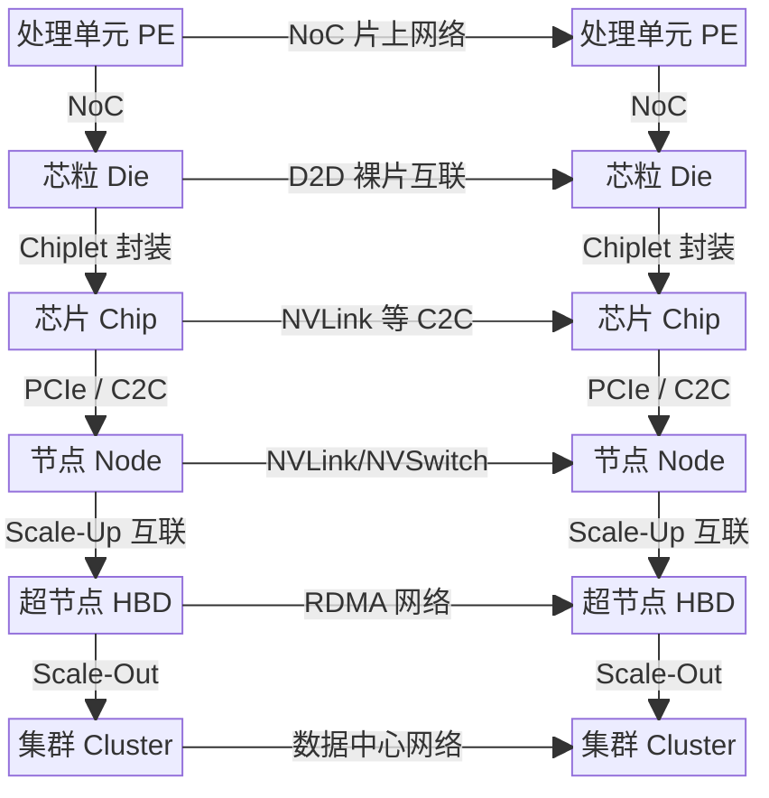

# 架构分析

前言已经提出了一个判断：下一代算力建设的关键，不再只是采购更强芯片或部署更多节点，而是能否把计算、互联、内存、软件与整机组织成一种可持续演进的系统能力【研判】。顺着这一判断继续往下追问，第一章真正要面对的，其实不是“超节点长什么样”，而是一个更根本的问题：在制程红利放缓之后，什么样的系统对象还能持续把系统算力向外推？如果这个问题没有被讲清，超节点就很容易被误解为“把更多卡装进一个机柜”的工程放大版。更准确地说，超节点不是形态概念，而是局部性边界被重新定义后的系统对象：它试图把更多高价值通信、远端访存、同步协同和恢复控制稳定收敛在同一个受控域内，这个域既要低时延、低抖动，也要具备可维持内存语义或近内存语义、故障域可控并最终兑现 Goodput 的能力。

本章试图给出的解释是：压力首先来自需求侧，而突破发生在供给侧【归纳】。需求侧并非单一增长曲线在推动算力基础设施演进，而是至少有两股力量同时施压【归纳】。一方面，大模型的参数-性能幂律仍在持续推高训练与推理所需计算量；另一方面，AI for Science 与复杂工程问题的求解又受到边际递减约束，迫使系统不断堆高可用算力。对应地，供给侧实际观测到的约每两年 5–6 倍系统算力增长，已经远超制程微缩所能解释的范围【验证】。更合理的解释是：每一代架构师都在封装、互联、内存、精度、软件和整机工程等层面引入新的系统级设计变量，使原本不可同时达到的一组性能、成本与复杂度组合变得可达，并推动系统能力边界持续外移【归纳】。超节点之所以重要，正因为它把封装、互联、内存、软件和整机工程收束为同一个局部性边界的重构问题【归纳】。**超节点竞争的本质，也因此是系统能力边界外移速度之争**【研判】。

沿着这条线索，本章按从「为什么」到「怎么做」的顺序展开。本章先从需求侧的双重指数压力出发，说明系统能力边界为何必须被重新理解，再用帕累托前沿把这种边界形式化；在此基础上，进一步澄清这里讨论的 `Scale-Up` 并非狭义上的「卡间网络」或「更快互联」，而是一种在功耗、布线、散热与故障域约束下，**把更多高价值通信稳定留在受控域内**的系统能力。与之对应，`Scale-Out` 负责把节点或超节点继续横向扩展为更大集群，`Scale-Across` 则把这种资源组织延伸到跨园区、跨中心与跨资源域协同。最后，本章逐层展开[产品实践](01-nvidia.md)（含 [NVIDIA](01-nvidia.md)、[华为](02-huawei.md) 等）、[电气接口](03-electrical.md)、[互联协议](04-protocols.md)、[网络拓扑](05-topology.md)、[系统架构](06-system-architecture.md)与[整机工程](07-server-architecture.md)，解释超节点究竟如何在机柜尺度上把这些变量组织成一个真正可交付的系统。

## 算力需求的指数增长

对算力基础设施的指数级需求，并非来自单一驱动力，而是至少有两条独立的增长曲线在同时施压。【归纳】

### 大模型的 Scaling Law

前沿生成式 AI 模型的训练算力需求呈现出稳定的指数增长。从 2020 年的 GPT-3（约 $3.14 \times 10^{23}$ FLOPs）到 2025 年的 Grok-3（约 $3.5 \times 10^{26}$ FLOPs），5 年间增长超过三个数量级。Kaplan et al. (2020) 与后续研究表明，模型性能（以损失函数衡量）与训练计算量之间存在幂律关系——要获得可感知的性能提升，所需计算量必须按固定比例增长[^scaling]。这条幂律没有显示出收敛迹象。

```vegalite
{
  "$schema": "https://vega.github.io/schema/vega-lite/v5.json",
  "description": "Training compute of frontier AI models over time.",
  "width": 700,
  "height": 500,
  "data": {
    "values": [
      {"model": "Meena", "organization": "Google", "date": "2020-01-28", "compute": 1.12e+23, "parameters": 2600000000},
      {"model": "GPT-3 175B", "organization": "OpenAI", "date": "2020-05-28", "compute": 3.14e+23, "parameters": 175000000000},
      {"model": "GShard", "organization": "Google", "date": "2020-06-30", "compute": 4.77e+22, "parameters": 2300000000},
      {"model": "Switch", "organization": "Google", "date": "2021-01-11", "compute": 8.22e+22, "parameters": 1571000000000},
      {"model": "FLAN 137B", "organization": "Google", "date": "2021-09-03", "compute": 2.05e+24, "parameters": 137000000000},
      {"model": "Gopher", "organization": "Google", "date": "2021-12-08", "compute": 6.31e+23, "parameters": 280000000000},
      {"model": "PaLM", "organization": "Google", "date": "2022-04-04", "compute": 2.53e+24, "parameters": 540000000000},
      {"model": "GPT-4", "organization": "OpenAI", "date": "2023-03-15", "compute": 2.1e+25, "parameters": 1800000000000},
      {"model": "PaLM 2", "organization": "Google", "date": "2023-05-10", "compute": 7.34e+24, "parameters": 340000000000},
      {"model": "Claude 2", "organization": "Anthropic", "date": "2023-07-11", "compute": 3.87e+24, "parameters": null},
      {"model": "Qwen-Max", "organization": "Alibaba", "date": "2023-09-12", "compute": 6e+24, "parameters": null},
      {"model": "Gemini 1.0 Ultra", "organization": "Google", "date": "2023-12-06", "compute": 5e+25, "parameters": null},
      {"model": "GLM-4", "organization": "Zhipu AI", "date": "2024-01-16", "compute": 1.2e+25, "parameters": null},
      {"model": "DeepSeek-V2", "organization": "DeepSeek", "date": "2024-05-06", "compute": 5e+24, "parameters": 236000000000},
      {"model": "Nemotron-4 340B", "organization": "NVIDIA", "date": "2024-06-14", "compute": 1.8e+25, "parameters": 340000000000},
      {"model": "Claude 3.5 Sonnet", "organization": "Anthropic", "date": "2024-06-20", "compute": 2.7e+25, "parameters": null},
      {"model": "Llama 3.1 405B", "organization": "Meta", "date": "2024-07-23", "compute": 3.8e+25, "parameters": 405000000000},
      {"model": "Grok-3", "organization": "xAI", "date": "2025-02-17", "compute": 3.5e+26, "parameters": 3e12},
      {"model": "Grok-4", "organization": "xAI", "date": "2025-07-09", "compute": 5.00e+26, "parameters": 3e12},
      {"model": "Qwen3-Max", "organization": "Alibaba", "date": "2025-09-05", "compute": 1.5e+25, "parameters": 1.0e12},
      {"model": "GPT-4.5", "organization": "OpenAI", "date": "2025-02-27", "compute": 3.8e+26, "parameters": 1.0e10}
    ]
  },
  "layer": [
    {
      "mark": {"type": "circle", "opacity": 0.7},
      "encoding": {
        "x": {
          "field": "date",
          "type": "temporal",
          "title": "发布时间",
          "axis": {"format": "%Y", "grid": true}
        },
        "y": {
          "field": "compute",
          "type": "quantitative",
          "scale": {"type": "log"},
          "title": "训练计算量 (FLOPs, Log Scale)",
          "axis": {"format": ".0e", "grid": true}
        },
        "color": {
          "field": "organization",
          "type": "nominal",
          "title": "机构"
        },
        "size": {
          "field": "parameters",
          "type": "quantitative",
          "title": "参数量",
          "scale": {"range": [50, 500], "domain": [1e9, 3e12]},
          "legend": {"format": ".1s"}
        },
        "tooltip": [
          {"field": "model", "title": "模型"},
          {"field": "organization", "title": "机构"},
          {"field": "date", "type": "temporal", "title": "发布时间", "format": "%Y-%m-%d"},
          {"field": "compute", "title": "计算量", "format": ".2e"},
          {"field": "parameters", "title": "参数量", "format": ",.0f"}
        ]
      }
    },
    {
      "mark": {"type": "text", "align": "left", "dx": 8, "dy": 2, "fontSize": 10},
      "encoding": {
        "x": {"field": "date", "type": "temporal"},
        "y": {"field": "compute", "type": "quantitative"},
        "text": {"field": "model"},
        "color": {"value": "#444"}
      }
    }
  ]
}
```
/// caption
图 1.1：顶级生成式 AI 模型训练算力需求演进趋势（2020-2025）
///

与此同时，模型架构本身也在向更「通信密集」的方向演进。特别是 2024–2025 年间，以 DeepSeek-V2/V3 为代表的 MoE（Mixture of Experts）架构在前沿模型中全面铺开，从根本上改变了 Scale-Up 域的通信需求画像。

**从 TP 主导到 EP 主导**：Dense 模型时代的核心通信模式是张量并行（TP）驱动的 AllReduce/ReduceScatter，其流量模式相对规则（集合操作、同步屏障）。MoE 架构引入的专家并行（EP）则要求高频 All-to-All 通信——每个 token 需要被路由到少量专家，且路由结果高度动态，流量模式呈现**不可预测的稀疏多播**特征。

| 维度 | Dense/TP 时代 | MoE/EP 时代 |
|:-----|:-------------|:------------|
| 主要通信模式 | AllReduce, AllGather | All-to-All（动态路由） |
| 流量可预测性 | 高（同步、对称） | 低（稀疏、动态、非对称） |
| 带宽敏感性 | 高（梯度同步） | 极高（每层每 token 均需路由） |
| 延迟敏感性 | 中（可隐藏） | 极高（EP 路由在关键路径上） |
| 尾延迟容忍度 | 可接受 | 极低（一个慢专家拖慢全局） |
| 对交换芯片的要求 | 聚合带宽 | 聚合带宽 + 动态负载均衡 + 低排队时延 |

这不仅推高了总算力需求，还对互联带宽、延迟和动态调度能力提出了远超传统架构的要求。这一范式跃迁直接解释了为什么近期出现了如此密集的 Scale-Up 协议竞赛——EP 通信对带宽、延迟和动态调度能力的三重极端要求，使得传统网络的性能天花板成为模型训练效率的核心瓶颈，倒逼产业界进行全栈重构。

### AI for Science

除大模型训练外，AI for Science（AI4S）构成了第二条独立的算力指数需求曲线，且其驱动逻辑更为深层【归纳】。

科学发现正面临系统性的边际收益递减。Park et al. (2023) 对过去六十年间 4,500 万篇论文和 390 万项专利的分析表明，科研成果的"颠覆性"——即打破既有知识框架、开辟新方向的可能性——在各主要学科中持续下降[^disruption]。Bloom et al. (2020) 的经济学研究更直接指出，维持过去的创新速度所需的研发投入在急剧增加：例如，实现摩尔定律中芯片密度定期翻倍，所需的研究人员数量已是 1970 年代的 18 倍[^ideas]。制药行业的"Eroom 定律"则表明，每十亿美元研发经费所能诞生的新药数量约每 9 年减半[^eroom]。

这些证据指向同一个结论：**科学探索的难度在上升，传统投入的边际收益在递减。仅依靠线性增加的人力、资金和时间来换取科研产出，正变得事倍功半**【归纳】。近期的标志性案例（如 AlphaFold 系列以计算预测替代传统实验方法）表明，打破这一困境的路径是将科研过程本身进行指数级 Scaling——通过 LLM 智能体批量执行实验以指数提升假设验证速度，通过自动化实验平台和高通量筛选以指数降低单次实验成本，通过科研 Copilot 系统性扩展研究人员的认知边界。这三个方向无一例外都转化为对算力基础设施的指数级需求【归纳】。

大模型的 Scaling Law 根植于参数-性能的幂律关系，AI4S 的 Scaling Law 根植于科学发现的认识论困境【归纳】。两者从完全不同的根源出发，却汇聚到同一个供给侧压力上：**算力基础设施必须以指数速度增长**【归纳】。即使其中一条曲线趋于饱和，另一条仍会持续施压。这使得对系统级算力指数增长的需求具有高度鲁棒性——它不依赖于某一个模型架构或某一个应用领域的繁荣【研判】。

## 系统算力的增长之谜

面对需求侧的双重指数压力，供给侧实际表现如何？

以 NVIDIA 数据中心训练 GPU 为标尺，从 V100（2017）到 GB200（2025），单芯片 FP16 张量峰值算力从 125 TFLOPS 攀升至 5,000 TFLOPS，8 年间增长约 40 倍【事实】。折算为两年一个代际周期，单芯片算力约每两年提升 2.5 倍【验证】。然而，若以系统级指标（如 DGX/NVL 超节点平台的整体训练吞吐）计算，每一代的系统级性能增幅则达到了惊人的 5–6 倍甚至更高【验证】。

```vegalite
{
  "$schema": "https://vega.github.io/schema/vega-lite/v5.json",
  "description": "NVIDIA AI Chip FP16 Performance over time.",
  "width": 700,
  "height": 400,
  "data": {
    "values": [
      {"name": "Tesla P100", "date": "2016-04-05", "flops": 2.12e13},
      {"name": "Tesla V100", "date": "2017-06-21", "flops": 1.25e14},
      {"name": "A100", "date": "2020-05-14", "flops": 3.12e14},
      {"name": "H100 SXM", "date": "2022-09-20", "flops": 9.89e14},
      {"name": "H200", "date": "2023-11-13", "flops": 1.98e15},
      {"name": "B200", "date": "2024-03-18", "flops": 4.5e15},
      {"name": "GB200", "date": "2025-02-15", "flops": 5.0e15}
    ]
  },
  "layer": [
    {
      "mark": {"type": "circle", "size": 60, "tooltip": true},
      "encoding": {
        "x": {"field": "date", "type": "temporal", "title": "发布时间"},
        "y": {
          "field": "flops",
          "type": "quantitative",
          "scale": {"type": "log"},
          "title": "FP16 算力 (FLOPs, Log Scale)",
          "axis": {"format": ".0e"}
        },
        "tooltip": [
          {"field": "name"},
          {"field": "flops", "format": ".2e"},
          {"field": "date", "type": "temporal", "format": "%Y-%m-%d"}
        ]
      }
    },
    {
      "mark": {"type": "text", "align": "left", "dx": 5, "dy": -5},
      "encoding": {
        "x": {"field": "date", "type": "temporal"},
        "y": {"field": "flops", "type": "quantitative"},
        "text": {"field": "name"}
      }
    },
    {
      "transform": [
        {
          "regression": "flops",
          "on": "date",
          "method": "exp"
        }
      ],
      "mark": {"type": "line", "color": "firebrick", "strokeDash": [4, 4]},
      "encoding": {
        "x": {"field": "date", "type": "temporal"},
        "y": {"field": "flops", "type": "quantitative"}
      }
    }
  ]
}
```
/// caption
图 1.2：NVIDIA 数据中心 GPU FP16 峰值算力演进趋势
///

这个速度远超半导体制程本身能解释的范围【归纳】。同一时期，TSMC 从 12nm 演进至 4nm，晶体管密度约提升 4 倍【事实】。对应到同面积下的算力增益，即使叠加微架构改进，制程单独能贡献的部分不超过每两年约 2 倍【验证】。

需求侧要求指数增长，单芯片层面的制程红利与微架构演进每代只能提供约 2.5 倍。但超节点系统实际做到了 5–6 倍。**这额外的系统级红利从何而来？**

要回答这一问题，需先审视约束。限制 AI 芯片与系统性能的物理边界，可以归结为三面墙：

1. **物理空间边界（面积墙）**。受限于光刻机的掩膜版极限（约 858 mm²），单颗芯片上的晶体管数量是有绝对上限的。要获取更大的算力总量，必须走向多 Die 封装或多芯片互联——但这会引入片间通信开销。
2. **热力学边界（能耗墙）**。晶体管翻转就会发热。在给定的面积内塞入更多晶体管或提高频率，会导致功耗密度呈显著的非线性上升。如果热量散不出去，芯片就会面临热节流甚至烧毁（暗硅效应）。更严苛的是，互联通道本身也消耗功率：每条 112G SerDes 通道约消耗 5–8 pJ/bit，在 NVL72 规模的 130 TB/s 系统中，仅互联 I/O 功耗就可达千瓦量级。
3. **信息传输边界（带宽墙）**。芯片内部的算力密度增长始终快于片外数据供给能力。HBM 堆叠层数与通道数有封装极限，PCIe/SerDes 引脚数受制于基板面积与信号完整性。系统互联带宽更是受限于物理距离、线缆密度与光电转换代价。算力再高，如果单卡数据"喂不饱"，或者多卡之间"协同太慢"，晶体管就会空转。

这三面墙彼此耦合、此消彼长：要提升算力密度，就需要更多晶体管（撞面积墙）和更多数据供给（撞带宽墙）；要提升互联带宽，就需要更多 SerDes 通道和更高速率（撞功耗墙）；要控制功耗，就得限制频率或利用率，算力密度随之下降【归纳】。系统设计本质上是一个**多目标优化问题**——算力密度、互联带宽、内存容量、能效比、可扩展规模之间存在由物理定律施加的结构性冲突【归纳】。

在 AI 大规模训练场景中，三面墙的交织直接转化为三个不可回避的系统瓶颈：

- **互联带宽的"剪刀差"**：NVLink 等加速器间互联带宽与 PCIe/外设网络带宽存在数量级差异；当关键通信路径被"挤回"传统网络时，系统可扩展性会快速恶化。
- **"显存墙"与模型并行**：规模化训练不仅需要算力，更需要**有效的显存容量**和极低的并行通信代价。单卡显存上限更频繁地成为瓶颈，高带宽互联是支撑张量并行（TP）与专家并行（EP）、实现显存池化的前提。
- **通信时延与尾延迟敏感**：大规模集群中集合通信高频发生。跨机网络处于微秒级时延且极易受拥塞影响；而机柜级互联可将关键通信压缩到**亚微秒甚至百纳秒量级**，提供更可控的拥塞行为。

这三个瓶颈共同指向同一个系统事实：今天真正昂贵的，越来越不是再多做一次矩阵乘法，而是把高频、高价值、强耦合的数据交换安全地推出局部域外。也正因为如此，超节点的使命不是简单把更多芯片拼在一起，而是在“比特搬运比 FLOPs 更昂贵”的时代，尽可能重构并扩大计算的局部性边界。换句话说，`Scale-Up` 的价值不在于链路指标本身，而在于把尽可能多的关键通信稳定留在一个低时延、低抖动、故障域可控的受控域内【归纳】。而要理解如何突破这些约束实现代际跃迁，需要一个能够描述多目标权衡的分析工具。

## 帕累托前沿与代际跃迁

描述多目标约束下可行权衡集合的数学工具是帕累托前沿（Pareto Frontier）【事实】。在多目标优化理论中，帕累托前沿是所有"非支配解"的集合——在这些解上，不可能在任何一个目标维度上取得改善，而不在至少一个其他维度上付出代价【事实】。

将这个框架映射到超节点设计，关键在于区分两种本质不同的操作：

- **沿前沿移动**：在同一技术世代内，设计者可以在前沿上选择不同的权衡点——比如牺牲互联带宽来换取更大的内存容量，或者牺牲能效来追求更高的峰值算力。这是设计哲学的选择，不改变可达的极限。
- **推移前沿**：引入一种此前不存在于设计空间中的新技术或新维度，使得原本不可能同时达到的性能组合变为可能。这才是代际跃迁的本质。

制程微缩带来的约 2 倍增益，本质上是在既有设计维度内把帕累托前沿向外推了一小步。但 NVIDIA 每一代做到的远不止于此。回顾从 Pascal/Volta 到 Blackwell 的四次代际跃迁，可以看到一个相对稳定的模式：每一代的核心创新都在向设计空间中引入一个**此前不存在或此前不占主导地位的变量**，从而在特定约束方向上大幅外推帕累托前沿：

| 代际跃迁 | 引入的破局变量 | 突破的约束墙 | 前沿外推方向 |
|:---------|:------------|:-----------|:-----------|
| Pascal → Volta (2017) | Tensor Core（专用矩阵乘法单元） | 面积效率墙 | TDP 仅增 20%（250W→300W），AI 峰值算力跃升 6× |
| Volta → Ampere (2020) | TF32 格式 + 2:4 结构化稀疏 | 精度-算力权衡墙 | 无需改变硬件面积，等效算力翻倍；NVSwitch 2.0 将 8 卡互联带宽推至 600 GB/s/GPU |
| Ampere → Hopper (2022) | NVLink 4.0 + NVSwitch 3.0 + FP8 + TMA | 跨节点通信墙 | Scale-Up 域从单机 8 卡扩展至 256 卡 NVLink 域；FP8 与 TMA 解耦访存与计算 |
| Hopper → Blackwell (2024) | NV-HBI 双 Die 封装 + NVL72 铜缆背板 + FP4 | 面积墙 + 机柜级互联墙 | 10 TB/s D2D 实现逻辑单芯片化；72 卡 130 TB/s 近全互联；FP4 微张量缩放再压单比特算力（推理 30× / 训练 4×，TCO 与能耗均降低 25×） |
| 未来（Rubin及以后） | HBM4 混合键合 + 光互联 (CPO/LPO) | 内存能效墙 + 传输墙 | 继续推移互联距离与功耗的双重极限 |

Blackwell 的 NV-HBI（NVLink High Bandwidth Interface）值得特别关注。B200 GPU 由两颗 Die 通过 NV-HBI 以 10 TB/s 带宽互联，对软件呈现为一颗逻辑统一的 GPU——这本质上是对光罩极限（858 mm²）的工程突破：当单 Die 面积无法容纳所需的晶体管总量时，通过封装级 D2D 互联将"物理双芯"包装为"逻辑单芯"。NV-HBI 的成功工程落地，为整个行业的 Chiplet 路线提供了关键实证：只要 D2D 互联带宽足够高（量级达到 TB/s）、延迟足够低（< 5 ns），多 Die 封装就不仅是成本优化手段，更是突破面积墙后获取新一级算力密度的必要路径（参见[第五章 · 多 Die 堆叠](../05-future/chiplet.md)）。此外，Blackwell 还引入了 AI 驱动的 RAS Engine，可在运行时对 SRAM 和寄存器文件进行预测性诊断与预防性维护，将硬件 RAS 从"被动纠错"推向"主动预防"（参见[第二章 · RAS](../02-software/ras.md)）。

每一代遵循相同的模式：**识别当代最紧的约束维度，引入一个新的设计变量来突破它**【归纳】。这恰好是帕累托前沿外推的操作定义。单芯片层面的制程微缩与架构演进是既有维度上的渐进推移，每代贡献了约 2.5 倍的算力增长；而系统级"破局变量"带来的超节点范围扩张则是新维度的跃迁式推移【归纳】。两者叠加，构成了系统级每代 5–6 倍甚至更高的综合吞吐增长【归纳】。

下图将这一"剪刀差"可视化。蓝色实线跟踪系统级训练吞吐的代际增长，灰色虚线跟踪单芯片 FP16 峰值算力的增长，红色标注的倍数即两者在每一代的差距。注意纵轴为对数刻度——在线性刻度下，这两条曲线的分叉会远比图中看起来更加剧烈。2025 年之后的虚线区域为趋势外推。

```vegalite
{
  "$schema": "https://vega.github.io/schema/vega-lite/v5.json",
  "description": "单芯片算力 vs 系统级算力增长——剪刀差与趋势外推",
  "width": 700,
  "height": 440,
  "layer": [
    {
      "data": {"values": [{"x1": "2025-01-01", "x2": "2027-06-01"}]},
      "mark": {"type": "rect", "opacity": 0.04},
      "encoding": {
        "x": {"field": "x1", "type": "temporal"},
        "x2": {"field": "x2"},
        "color": {"value": "#f59e0b"}
      }
    },
    {
      "data": {"values": [{"x": "2025-10-01", "y": 1800}]},
      "mark": {"type": "text", "fontSize": 11, "fontStyle": "italic", "align": "center"},
      "encoding": {
        "x": {"field": "x", "type": "temporal"},
        "y": {"field": "y", "type": "quantitative", "scale": {"type": "log"}},
        "text": {"value": "趋势外推 →"},
        "color": {"value": "#b45309"}
      }
    },
    {
      "data": {
        "values": [
          {"date": "2017-06-01", "chip": 1, "system": 1},
          {"date": "2020-05-01", "chip": 2.5, "system": 5},
          {"date": "2022-09-01", "chip": 7.9, "system": 30},
          {"date": "2024-03-01", "chip": 36, "system": 180},
          {"date": "2026-06-01", "chip": 90, "system": 1080}
        ]
      },
      "mark": {"type": "area", "opacity": 0.07, "interpolate": "monotone"},
      "encoding": {
        "x": {"field": "date", "type": "temporal"},
        "y": {"field": "chip", "type": "quantitative", "scale": {"type": "log", "domain": [0.6, 2500]}},
        "y2": {"field": "system"},
        "color": {"value": "#2563eb"}
      }
    },
    {
      "data": {
        "values": [
          {"date": "2017-06-01", "v": 1},
          {"date": "2020-05-01", "v": 5},
          {"date": "2022-09-01", "v": 30},
          {"date": "2024-03-01", "v": 180}
        ]
      },
      "mark": {"type": "line", "strokeWidth": 2.5, "interpolate": "monotone"},
      "encoding": {
        "x": {"field": "date", "type": "temporal"},
        "y": {"field": "v", "type": "quantitative"},
        "color": {"value": "#2563eb"}
      }
    },
    {
      "data": {
        "values": [
          {"date": "2024-03-01", "v": 180},
          {"date": "2026-06-01", "v": 1080}
        ]
      },
      "mark": {"type": "line", "strokeWidth": 2.5, "interpolate": "monotone", "strokeDash": [8, 6]},
      "encoding": {
        "x": {"field": "date", "type": "temporal"},
        "y": {"field": "v", "type": "quantitative"},
        "color": {"value": "#2563eb"}
      }
    },
    {
      "data": {
        "values": [
          {"date": "2017-06-01", "v": 1},
          {"date": "2020-05-01", "v": 2.5},
          {"date": "2022-09-01", "v": 7.9},
          {"date": "2024-03-01", "v": 36}
        ]
      },
      "mark": {"type": "line", "strokeWidth": 2, "interpolate": "monotone", "strokeDash": [6, 4]},
      "encoding": {
        "x": {"field": "date", "type": "temporal"},
        "y": {"field": "v", "type": "quantitative"},
        "color": {"value": "#94a3b8"}
      }
    },
    {
      "data": {
        "values": [
          {"date": "2024-03-01", "v": 36},
          {"date": "2026-06-01", "v": 90}
        ]
      },
      "mark": {"type": "line", "strokeWidth": 2, "interpolate": "monotone", "strokeDash": [3, 5]},
      "encoding": {
        "x": {"field": "date", "type": "temporal"},
        "y": {"field": "v", "type": "quantitative"},
        "color": {"value": "#c0c8d4"}
      }
    },
    {
      "data": {
        "values": [
          {"date": "2020-05-01", "chip": 2.5, "system": 5},
          {"date": "2022-09-01", "chip": 7.9, "system": 30},
          {"date": "2024-03-01", "chip": 36, "system": 180},
          {"date": "2026-06-01", "chip": 90, "system": 1080}
        ]
      },
      "mark": {"type": "rule", "strokeDash": [2, 2]},
      "encoding": {
        "x": {"field": "date", "type": "temporal"},
        "y": {"field": "chip", "type": "quantitative"},
        "y2": {"field": "system"},
        "color": {"value": "#dc2626"},
        "strokeWidth": {"value": 1.2},
        "opacity": {"value": 0.5}
      }
    },
    {
      "data": {
        "values": [
          {"date": "2020-05-01", "midY": 3.54, "ratio": "2×"},
          {"date": "2022-09-01", "midY": 15.4, "ratio": "3.8×"},
          {"date": "2024-03-01", "midY": 80.5, "ratio": "5×"},
          {"date": "2026-06-01", "midY": 312, "ratio": "12×"}
        ]
      },
      "mark": {"type": "text", "fontSize": 15, "fontWeight": "bold", "align": "center"},
      "encoding": {
        "x": {"field": "date", "type": "temporal"},
        "y": {"field": "midY", "type": "quantitative"},
        "text": {"field": "ratio"},
        "color": {"value": "#dc2626"}
      }
    },
    {
      "data": {
        "values": [
          {"date": "2017-06-01", "v": 1, "label": "DGX-1"},
          {"date": "2020-05-01", "v": 5, "label": "DGX A100"},
          {"date": "2022-09-01", "v": 30, "label": "DGX H100"},
          {"date": "2024-03-01", "v": 180, "label": "NVL72"},
          {"date": "2026-06-01", "v": 1080, "label": "Rubin NVL"}
        ]
      },
      "mark": {"type": "circle", "size": 60},
      "encoding": {
        "x": {"field": "date", "type": "temporal"},
        "y": {"field": "v", "type": "quantitative"},
        "color": {"value": "#2563eb"},
        "tooltip": [{"field": "label", "title": "系统"}, {"field": "v", "title": "相对性能", "format": ".0f"}]
      }
    },
    {
      "data": {
        "values": [
          {"date": "2017-06-01", "v": 1, "label": "V100"},
          {"date": "2020-05-01", "v": 2.5, "label": "A100"},
          {"date": "2022-09-01", "v": 7.9, "label": "H100"},
          {"date": "2024-03-01", "v": 36, "label": "B200"},
          {"date": "2026-06-01", "v": 90, "label": "Rubin"}
        ]
      },
      "mark": {"type": "circle", "size": 40},
      "encoding": {
        "x": {"field": "date", "type": "temporal"},
        "y": {"field": "v", "type": "quantitative"},
        "color": {"value": "#94a3b8"}
      }
    },
    {
      "data": {
        "values": [
          {"date": "2017-06-01", "v": 1, "label": "DGX-1", "note": "Tensor Core · NVLink 1.0"},
          {"date": "2020-05-01", "v": 5, "label": "DGX A100", "note": "TF32 · NVSwitch 全连接"},
          {"date": "2022-09-01", "v": 30, "label": "DGX H100", "note": "NVLink 4 · FP8 · 256 卡域"},
          {"date": "2024-03-01", "v": 180, "label": "NVL72", "note": "NV-HBI · 72-GPU · 液冷"},
          {"date": "2026-06-01", "v": 1080, "label": "Rubin NVL", "note": "NVLink 6 · HBM4 · 光互联"}
        ]
      },
      "layer": [
        {
          "mark": {"type": "text", "align": "left", "dx": 10, "dy": -12, "fontSize": 11, "fontWeight": "bold"},
          "encoding": {
            "x": {"field": "date", "type": "temporal"},
            "y": {"field": "v", "type": "quantitative"},
            "text": {"field": "label"},
            "color": {"value": "#1e40af"}
          }
        },
        {
          "mark": {"type": "text", "align": "left", "dx": 10, "dy": 4, "fontSize": 9},
          "encoding": {
            "x": {"field": "date", "type": "temporal"},
            "y": {"field": "v", "type": "quantitative"},
            "text": {"field": "note"},
            "color": {"value": "#6b7280"}
          }
        }
      ]
    },
    {
      "data": {
        "values": [
          {"date": "2017-06-01", "v": 1, "label": "V100"},
          {"date": "2020-05-01", "v": 2.5, "label": "A100"},
          {"date": "2022-09-01", "v": 7.9, "label": "H100"},
          {"date": "2024-03-01", "v": 36, "label": "B200"},
          {"date": "2026-06-01", "v": 90, "label": "Rubin"}
        ]
      },
      "mark": {"type": "text", "align": "right", "dx": -10, "dy": 4, "fontSize": 10},
      "encoding": {
        "x": {"field": "date", "type": "temporal"},
        "y": {"field": "v", "type": "quantitative"},
        "text": {"field": "label"},
        "color": {"value": "#64748b"}
      }
    },
    {
      "data": {"values": [{"x": "2017-02-01", "y": 1800}]},
      "mark": {"type": "text", "fontSize": 10, "align": "left", "fontStyle": "italic"},
      "encoding": {
        "x": {"field": "x", "type": "temporal"},
        "y": {"field": "y", "type": "quantitative"},
        "text": {"value": "⚠ 纵轴为对数刻度，线性视角下剪刀差远比图中显示更大"},
        "color": {"value": "#9ca3af"}
      }
    }
  ],
  "encoding": {
    "x": {"axis": {"title": "", "format": "%Y", "grid": false, "labelFontSize": 11}},
    "y": {"axis": {"title": "相对性能（V100 / DGX-1 = 1×，对数刻度）", "grid": true, "gridOpacity": 0.12, "labelFontSize": 11, "titleFontSize": 12, "format": "~s"}, "scale": {"type": "log", "domain": [0.6, 2500]}}
  },
  "config": {
    "view": {"stroke": null},
    "axis": {"domainColor": "#e5e7eb", "tickColor": "#e5e7eb"}
  }
}
```
/// caption
图 1.3：帕累托前沿外推的累积效应——系统级算力（蓝色实线）vs 单芯片算力（灰色虚线）增长对比。红色数字标注每一代的剪刀差倍数（系统增速 ÷ 芯片增速）。2025 年后为趋势外推。纵轴为对数刻度；在线性刻度下 2024 年的 5× 差距意味着系统级算力是芯片单独能解释部分的 5 倍。基线：V100 / DGX-1（2017）= 1×。
///

回顾这些"破局变量"，还可以发现一个趋势：它们的**物理作用尺度**在逐代扩大。Tensor Core 和 TF32 作用于**芯片内部**；NVLink Switch System 作用于**节点之间**；NV-HBI 作用于**封装级**；NVL72 铜缆背板作用于**整个机柜**。创新的物理尺度从芯片内部向系统外部持续扩展，帕累托前沿外推的"作用域"已经从单芯片扩大到了整个机柜乃至 Pod。

由此可得一个直接的工程推论：要继续维持高速的代际增长，仅在芯片层面做优化已远远不够。封装工艺、互联协议、网络拓扑、供电架构、液冷散热、系统软件——这些原本分属不同工程团队的技术，必须被放入同一个设计空间中进行联合优化。**超节点的本质不是"把更多的卡装进一个柜子"，而是"把足够多的设计维度纳入同一个可联合优化的工程边界内"。**

## 系统分层蓝图

从工程实现的角度，现代 AI 超算系统可以理解成一个从芯片内部一路往外放大的分层结构。下图用左右两列表示同一层内的两个对等实例，**横向箭头**表示同层之间的互联方式，**纵向箭头**表示从下一层组合到上一层所依赖的技术：【归纳】


/// caption
图 1.4：AI 超算系统硬件分层蓝图——左右两列表示同层对等实例，横向为同层互联，纵向为层间组合
///

1. **层级 1 - 芯粒内部 (Die)**：系统的最基本计算单元是处理单元 (PE)，例如 GPU 中的流式多处理器 (SM)。在单个硅片 (Die) 上，PE 通过片上网络 (NoC) 高效互联。
2. **层级 2 - 芯片 (Chip)**：借助先进封装技术，多个独立的芯粒被封装在一起。它们之间通过高速的 Die-to-Die (D2D) 接口通信，使其在逻辑上表现得像一个单片大芯片。
3. **层级 3 - 节点 (Node)**：节点内的 GPU 之间通过芯片间互联 (C2C) 技术（如 NVLink）构建高速通信域。
4. **层级 4 - SuperPod/HBD**：节点间以交换 Fabric（如 NVSwitch）组成机柜级 Scale-Up 域，这是超节点作用的核心边界。
5. **层级 5 - 集群 (Cluster)**：多个 SuperPod 组合成集群。SuperPod 之间的通信依赖数据中心网络，使用基于 RDMA 的 Scale-Out 网络。

真正的竞争点往往集中在第 3–4 层：如何在机柜级保持低直径与高二分带宽，同时兼顾工程可运维性与软件可用性。

## 竞争格局

上述分析框架直接导出一个重要的竞争推论【研判】。

如果参与者 A 能够在每一代持续外推的是系统能力边界——不仅提高峰值指标，更能在制程、封装、互联、数值精度、软件栈、整机工程和恢复机制等约束下，把更多资源稳定维持在同一个受控协同域内——那么其系统算力可以维持约每两年 5–6 倍的增长【研判】。如果参与者 B 仅在芯片层面优化（制程微缩加架构演进，不具备超节点级系统集成能力），每两年约 2–2.5 倍【研判】。

$N$ 代之后，两者的系统性能差距以指数形式扩大。即使保守地取 A=5 倍、B=2.5 倍，差距比仍为 $2^N$：

| 代数 | 时间 | A 的累计增长（5×/代） | B 的累计增长（2.5×/代） | A/B 差距 |
|:-----|:-----|:-------------------|:---------------------|:--------|
| 1 | 2 年 | 5× | 2.5× | 2× |
| 2 | 4 年 | 25× | 6× | 4× |
| 3 | 6 年 | 125× | 16× | 8× |
| 4 | 8 年 | 625× | 39× | 16× |

四代之后差距是 16 倍。若取更激进的 A=6 倍、B=2 倍（即纯制程微缩，不含芯片级架构创新），差距在三代后即达 27 倍【验证】。无论取哪组参数，结论一致：**一旦“可持续交付的系统能力边界”外推速度出现持续差异，这种差异就会以指数形式放大为系统性能差距**【归纳】。这解释了为什么 AI 基础设施领域呈现出如此强烈的领先者优势——不是因为起跑线差距大，而是因为系统级创新速度的差异会在几代之内累积为数量级差距【归纳】。

然而，能够持续完成这种系统边界外推的参与者，在全球范围内屈指可数【归纳】。这不是因为缺乏某一项单点器件能力，而是因为边界外推要求多个设计维度同时成立——芯片与封装的迭代能力、`Scale-Up` 互联与交换能力、通信库与运行时、整机与液冷工程、开发者生态与客户牵引、大规模真实场景下的验证与恢复闭环——这些环节必须在同一个工程边界内联合推进【归纳】。当前能做到这种全栈垂直整合的，只有极少数体量足够大的平台型厂商【研判】。

对于多数参与者而言，约束往往不在某项单一技术缺失，而在于芯片、互联、封装、软件、整机、验证与生态尚未形成闭环【归纳】。单点能力有，系统闭环没有；器件能做，参考设计和整机交付弱；硬件能拼，软件兑现链路弱；有产品，没有方法论和跨产业协同接口。**差距的根源不是某个维度落后，而是缺乏把多个维度拉齐并联合优化的系统能力和协同机制**【归纳】。

这意味着对于不具备全栈垂直整合能力的参与者，真正的问题不在能否做出单点产品，而在于能否通过跨芯片、互联、封装、软件、整机与运维的产业协同，共同外推这条系统能力边界【研判】。这种协同的前提是：各方在共同的分析框架和评估语言下识别关键短板、对齐优先级、降低协调成本。也正因此，后续的帕累托分析框架、参考设计体系和 SPI 筹备构想才有意义：它们并不替代能力建设本身，而是为标准制定、验证平台搭建和联合项目提供共同起点【研判】。

指数级放大效应进一步说明，超节点能力不是"锦上添花"，而是关乎未来十年 AI 竞争力的基础设施能力【研判】。光互联、先进封装、Chiplet 和 Scale-Up 互联协议等环节，是需要优先建立自主能力的关键技术节点；帕累托前沿外推的分析框架和参考设计体系，可以为行业标准制定和跨组织协同提供方法论基础，降低各方"各说各话、各做各的"的协调成本；而没有系统级的前沿外推能力，算力基础设施建设将停留在"堆卡"阶段，无法实现算力的高效供给【研判】。

当然，硬件带宽和协议能力不会自动变成有效吞吐。下一章将转入软件系统，讨论统一寻址、通信运行时与 RAS 体系如何把这些硬件潜力稳定兑现为真实业务中的 Goodput。

[^scaling]: Kaplan, J. et al. "Scaling Laws for Neural Language Models." *arXiv:2001.08361*, 2020.
[^disruption]: Park, M. et al. "Papers and patents are becoming less disruptive over time." *Nature*, 613, 138–144, 2023.
[^ideas]: Bloom, N. et al. "Are Ideas Getting Harder to Find?" *American Economic Review*, 110(4), 1104–1144, 2020.
[^eroom]: Scannell, J.W. et al. "Diagnosing the decline in pharmaceutical R&D efficiency." *Nature Reviews Drug Discovery*, 11, 191–200, 2012.
