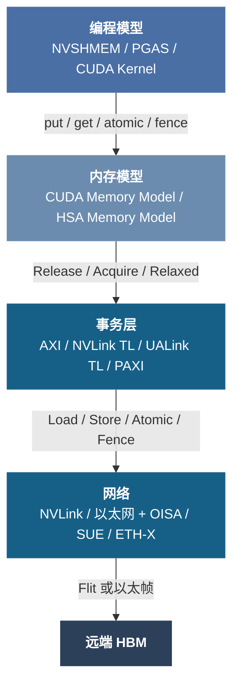
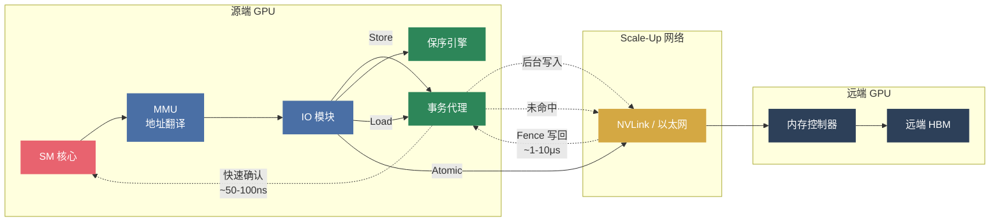

# 硬件内存语义

如果统一内存真的要成为超节点的软件基础，它首先就不能只是“远端显存也能被看到”这么简单。软件真正关心的，不是地址能不能指到远端，而是指过去之后，系统究竟承诺了什么：这次写入什么时候对别人可见，先后的顺序会不会被打乱，原子操作是不是仍然成立，一次同步到底是在等待本地完成、对端完成，还是整个系统都进入同一个可见状态。只有这些承诺被讲清，远端资源才可能在软件里表现得像一种稳定资源；否则，再高的带宽和再大的地址空间，也只会把“不确定性”更快地扩散到更大的系统里。

也正因为如此，统一访存必须先从语义讲起。实现可以各不相同，`GMMU`、`Fabric Address`、事务代理、导入导出接口都只是后续把承诺落地的方式；但在进入这些机制之前，首先需要回答的是：当多个 GPU 的显存被纳入同一个高带宽域时，系统究竟打算把远端内存组织成什么样的对象，又准备为上层软件承担哪些顺序、一致性和可见性义务。接下来这一节讨论的，正是这组最底层的前提，因为只有先把“系统承诺什么”说清，后面那些具体工程组织才不会沦为零散的功能拼装。

当多个 GPU 的显存被纳入同一个高带宽域时，远端内存访问为什么还能看起来像“本地可编程资源”？答案不在单一协议，而在一条从软件到硬件的完整语义链路。本节关心的是这条链路里**系统对上层做出的承诺**，而不是某一家厂商用什么模块去实现这些承诺。真正的分水岭恰恰在这里：如果承诺太弱，软件就不敢把远端资源当成稳定资源；如果承诺太强，硬件和协议又会迅速背上难以承受的复杂度与代价。

每一层都对上层做出语义承诺：编程模型承诺“远端访存像本地一样可编程”，内存模型定义可见性和顺序保证，事务层和网络负责在硬件上兑现这些保证。`Scale-Up` 互联正从早期的消息语义（显式 `Send/Receive`、`RDMA`，适用于 `Scale-Out` 松耦合场景）全面转向内存语义（隐式 `Load/Store/Atomic`，统一地址空间），`NVLink`、`UALink`、`OISA`、`SUE` 等主要新兴协议均采用后者。把视角收紧到事务层和网络层之后，问题也会变得更尖锐：硬件侧到底必须长出哪些机制，才能让上层内存模型的承诺不在真实系统里落空？换句话说，这条语义链路的完整程度，决定了硬件打开的可能性空间有多大；支持的语义越完整、保序机制越高效，软件可兑现的 `Goodput` 上限就越高。[^cuda-memory-model][^hsa-psa]

## AI 负载的访存特性

在单 GPU 内部，SM 核心发出的 Load/Store 指令经过片上网络直接到达 HBM 控制器，保序、原子性和一致性由芯片内部硬件保障，对软件完全透明。Scale-Up 互联将这些问题从"芯片内"扩展到了"芯片间"甚至"机柜间"——访存事务经过 IO 模块、交换网络、到达远端 GPU 再返回，每一跳都可能引入乱序、丢包和延迟不确定性。这不是理论问题：当 8 卡节点扩展到 64 卡甚至 256 卡的 Scale-Up 域时，远端访存路径的复杂度呈组合式增长，任何一跳的语义缺失都会成为整个系统的瓶颈。

当前 AI 负载对 Scale-Up 互联的需求可以通过两种代表性编程范式来理解，它们代表了截然不同的数据流模式：

| 维度 | DMA 搬运（Kernel 分离） | LDST 访存（Kernel 融合） |
|:-----|:----------------------|:------------------------|
| **典型应用** | DeepEP、Transformer Engine | FLUX 等算子融合框架 |
| **访存模式** | HBM-to-HBM，专用拷贝引擎 | SM-to-HBM，Load/Store 指令 |
| **数据粒度** | KB-MB 级，连续 | 1B-数十 KB，可能非连续 |
| **对互联要求** | DMA/RDMA 语义，批量传输 | 内存语义级端到端传输 |

**DMA 搬运**是今天最常见的跨 GPU 通信模式。以 MoE 场景中的 DeepEP 为例：Expert 并行需要在 GPU 间做 All-to-All 数据重分布，每次搬运的数据量在 KB 到 MB 量级，由专用拷贝引擎在后台批量完成，计算和通信可以流水线重叠。这类场景对互联的要求是"大带宽、可批量"，传统的 DMA/RDMA 语义足以胜任。

**LDST 访存**则是正在快速增长的新范式。FLUX 等算子融合框架将通信操作内嵌到计算 Kernel 中——SM 核心在计算过程中直接通过 Load/Store 指令读写远端 GPU 的 HBM，不再有独立的拷贝阶段。这消除了 Kernel 间的同步屏障和中间缓冲区拷贝，对小规模推理和延迟敏感场景尤其重要。但这意味着互联必须支持 SM 发出的每一笔 Load/Store/Atomic 操作都能正确到达远端并保序返回——这就是"内存语义"的本质要求。

Scale-Up 互联硬件**必须同时支持两种语义**。只支持 DMA 搬运的方案能处理批量集合通信，但无法支持融合 Kernel 的细粒度远端访存；只支持 LDST 访存而缺少高效拷贝引擎，则大规模 All-to-All 的吞吐无法达标。两种范式的共存，而非替代，决定了 Scale-Up 硬件必须提供从 DMA 批量传输到单笔 Load/Store 的全谱系语义支持。

需要指出的是，`DMA` 搬运与 `LDST` 访存是当前 `AI` 负载中最具代表性的两种远端访存范式[^eth-x-naming]，用于说明 `Scale-Up` 互联为什么必须同时支持批量搬运和细粒度远端访存。但它们不是对所有远端访存模式的穷尽分类——随着池化内存、异构 `XPU`、存算分离和新型运行时抽象的演进，未来可能出现不完全落入这两类的新模式。也因此，这里的讨论不能停留在“举两个例子”上，而必须继续往下分出三个递进层次：

| 层次 | 内容 | 示例 |
|:-----|:-----|:-----|
| **编程范式** | 工作负载如何组织远端访存 | DMA 搬运、LDST 访存等代表性模式 |
| **内存模型** | 语义约束与可见性规则 | Release / Acquire / Fence / Atomic |
| **硬件兑现机制** | 互联与端点如何在物理层面保证语义成立 | 保序引擎、事务代理、MMU、流控、重传、多路径约束 |

编程范式描述“负载需要什么”，内存模型定义“系统承诺什么”，硬件兑现机制决定“承诺如何落地”。三层必须分开理解：如果把编程范式层的两个代表性例子误读为内存模型或硬件机制的总分类，会不当地缩窄整个分析框架的适用范围。对第二章的行文来说，这里尤其要避免把**语义层**和**机制层**混写：这一节讨论的是系统愿意对上层承担什么义务，下一节才会进入 `GMMU`、`Fabric Address`、`IMEX`、事务代理与 `SU Engine` 等具体实现，去看这些义务为什么最终会长成那样一组工程对象。

## 访存语义

### 内存语义的定义

明确了 AI 负载的两种访存范式后，下一个问题是：互联硬件需要提供哪些语义原语？

把显存扩展成跨 GPU 的可访问资源，不是"能传数据"就够了。Scale-Up 域至少需要四类基本操作成立：**Load**（远端读）、**Store**（远端写）、**Atomic**（目标侧原子读-改-写）、**Fence**（建立顺序与可见性边界）。这四类操作在编程模型层有直接对应：PTX 指令集提供 `ld.global.acquire`、`st.global.release`、`atom.global.add`、`fence.sc.sys`；NVSHMEM 提供 `nvshmem_get`/`nvshmem_put`/`nvshmem_atomic_add`/`nvshmem_fence`+`nvshmem_quiet`。如果只有 Copy 语义（DMA 搬运）而没有这组操作，Scale-Up 域仍然只是"高带宽搬运网络"，无法支撑 SM 核心发起的细粒度远端访存。[^ptx-isa][^nvshmem-sc20]

这些操作在多线程、多 GPU 条件下遵循**释放一致性（Release Consistency）**模型——这是 CUDA Memory Model 和 HSA Memory Model 共同采用的弱序内存模型。其核心语义可以通过一个典型场景来理解：[^cuda-memory-model][^hsa-psa][^primer-coherence]

> **场景**：GPU-A 的 SM 线程写入一组参数到远端 GPU-B 的 HBM，GPU-B 的 SM 线程读取这些参数。如果 GPU-A 只用 Relaxed Store 写入，GPU-B 可能看到部分新值、部分旧值——因为弱序内存模型不保证跨 GPU 写操作的到达顺序。正确的做法是：GPU-A 在写完所有参数后执行 `st.release`（Release），GPU-B 在读取前执行 `ld.acquire`（Acquire）。Release 保证"这条写操作到达远端时，之前的所有写操作也已到达"；Acquire 保证"这条读操作返回时，之后的所有读操作都能看到 Release 之前的写入"。二者配对，形成**跨 GPU 的 happens-before 关系**。

CUDA 进一步引入 **scope** 概念（Block / Device / System），让程序员按通信范围选择保序粒度——Block scope 仅在线程块内有效，Device scope 在同一 GPU 内有效，而跨 GPU 通信必须使用 System scope，硬件代价也相应递增。满足一对 GPU 间的 Release 语义（**P2P 一致性**）可支持大部分点对点通信；但当通信模式涉及三个或更多 GPU——例如 AllReduce 中 GPU-A 写入 GPU-B、GPU-B 再转发给 GPU-C——就需要更昂贵的 System-scope **全局一致性**：GPU-A 的 Release 必须等待其对所有目标 GPU 的写操作都已完成，而不仅仅是对 GPU-B 的那一笔。这是 System Fence 代价高昂的根本原因。

### 乱序的产生与影响

语义定义本身不复杂，难的是它要穿过多个天然允许乱序和并行的硬件层次。这里的"难"不是理论上的难，而是工程上每个环节都有乱序的合理动机（为了性能），而保序必须在不显著牺牲性能的前提下恢复正确性。

**传输路径乱序**：Scale-Up 网络的多平面或 ECMP 负载均衡会把同地址的先后事务分到不同路径，后发的事务可能先到达。例如，GPU-A 先写 `addr_x = 1` 再写 `addr_x = 2`，两笔事务被分配到不同物理平面，如果第二笔更快到达远端，远端 HBM 中 `addr_x` 最终为 1——这是一个静默数据错误，没有任何异常信号。解决方式是对同地址事务施加一致的路径选择约束（如相同的 Flow Entropy），但这会在热点地址上造成路径不均衡，带来新的工程取舍。

**端点内部乱序**：GPU 与 IO 模块间的高性能总线（典型如 AXI）采用独立读写通道，其保序规则为"same AXI ID → ordered, different ID → out-of-order allowed"（AMBA AXI4 Specification），天然允许跨 ID、跨通道的乱序完成。具体而言：一笔 Read（AR 通道）和一笔 Write（AW/W 通道）指向同一地址但使用不同 AXI ID 时，协议不保证谁先到达内存控制器——即 RAW（先写后读）语义可能被打破。此外接收端不同 HBM 控制器的执行延迟也可能不同，两个通道分别打向不同 HBM bank 时完成时间可能相差数十纳秒。两者叠加，使保序成为需要在整条数据通路上逐跳解决的系统性问题。[^arm-axi4]

**多 IOD 负载均衡破坏全局语义**：当 GPU 通过多个 IOD（IO Die）连接 Scale-Up 网络时，相当于有多个并行的出口平面。两笔分别经过不同 IOD 的事务，即使各自在单 IOD 平面内保序正确，全局顺序也可能不一致——因为不同 IOD 平面的排队深度、网络拥塞、路径长度都不同，且平面间没有细粒度的时序协调。这意味着"一对 GPU 间语义正确"不能自动推出"整个 Scale-Up 域语义正确"，System Fence 必须跨所有 IOD 平面做全局排空。

**三类乱序的系统代价——从协议细节到 Goodput 兑现率**：上述三类乱序不只是协议或硬件设计层面的细节问题，它们直接决定了系统可兑现的 Goodput。传输路径乱序引发的静默数据错误会导致训练发散或推理结果不可复现，一旦发生则整个作业需要回滚重启——这不是"偶尔降速"，而是"系统不可用"。端点内部乱序的保序代价如果过高，会压缩同一时刻 Outstanding 事务数量，直接拉低训练阶段的有效吞吐。多 IOD 全局排空的延迟则表现为 System Fence 的长尾——在推理场景中，一次 Fence 阻塞可能将 P99 尾延迟拉高数倍，对服务质量产生不可接受的影响。更进一步，这些时序行为还直接影响**软件迁移成本**：如果不同互联方案在保序语义细节上存在差异（例如 Fence 粒度、代理行为、多路径约束），为一种方案调优的集合通信库或算子融合框架在另一种方案上可能出现正确性回退或性能退化，生态碎片化由此而来。因此，评估 Scale-Up 互联方案时，保序能力不应被视为协议层的功能清单项，而应被视为**决定 Goodput 兑现率的系统级约束**——这也是下一节"硬件如何兑现语义"和后文"对参考设计的含义"持续追踪的主线。

### 保序机制

上面的分析确立了两个事实：`AI` 负载需要完整的内存语义支持，而传输路径上的多层乱序让语义兑现变得困难。这些乱序最终都要被硬件机制重新收束。这里仍然站在语义层的视角，只讨论**为了让承诺成立，系统至少需要承担哪些实现义务**；至于这些义务在真实系统里为什么会进一步长成 `GMMU`、路由表、协调守护进程和数据路径模块，则留给下一节。关键不在于单个机制是否存在，而在于这些机制能否组成闭环：既保证语义正确，又不把延迟和吞吐代价推到不可接受的程度。下表给出六个机制义务的全局视图：

| 机制 | 一句话功能 | 解决的乱序/语义问题 | 延迟量级 |
|:-----|:----------|:-------------------|:---------|
| 同地址保序引擎 | 检测同地址 RAW/WAR/WAW 依赖，选择性串行化 | 端点内部乱序（AXI 跨 ID） | 接近零（仅增加比对延迟） |
| 事务代理 | 本地快速确认 Store，后台异步写入远端 | 写延迟过高导致队列阻塞 | ~50-100ns（本地确认） |
| System Fence | 等待所有 buffered writes 写回远端并确认 | P2P → 全局一致性 | ~1-10μs（全局排空） |
| 专用 SU Engine | 绕过 GPU 核心总线的 P2P 拷贝引擎 | Copy/Access 保序域冲突 | 与网络延迟一致 |
| 远端原子执行 | 在目标内存控制器侧执行 Atomic 操作 | 分布式原子性（Lost Update） | ~0.5-2μs（不可代理） |
| MMU 与地址翻译 | 虚拟地址 → 物理地址 + 路由（本地/远端/系统） | 统一虚拟地址空间 | ~数十 ns（TLB hit） |

以下逐一展开。

**同地址保序引擎**：在 IOD 内部或 GPU 侧接口实现的硬件逻辑，实时检测同地址事务之间的读写依赖（RAW/WAR/WAW），只对存在依赖的事务收紧顺序，允许不同地址的事务继续乱序执行。其实现通常需要维护一个正在进行中（in-flight）事务的地址表，每笔新事务与表内已有事务做地址比对——匹配到则串行化，否则放行。这是"选择性保序"的关键：全局串行保序简单但吞吐崩塌，完全不保序则语义错误，保序引擎在二者之间找到精确的折中点。

**事务代理（Transaction Proxy）**：Push 事务（Store/Write）在本地代理处获得快速确认（~50-100ns），释放 GPU 核心队列槽位，后台由代理完成跨域传输。这个设计的意义在于：GPU SM 发出一笔远端 Store 后，如果必须等待数据真正到达远端 HBM 才能继续（以太网方案需 0.5-2μs，NVLink 约 100ns），SM 内可同时执行的事务数量受限于 Outstanding queue 深度——在大多数 GPU 中只有十几到几十个槽位。代理通过在本地立即回复确认，把这个等待时间从微秒级压缩到数十纳秒级，同等队列深度下并发写吞吐提升约一个数量级。但代理引入了两个正确性问题：后续 Load 命中 buffered writes 时必须返回最新值（类似 CPU store buffer forwarding），System Fence 到达时必须把所有脏数据写回远端并等待真实确认后才能放行。[^pooling-whitepaper]

**System Fence**：从 P2P 一致性走向全局一致性的关键机制。当程序执行 `fence.sc.sys` 或 `nvshmem_quiet` 时，硬件必须确保该 GPU 之前的所有写操作对所有远端 GPU 可见——这意味着等待事务代理中所有 buffered writes 被真正写入远端 HBM 并收到确认。如果该 GPU 同时对 8 个远端 GPU 有未完成写操作，Fence 阻塞时长取决于最慢的那条路径，可达数微秒甚至十余微秒。在延迟敏感的 FLUX 类 Kernel 中，每个 Fence 都是一次吞吐悬崖。因此更现实的设计是引入**基于区域的一致性域**——由软件标注"这组写操作只需要对 GPU-B 可见"，硬件只排空到 GPU-B 的 buffer，而非全局排空。这把 Fence 的平均代价从最坏情况拉回到实际通信模式所需的最小范围。[^cuda-memory-model][^nvshmem-sc20][^pooling-whitepaper]

**专用 Scale-Up 拷贝引擎（SU Engine）**：直觉上，GPU 已经有 Copy Engine（用于主机-设备间拷贝），为什么不能复用？问题在于原生 Copy Engine 的数据路径：它从 HBM 读出数据，经片上总线送到 IO 模块，IO 模块封装后发到网络——但对于 P2P 拷贝，数据需要先从源端 HBM 读到 GPU 核心侧，再从 GPU 核心侧送到 IO 模块，造成总线流量翻倍。此外原生引擎不理解 Scale-Up 事务的地址映射和保序域，会引入不必要的全局 Fence。在 IOD 内实现专用 SU Engine 可以直接从网络侧接收数据写入本地 HBM（或反方向），绕过 GPU 核心总线路径，同时让 Copy 语义与 Access 语义在顺序模型和屏障域上适度解耦——Copy 使用自己的 Fence 域，不干扰 SM 发出的 Load/Store 事务。

**远端原子执行**：Atomic 操作（如 FetchAdd、CAS）必须在目标地址所在 GPU 的内存控制器侧执行，不可在源端模拟。原因直接：如果 GPU-A 和 GPU-B 同时对 GPU-C 的同一地址做 FetchAdd，只有在 GPU-C 的内存控制器处串行化这两笔操作，才能保证返回值的正确性。如果在源端各自读-改-写再写回，就退化成了经典的 Lost Update 问题。这要求网络能够携带原子操作类型信息到达远端，远端 IOD 或内存控制器在接收后执行原子操作并返回旧值。其延迟特征与 Load 相当（~0.5-2μs），但不可被事务代理加速——因为必须等到远端真正执行完毕才能返回结果。

**MMU 与地址翻译**：GPU 上的 Load/Store 指令使用虚拟地址，MMU 通过页表项（PTE）完成地址翻译。关键在于 PTE 不仅包含物理地址，还包含路由信息：典型实现中，Aperture 字段区分本地访问、Peer 访问和系统内存访问，Peer Index 字段指示目标 GPU 编号。MMU 查表后，本地访问直接送往 HBM 控制器，远端访问则路由到 IO 模块，IO 模块再通过地址映射寄存器将 GPU ID 翻译为网络地址（如端口号或以太网 MAC）。这套翻译链路的效率直接影响远端访存延迟——TLB miss 导致的页表 walk 可能增加数百纳秒。NVIDIA 的 GMMU 是这一通用机制的典型代表，其 Aperture/Peer/Fabric 地址路由将在下一节详细展开。

不同互联方案在地址空间的定义层级上存在根本性分歧。UALink 在 Fabric 规范层面定义了 57-bit 统一物理地址空间（128 PB），任何加速器可用同一组 Fabric 地址直接寻址其他加速器的内存，无需厂商间额外的地址翻译协调——这使得异构多厂商部署中，GPU-A（来自厂商 X）可以用与 GPU-B（来自厂商 Y）相同的地址格式完成远端访存。相比之下，以太网增强方案（SUE 等）将 Fabric 定位为传输层，地址翻译由各 XPU 厂商自行实现（SUE 规范明确指出"Address translation, when required, is handled by the XPU outside of the SUE instance"），跨厂商的内存操作需要额外的软件翻译层。NVLink 则在私有生态内通过 NVSwitch 实现全对称编址，效果类似 UALink 但限于 NVIDIA 设备。[^ualink-spec][^song-survey][^hopper-nvswitch]

在更大的 Scale-Up 域中，统一虚拟地址还面临三种模式的取舍：硬件全对称编址（所有 GPU 共享统一页表，最透明但扩展受限）、Page-fault 驱动的按需映射（灵活但延迟不可预测）、以及 PGAS 模型（由程序显式管理，开销最低但对应用侵入最大）。UALink 的 Fabric 级统一寻址降低了第一种模式的跨厂商复杂度，但 128 PB 地址空间的实际利用效率仍取决于各加速器的 MMU 实现质量。

把这条路线放回近十多年的演进脉络里看，NVIDIA 实际上是在分层推进同一个问题。早期 `CPU` 与 `GPU` 仍然是典型的分离内存管理，程序显式区分主机内存、设备内存与拷贝路径；`UVA` 先解决统一编址与指针可见性问题，让不同内存空间进入同一套虚拟地址表达；`Unified Memory` 再把“地址统一”推进到“迁移由运行时托管”，通过页错误、迁移与预取接管部分数据移动成本。问题也恰恰出在这里：一旦访问落入 page-fault 慢路径，地址转换、迁移与重放开销就会重新回到关键路径上。也正因为如此，`NVLink-C2C` 的推进意义不在于又多了一种统一内存 API，而在于它开始把统一编址、硬件地址转换、缓存行粒度远端访问和分层迁移管理压到同一个系统边界里。被持续推进的，从来不只是“编程更方便”，而是**远端内存究竟能在多大程度上被兑现为一种稳定、可持续使用的系统资源**。[^cuda-uva][^cuda-um][^gpu-demand-paging]

### 工程约束

前面从上到下回答了"需要什么语义"（四类操作 + 一致性模型）和"靠什么机制实现"（六个硬件机制形成闭环）。最后一个问题是协议层面的：这些语义事务如何被封装、带出芯片、穿过网络到达远端？不同的协议选择在传输效率、延迟和生态兼容性上有显著差异。

如果说前文讨论的是"互联层必须承载哪些语义"，那么工程实现还要回答另一个更具体的问题：**怎样把这些语义稳定地暴露成一个可被不同芯片、不同拓扑和不同链路形态共同使用的接口层。** 对超节点而言，互联层的价值不只是把一笔 `Load/Store/Atomic` 事务送到远端，而是让上层软件可以把"远端内存"当成可持续使用的资源。这要求互联层同时满足三个条件。

第一，**数据路径必须尽可能保持零拷贝**。跨节点访问如果频繁退化为"主机中转 + 软件拷贝"，则内存语义会迅速失真为消息语义，CPU 重新回到关键路径。真正可用的互联层需要把虚拟地址转换、远端地址映射和目标定位尽量前移到硬件或低层运行时中，使计算节点与存储/对端节点之间能够通过直接访存完成数据交换。这也是为什么虚拟地址到远端物理位置的翻译链路，会成为互联层设计的一部分，而不只是驱动实现细节。

第二，**接口语义必须对上屏蔽芯片差异，对下适配不同链路形态**。开放生态中的现实约束是，不同加速器在寄存器组织、中断机制、队列模型和地址映射方式上并不一致。若这些差异直接暴露给上层通信库，那么所谓统一内存语义只会停留在概念层。更合理的做法，是在互联层抽象出统一的事务接口，把设备差异收敛在适配层内，让上层始终面对一致的"远端可读写、可原子、可同步"模型。换句话说，互联层不仅承担传输职责，也承担语义归一化职责。

第三，**传输层必须提供足够强的可靠性与流控能力，保证内存语义不会在链路层被破坏。** 内存语义比消息语义更敏感，因为上层默认一次远端读写就是一次正确的内存操作，而不是一条可以稍后重发、由软件重组的消息。因此互联层通常需要联合使用 credit 流控、链路级重传、FEC、优先级队列与拥塞反馈等机制，在不显著拉高延迟的前提下保证事务连续性和顺序边界。特别是在光交换或多跳交换场景下，链路切换、瞬时误码和拥塞扩散都会直接表现为可见性抖动或长尾延迟；如果没有足够强的链路层保护，前文讨论的一致性与保序语义在系统层面就难以真正成立。

因此，从实现角度看，互联层内存语义并不是"协议里多几个读写事务类型"这么简单，而是一个由**统一事务接口、地址翻译链路、零拷贝数据路径以及可靠传输机制**共同构成的工程闭环。只有这个闭环完整，上层的 PGAS、单边通信和统一内存运行时才有可持续构建的基础。

#### 一个更具体的工程落点：面向光交换的内存语义接口

如果把上述抽象要求进一步落到国产开放生态，一个更具体的问题就会出现：**能否在光交换场景下，把内存语义接口做成既兼容国产 GPGPU 和其他国产计算芯片、又能承接多芯片互联和多种组网模式的统一硬件接口？** 这个问题的难点，不只在于链路速率做到多高，而在于光链路切换、异构芯片接口差异和内存语义的时序要求会同时施加约束。换句话说，互联层不再只是"把 AXI 事务送出去"，而是要把"可编程的远端内存访问"稳定投射到一个动态链路和异构端点共同组成的系统中。

以国产 GPGPU 与其他国产计算芯片为代表的适配目标，可以把这类接口的工程要求概括为四组能力：

| 维度 | 目标 | 对应的系统含义 |
|:-----|:-----|:---------------|
| **统一内存语义** | 支持 UVA、跨节点内存共享、计算节点到存储节点的直接访存 | 让远端资源在软件上表现为可编址、可零拷贝访问的内存，而不是退化成消息搬运 |
| **多芯片兼容适配** | 屏蔽不同国产芯片在寄存器、中断、队列和映射机制上的差异 | 让内存语义接口成为上层公共承载面，而不是每接一种芯片就重写一套驱动 |
| **低延迟高带宽传输** | 带宽达到 1.6 Tbps/卡，P2P 模式 OTT 低至 170 ns，单跳交换模式 OTT 小于 1 μs | 让内存语义不止"可用"，而是真正能承接融合 Kernel 和高频小事务 |
| **可靠传输与流控** | 信用流控、链路/端到端重传、多档 FEC、拥塞控制、优先级隔离 | 保证光交换和多跳组网下事务连续性不被链路层抖动破坏 |

从这四组能力出发，可以把接口微架构理解为一条连续的数据路径：**上游由 GPU/NPU 发出统一的内存事务，下游通过光交换网络把事务稳定送达远端内存或远端寄存器，中间则靠适配层、地址翻译层和可靠传输层共同把语义补齐。** 其中最核心的不是某个单点模块，而是三层衔接是否完整。

第一层是**语义与地址层**。它要求接口支持基于虚拟地址转换的远端地址映射，使计算节点与存储节点之间能够直接进行内存访问；同时还要支持 Remote Chip Register Access，把"访问远端内存"与"访问远端控制面寄存器"放入同一套事务体系中。对上层运行时而言，这一层的价值在于把计算资源、内存资源和部分远端设备控制统一纳入可编址空间，为 UVA、PGAS 和单边通信提供落点。

第二层是**适配与封装层**。在开放生态里，不同国产芯片在寄存器地址布局、中断机制、doorbell 形式、完成队列语义上并不一致，因此需要一个统一接口把这些差异收敛起来。这里可把 AMBA/AXI 一类片上接口视为设备侧的共同承载面：上游芯片仍按本地事务模型发起读写，互联接口负责完成地址重写、事务分类、优先级标记和链路侧封装。这样做的意义不是追求"所有芯片完全同构"，而是把差异约束在适配层中，让上层始终面对一致的内存语义接口。

第三层是**传输与可靠性层**。面向光交换的内存语义接口不能只追求峰值带宽，还必须对链路切换、误码和拥塞具备韧性。一个较完整的设计通常同时包含：inside credit 流控、传统以太网 `PFC/PAUSE`、支持最多 1024 个 RC 队列的 `CBFC`、对 `RC_REQ/RC_ACK/TYPE_2/TYPE_3` 四类数据流的独立流控、面向 `ECN/CNP + DCQCN` 的软硬协同拥塞控制，以及按链路条件切换的多种可靠性机制，例如交换机侧 `L1-retry`、SUE 的 `AFH/LLR/CBFC` 组合以及通用交换场景下的 `End-to-End retry`。这些机制共同解决的，不是"链路会不会出错"这种宽泛问题，而是**一旦链路切换或瞬时误码发生，内存事务是否还能保持连续、可恢复且顺序边界不失真。**

从指标上看，这类接口的价值在于同时覆盖三种典型组网模式，而不是只优化一种理想路径：

| 模式 | 目标指标 | 工程意义 |
|:-----|:---------|:---------|
| **P2P-Mode** | 400G 条件下 OTT 低至 170 ns | 面向最短路径、最强确定性的点对点内存语义访问 |
| **Switch-Mode** | 单跳组网端到端 OTT < 1 μs，RTT < 2 μs | 面向机内/机柜内交换网络，把统一内存能力扩展到更大拓扑 |
| **Board-Mode** | OTT 低至 90 ns | 面向板级或封装内更短距离互联，逼近片间直连语义 |

这些指标本身也揭示了协议设计的几个关键抓手。为了在 400G 乃至更高速率下把 RTT 压到百纳秒量级，协议头必须足够短，小包必须支持 merge，事务确认路径要尽量避免软件介入，FEC 和重传也不能采用过重的通用做法。以用户给出的目标为例，接口不仅要兼容标准以太网协议，还要兼容 SUE 所需的 `AFH/LLDP/CBFC/LLR` 等机制；不仅要支持 `256B` 负载下 `85%+` 的交换模式效率，也要在 `4096B` 负载下达到 `95%+` 的效率，并接受 SUE 额外带来的 `TX 9clk / RX 11clk` 延迟开销。换句话说，**这不是单纯拼 PHY 速率，而是在报文格式、缓冲策略、重传粒度和流控反馈上做系统级联调。**

对参考设计而言，这类指标还有两个特别重要的启发。其一，**开放生态的内存语义接口必须天然支持多拓扑共存**，至少要覆盖 `P2P`、交换网络和板级互联三种模式；否则同一套运行时无法在封装内、整机内和机柜内平滑复用。其二，**兼容性本身就是第一性约束**。如果不能把国产 GPGPU 以及其他国产芯片的接口差异收敛到统一适配层，那么所谓内存语义只能停留在单厂闭环里，很难形成真正可扩展的软件生态。

从验证方法看，这类接口也不能只看实验室中的单点时延，而需要同时覆盖四类测试：64B 到 1MB 不同报文尺寸下的带宽/时延测试；在不同国产芯片环境中的联调与兼容性日志；72 小时稳定性与自动恢复成功率统计；以及信号完整性、环回和链路降速等硬件层测试。只有这些测试同时成立，"带宽 ≥ 1.6 Tbps/卡、连续 72 小时可靠性 ≥ 99.99%" 这样的指标才具有系统意义，而不只是某个理想场景下的峰值数字。

**设备侧接口**：开放 Scale-Up 方案普遍采用 AMBA AXI4 作为 GPU 到 IOD 的数据通路接口（ETH-X 的 PAXI、UALink 的事务层均以 AXI 事务为封装对象）。AXI 的五通道架构（AW/W/B/AR/R）提供读写通道分离、基于 Transaction ID 的乱序完成和 Outstanding 事务并行，是高吞吐的基础，但 ID-based ordering 规则也正是前文"端点内部乱序"的硬件根源——同 ID 严格有序、跨 ID 允许乱序意味着保序引擎必须在此之上补齐跨 ID 的地址依赖检查。除 AXI 外，CHI（AMBA 一致性协议，原生支持 Snoop/Directory）、TileLink（RISC-V 生态开源总线，支持一致性扩展）、以及厂商私有协议（如 NVLink 内部接口）也是可能的选择，核心取舍在于开放生态兼容性、协议复杂度与原生一致性能力之间的平衡。[^arm-axi4][^eth-x-v1][^ualink-spec]

**CXL 的角色**：CXL（Compute Express Link）3.0 定义了 CXL.mem 和 CXL.cache 两个子协议，在 PCIe PHY 之上提供硬件级内存语义，支持主机与设备间的缓存一致性访问和内存池化。CXL 3.0 进一步引入 fabric-attached memory，允许多个主机通过 CXL 交换机共享远端内存池——这与 Scale-Up 域的统一寻址目标高度重合。UALink 白皮书也明确将"CXL memory expansion"列为未来方向之一。但 CXL 的 PCIe PHY 基础限制了其带宽上限和延迟下限，当前更适合 CPU-GPU 间的内存扩展和异构内存池化场景，而非 GPU-GPU 间的高带宽 Scale-Up 互联。未来 CXL 与 UALink/NVLink 的关系更可能是互补而非替代：CXL 负责内存池化和异构访问，UALink/NVLink 负责 GPU 间高带宽通信。[^cxl-3][^ualink-spec]

**链路/网络侧承载**可分为两大路线：Flit 原生总线方案（NVLink、UALink）和以太网增强方案（OISA、SUE、ETH-X PAXI）。

| 特性 | NVLink / UALink | 以太网增强（OISA / SUE / ETH-X PAXI） |
|:-----|:----------------|:--------------------------------------|
| **封装方式** | 固定 Flit，原生内存语义 | AXI 事务 → 以太帧（帧头设计各异） |
| **帧头开销** | 极小（UALink 控制半 Flit 32B 含多事务） | OISA TLP ~20B；SUE AFH 压缩仅 6B；ETH-X PRI 压缩帧 |
| **事务粒度** | 64-256B 固定事务（UALink），确定性缓冲分配 | 可变长以太帧封装，效率依赖聚合策略 |
| **链路利用率** | ~93-95%（UALink 目标 93%，TL 数据效率 95.2%） | ~56%（标准帧）→ ~74-77%（压缩 + 聚合） |
| **端到端延迟** | <100ns（NVLink 单跳）；亚微秒（UALink 规范目标） | 0.5-2μs（交换芯片转发 ~250ns） |
| **流控机制** | UALink：三层独立信用域（UPLI / TL / Switch），单跳 6 组信用环路；NVLink 内建 | LLR + CBFC（链路层单层信用，各方案均已支持） |
| **地址空间** | UALink：Fabric 级 57-bit 统一寻址（128 PB）；NVLink：私有统一寻址 | 地址翻译由 XPU 厂商实现，Fabric 仅负责传输 |
| **交换芯片** | 专用（NVSwitch 已量产；UALink Switch 2026 评估硬件） | 复用/增强标准以太网交换芯片 |
| **网内计算** | SHArP（NVSwitch） | CCA（OISA）；UALink/SUE 暂未支持 |
| **生态** | 私有（NVLink）/ 115+ 成员开放联盟（UALink） | 成熟以太网生态 |

尽管帧格式和具体机制不同，各方案在协议设计上正呈现明显的收敛趋势：均采用交换芯片构建全互联拓扑、追求紧凑包头和事务聚合以提高有效载荷率、在流控上从 PFC 向 CBFC 演进、在重传上以数据链路层重传（DLR/LLR）为主而非事务层重传。但一个根本性分歧正在浮现：**内存语义在协议栈的哪一层定义？** UALink 选择在 Fabric 规范层面定义统一地址空间和内存语义（read/write/atomic + 57-bit 统一物理地址），使 Fabric 本身成为一个"内存域"；以太网增强方案则将 Fabric 定位为传输层，内存语义由各 XPU 厂商在端点实现。前者的好处是跨厂商互操作天然统一，代价是需要专用交换芯片和完整的协议栈重新设计；后者的好处是复用成熟以太网基础设施，代价是跨厂商的远端内存操作需要额外的软件翻译层。以太网方案用约 20% 的传输效率损失换取了与标准以太网 PHY、交换芯片和管理工具链的兼容性。总线方案效率更高但需要专用生态。[^eth-x-v1][^song-survey][^ualink-spec][^ualink-pike][^hopper-nvswitch]

## 设计参考

### 统一编址与分层访存

`Grace Hopper` 的代表性，不在于“GPU 可以看到 CPU 内存”这件事本身，而在于系统已经开始把 `CPU LPDDR` 与 `GPU HBM` 组织成统一编址、分层访问、动态迁移的异构内存系统。[^gh200-whitepaper]

这一路线最关键的变化，是地址翻译链条被明显前移。依托 `NVLink-C2C`、`ATS` 与 `Grace CPU` 侧 `SMMU`，系统分配内存可以由 `CPU` 与 `GPU` 共享同一套系统页表；对 `GPU` 而言，访问系统分配内存时不再必然退化为早期 `CUDA Managed Memory` 那种“先触发 GPU 页错误、再由运行时补页和迁移”的软件主路径，而是可以先通过硬件地址转换与缓存行粒度的直接远端访问建立可用路径。页迁移并没有消失，但“访问能否成立”和“页面是否值得迁移”这两个问题，开始被拆开处理：前者更多由硬件地址转换与一致性机制保障，后者再交给运行时按热度与压力做优化。[^gh200-hpc]

但这并不意味着 `Grace Hopper` 已经把 `CPU` 和 `GPU` 做成了一个完全对称、完全扁平的单体内存。更准确地说，它仍然保留了清晰的分层结构：系统分配内存依赖 `CPU` 侧系统页表，`cudaMalloc` 一类设备分配仍然保留 `GPU` 本地页表与设备侧管理路径；从操作系统视角看，`LPDDR` 与 `HBM` 依然更接近两个不同的 `NUMA` 层级，只是运行时和硬件现在能够更积极地根据 first-touch、访问热度和内存压力，在两层之间改变物理驻留位置。**这说明统一地址空间不等于对称内存，更不等于“所有远端访问都已经变成本地访问”；它真正改变的，是跨层使用这些内存资源的成本结构。**[^gh200-hpc]

这一路径继续往外推，就形成了 `Grace Hopper` 在 `NVLink Switch System` 中提出的扩展 GPU 内存（`EGM`）概念：远端 `Grace` 侧 `LPDDR` 可以被网络中的 `Hopper GPU` 直接映射和访问，从而把“GPU 可用内存边界”从本地 `HBM` 容量推进到受控域内更大的系统内存池。这里最值得吸收的判断，不是“显存变大了”，而是：**页表、地址翻译、迁移策略和一致性机制，已经开始共同决定超节点里什么资源可以被软件当作稳定资源来使用。** `Grace Hopper` 展示的不是统一内存的终局，而是一个过渡阶段的清晰形态：它证明了硬件协同内存管理的现实价值，也把分层延迟、非对称一致性和运行时迁移这些系统代价一并暴露了出来。[^dgx-gh200-whitepaper]

### 端到端数据通路

**三条路径的延迟特征**：

- **Store**：常态下代理本地确认 ~50-100ns，SM 不阻塞；Fence 触发时回收全部代价 ~1-10μs
- **Load**：代理命中 buffered writes 则直接返回；未命中走网络，端到端 ~0.5-2μs
- **Atomic**：必须在远端内存控制器原子执行后返回，延迟与 Load 相当，不可代理

核心取舍：**常态路径上代理把 Store 延迟压到本地级别，Fence 把积累的全部代价一次性回收**。Fence 越少、缓冲区越深，常态吞吐越高，但单次 Fence 代价越大。上述延迟参数（Store 代理 ~50-100ns、Load 端到端 ~0.5-2μs、Fence 全局排空 ~1-10μs）将在第三章建模仿真中用于量化不同参考设计的 Goodput 影响。

## 小结

到这里可以回过头看一个完整的图景：跨设备内存要被上层软件当作稳定资源来使用，不能只停留在"能搬数据"——四类操作必须成立，三类乱序必须被化解，六项机制必须形成闭环，协议层必须把语义完整地封装、传输并在远端还原。少了其中任何一个环节，统一内存都只能停留在概念层。

但这些能力不是免费的。语义越完整，硬件与协议栈就越复杂：保序引擎约束乱序、事务代理隐藏写延迟、Fence 建立全局可见性边界、MMU 把远端内存纳入统一寻址——每一项都在延迟、面积和功耗上有工程代价。真正的问题不是"能不能做统一内存"，而是**为了更高的软件兑现上限，愿意支付多大的一致性代价与实现复杂度**。

这个问题在当前的协议竞争中表现得最为直接。NVLink/NVSwitch 在私有生态内实现了完整的硬件级内存语义与极低延迟，是事实上的帕累托基准，但规范演进由单一厂商控制。UALink 试图用开放联盟的方式复制同样的"Fabric 即内存域"模型——在 Fabric 规范层面定义统一物理地址空间和内存语义，代价是交换芯片仍处于评估阶段。以太网增强方案（OISA / SUE / ETH-X）则坚持把 Fabric 定位为传输管道、内存语义由端点实现，用 ~20% 的传输效率损失换取成熟以太网生态的复用。三条路线不是"谁更快"的简单排序，而是在**语义完整性、生态开放性和实现复杂度**之间做出不同的帕累托选择。

这些选择对超节点的影响也不止于协议层。硬件提供的语义越完整，上层运行时和通信库就越容易把远端内存当作可编程资源来组织；反过来，如果底层语义长期摇摆或过于碎片化，软件生态就不得不反复支付适配和迁移成本，而不是沉淀出可复用的资产。换句话说，语义定义的稳定性本身就是一种系统级收益——它决定了软件资产能积累多快、迁移成本有多低、生态能长到多大。

接下来的问题是：这些语义承诺在一个真实系统中如何被落地？从 GMMU 页表到 Fabric Address 编码，从 Fabric Manager 初始化到 IMEX 跨节点协调——下一节将用 NVIDIA 的实现剖面来回答这个问题。

## 参考文献
[^eth-x-naming]: ETH-X 将这两种模式分别称为 Direct Copy 和 Direct Access。本文采用更通用的机制命名以避免与特定协议绑定。

[^cuda-memory-model]: NVIDIA, *CUDA C++ Programming Guide*, Chapter 12: Memory Model.
[^ptx-isa]: NVIDIA, *PTX ISA Reference*.
[^nvshmem-sc20]: Aggarwal et al., *NVSHMEM: GPU-Initiated Communication for NVIDIA GPU Clusters*, SC20.
[^hsa-psa]: HSA Foundation, *HSA Platform System Architecture Specification*.
[^arm-axi4]: ARM, *AMBA AXI4 Protocol Specification*.
[^primer-coherence]: Sorin, Hill & Wood, *A Primer on Memory Consistency and Cache Coherence*, 2nd Ed.
[^gh200-whitepaper]: NVIDIA, *NVIDIA Grace Hopper Superchip Architecture*.
[^gh200-hpc]: *Harnessing Integrated CPU-GPU System Memory for HPC: a First Look into Grace Hopper*.
[^dgx-gh200-whitepaper]: NVIDIA, *NVIDIA DGX GH200 AI Supercomputer Whitepaper*.
[^cuda-uva]: NVIDIA, *CUDA C Programming Guide*, sections on Unified Virtual Addressing.
[^cuda-um]: NVIDIA, *Unified Memory for CUDA Beginners*; and *CUDA C Programming Guide*, sections on Unified Memory and prefetch/advice APIs.
[^gpu-demand-paging]: J. Power et al., *Supporting x86-64 Address Translation for 100s of GPUs on a Commodity Server*; and *Improving GPU Memory Oversubscription Performance*, HPCA.
[^eth-x-v1]: ODCC, *ETH-X Scale Up 互联协议白皮书 V1.0*（ODCC-2025-03002）.
[^pooling-whitepaper]: ODCC, *AI 超节点内存池化技术白皮书*（ODCC-2025-03004）.
[^song-survey]: Song et al., *Survey of Intra-Node GPU Interconnection in Scale-Up Network*, Future Internet 2025, 17, 537.
[^ualink-spec]: UALink Consortium, *UALink 200G 1.0 Specification* (April 2025) and *UALink 1.0 White Paper*.
[^ualink-pike]: Pike, J., *UALink: An Open, High-Efficiency Scale-Up Interconnect for AI*, TASK Consultancy.
[^hopper-nvswitch]: NVIDIA, *NVIDIA NVLink and NVSwitch*, in *NVIDIA Hopper Architecture Whitepaper* and Hot Chips presentations.
[^cxl-3]: CXL Consortium, *Compute Express Link Specification, Rev. 3.0*.
