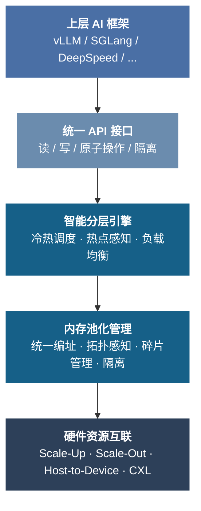

# 内存池化技术

如果说前两节已经回答了“远端资源在语义上是什么”，“这些语义在机制上怎样成立”，那么接下来要面对的问题就是：这些能力究竟能不能被用好。因为统一内存一旦进入真实系统，难点很快就不再是“地址能不能打通”，而是数据该放在哪里、什么时候迁、什么该留在本地、什么可以下沉、什么必须隔离、什么值得回收。到这一步，系统面对的已经主要是调度问题。

也正因为如此，统一内存是否真正成立，最终看的是它能否被组织成收益。远端资源可访问，只是起点；如果放置、迁移、复用和回收的成本失控，那么“统一内存”很快就会退化成一个看起来容量更大、实际上更难用的系统。下面这一节讨论的，正是软件如何在多层级异构存储之间做出这些策略性选择，把已经打开的硬件能力转化成稳定收益。

## 池化需求

前两节已经把一条主线逐步讲清：远端内存之所以能够进入同一个系统视野，不只是因为链路更快了，而是因为底层语义、地址空间和访问机制被一点点组织起来，原本分散在不同设备上的资源才开始具备“可被统一看待”的前提。但走到这里，问题其实才刚刚开始。硬件已经回答了**“能不能访问”**，接下来真正决定系统结果的，是这些被打通的资源能不能被持续、稳定地用好。

本节要回答的是更上层的问题：**"如何高效地管理和调度这些分散在多层级、多节点上的异构存储资源？"** 前面已经建立起来的内存语义和统一寻址能力，是池化能够成立的前提——没有硬件级的 `Load/Store` 语义和全局地址空间，池化调度器就无法把远端 HBM 当作真正可调度的资源；但光有“可访问”还不够，系统软件还必须在多层级异构存储之间持续做出放置、迁移和回收决策。统一内存之所以能成为软件章的第一个例子，正因为它最直接地体现了这一点：硬件打开了跨设备内存的可达性，软件决定这种可达性能否稳定兑现为 Goodput。也正因此，统一内存不是“能访问远端显存”这么简单，而是能否把位置差异、一致性代价、迁移时延、隔离成本和恢复复杂度压缩到调度器仍能稳定控制的范围内。

AI 超节点的存储体系是高度分层化与异构化的：片上 L1/L2 Cache、高带宽显存（HBM）、DDR 主存、PCIe/CXL 扩展内存以及本地 NVMe/SSD，性能与容量跨越数个数量级。模型在训练与推理过程中，数据需在多层存储之间频繁搬移，而任何环节的延迟与带宽瓶颈都将直接制约整体计算效率。现有架构面临两个核心挑战：

1. **手动管理复杂度高**：多 GPU 训练场景中，模型参数和激活值需要显式地从 HBM 迁移到 CPU DRAM 再到 SSD，调用频繁、管理繁琐，容易引发内存溢出和数据一致性失效。
2. **跨域带宽鸿沟**：CPU 主存（DDR）与 GPU 显存（HBM）之间带宽差异显著且缺乏统一内存语义的底层直连协议，数据往往需要中转，导致延迟放大和吞吐率下降。

内存池化技术从系统层面打破这种割裂状态：通过构建统一寻址空间与统一内存语义，结合 NVLink、CXL、UALink 等高速互联和 RDMA、GPUDirect 等零拷贝技术，实现跨设备、跨节点的多级存储间透明访问和直接传输。

### 四类典型场景

不同工作负载对内存池化的需求层级各不相同。**常规模型训练**（几十亿至百亿参数）中 HBM 略显不足，通常只需要 HBM + DRAM 两级池化，通过 ZeRO-1/2 将优化器状态卸载到主存即可缓解。当模型规模超过 200B 参数时，DRAM 卸载也不够用，**超大规模训练**需要 HBM + DRAM + SSD 三级池化（ZeRO-Infinity）。**KVCache 推理**面临的是不同维度的压力——长上下文或高并发场景中 KVCache 在 HBM、DRAM 和 SSD 之间频繁迁移，需要分层存储与动态加载的精细调度。**推荐系统推理**的特殊性则在于海量特征交互导致 CPU-GPU 之间的数据交换极为频繁，需要跨 CPU-GPU 域的共享能力。四类场景的共同点是：单一层级的存储已经无法满足需求，必须把多层级存储作为一个整体来管理。

### 资源组成

超节点内存池在硬件上包含 CPU DRAM、GPU SRAM/HBM、DPU DDR、FPGA 缓存等异构存储单元，按介质、性能和位置分为多个层次：

| 存储层次 | 位置 | 带宽量级 | 成本 | 互联技术 |
|----------|------|----------|------|----------|
| L1 Shared Buffer | GPU Core 内 SRAM | 十 TB/s | 高 | 片内 NoC |
| HBM | GPU 内 | TB/s | 高 | Scale-Up 网络 |
| DDR | Host 主存或 CXL 扩展 | 百 GB/s | 中 | Scale-Out 网络 |
| Flash | 服务器内 NVMe/SSD | GB/s | 低 | Scale-Out 网络 |

从上表可以看出，各层级之间的带宽跨越了三个数量级（从 SSD 的 GB/s 到 HBM 的 TB/s）。相比传统单机 8 卡，AI 超节点内存池的关键差异在于 Scale-Up 网络打通了多节点间的 HBM 访问。以前文讨论过的 NVLink/NVSwitch Fabric 为例，`NVL72` 可将 `72 GPU / ~13.5 TB HBM` 纳入同一个 Fabric 地址空间，跨节点 `Load` 延迟约 `300-500ns`。在超节点出现之前，节点间的数据搬运完全依赖 Scale-Out 网络（延迟数十 `μs`）；Scale-Up 互联显著提升了池化访问的带宽上限和延迟下限。

### 核心特征

内存池化的本质可以从四个方面理解。首先是**化零为整**——将分布在不同节点上的零散存储资源整合为可再分配的逻辑资源池，最大化利用率。其次是**转静为动**——引入动态分配机制，让资源根据任务负载在节点内外实时调整，而非在任务启动时一次性静态绑定。第三是**弹性可扩**——依托 CXL 等互联技术，存储池的规模可以动态扩展，新加入的节点即时纳入统一调度。最后是**异构协同**——在 CPU 内存与 GPU 内存之间建立高速直连路径，使不同介质的存储可以统一池化、协同使用。

## 技术架构

内存池化技术架构自下而上分为四层：

### 统一 API 接口

内存池化需要统一的软件接口，使各种异构存储可以被统一使用。这里首先要分清三层：语义层定义“远端资源能否像内存一样被访问”，机制层定义 `GMMU`、路由和导入导出如何让这种访问成立，而策略层关心的是“调度器该如何利用这些能力”。本节讨论的统一 `API` 属于策略层入口。核心是 **UVM（Unified Virtual Memory）统一寻址技术**：所有层级的存储被统一编址，AI 加速器的 Core 可以直接使用。不同层次的存储使用特定的地址范围，运行时再根据源地址与目的地址选择合适的数据路径。

内存池支持两种基本访问类型：Scale-Up 域内的 HBM 之间可通过原生**内存语义访问（Load/Store）** 实现；跨 Scale-Up 域则需要借助网卡 NIC、Scale-Out 网络以及 RDMA 协议进行**数据拷贝（Memcpy）**。

统一 API 向上层暴露四类接口——**读、写、原子操作、隔离**。它们沿着前文已经建立起来的内存语义自然展开：读写对应最基本的远端访问，原子操作承接跨设备协同中不可回避的同步需求，而隔离则负责把一致性边界重新收紧。读/写接口接受源地址、目的地址、数据长度和设备 ID，根据地址所属分区自动选择传输方式（Scale-Up 域内走内存语义，跨域走 RDMA）。原子操作接口支持 `add/swap/CAS` 等操作类型，在远端内存控制器侧执行。隔离接口提供一致性屏障：Scale-Up 域内使用硬件原生 `Fence`，跨域则通过网卡侧实现等效语义。

不同存储层级间的访问，在语义和数据路径上并不相同。真正重要的不是把所有路径都写成同一种“内存语义”，而是明确哪类场景可直接访问、哪类场景必须退化为搬运：

| 相对位置 | 典型访问对象 | 典型语义 / 数据路径 |
|----------|-----------|----------------------|
| 同一 Scale-Up 域 | HBM ↔ HBM / HBM ↔ Core | 域内可直接使用内存语义访问，或使用 P2P copy 引擎做显式搬运 |
| 不同 Scale-Up 域 | HBM ↔ HBM | 通常退化为显式拷贝路径，经 RDMA / GPU-initiated RDMA / 传输库完成 |
| 同一节点 | DDR ↔ HBM | 统一虚址访问、页迁移或 DMA 搬运，取决于运行时与拓扑 |
| 不同节点 | DDR ↔ HBM | 通常通过 RDMA、远端内存服务或软件管理的数据搬运完成，不天然等价于域内内存语义 |
| 任意节点间 | Flash / SSD ↔ HBM | 存储 I/O + DMA / RDMA / 分层缓存路径，通常需要 staging 或后台预取 |

### 智能分层引擎

智能分层引擎的目标是打通 GPU HBM、Host 内存（CXL 扩展）、本地存储（SSD）、分布式存储等多个存储层级。上层存储访问速度更高，适合放置热数据；下层存储容量更大，放置冷数据。在 Transformer 架构的大语言模型场景下，KVCache 数据的重复使用特性使分层存储具有重要价值。

智能分层依赖三个技术手段：

**数据访问追踪**：持续采集每个数据块的访问频度或最近访问时间，以指数平滑或 LRU 列表记录内存访问热度。以 KVCache 为例，在引擎处理请求时先检索现有 KVCache，在检索到相同索引时记录一次访问。

**数据热度分层**：根据热度信息将数据指定到对应存储层级。典型算法如 LFU、LRU 等。更先进的智能调度算法支持预测性预取——通过滑动窗口统计、顺序流扫描或轻量 ML 模型提前识别即将被访问的数据，将热数据预取到上层存储，同时将冷数据驱逐到下层。

**数据迁移操作**：将数据根据分层结果迁移到指定存储层。主要步骤包括在目标层分配空间、拷贝数据、修改索引、删除原数据。迁移有两种模式：**同步迁移**在发现层级不匹配后立即执行，适用于资源紧张或数据关键的场景；**异步迁移**则按固定延迟、批量触发或带宽条件延后执行，使迁移与核心计算流水线重叠以隐藏传输延迟。这种设计延续了前文反复出现的一个原则：把控制平面的协调开销尽量推到后台，不阻塞数据平面的快速访问。引擎配备闭环反馈模块，持续监测预取命中率、迁移延迟和带宽利用情况，在线调整冷热阈值、预取策略和压缩参数。

### 池化管理

#### 统一地址管理

内存池化管理的核心在于将分布在多台 GPU 及主机上的异构存储资源，通过统一编址和拓扑感知调度，呈现为一个逻辑连续的内存池。前文已经展示过，Scale-Up 域内的 GPU 显存可以借助 Fabric 地址和交换网络被组织成全局可达的空间；到了池化层面，还需要把主机内存、CXL 扩展内存和 SSD 也纳入同一套地址视野。典型的统一编址模式包括：

| 编址模式 | 特点 | 硬件要求 |
|----------|------|----------|
| **全对称统一编址** | 所有 HBM 与主机内存无差别映射到同一地址空间 | NVLink C2C、CXL 等一致性支持 |
| **分页式统一编址** | 逻辑统一、物理分散，借助缺页中断按需迁移 | CUDA UVM |
| **分区全局地址空间（PGAS）** | 逻辑统一但物理分区，显式/隐式局部性提示 | OpenSHMEM、UPC++ |

#### 拓扑感知与资源分配

调度器需实时发现并利用底层硬件的物理连接结构，包括 CPU–GPU 的 NUMA 拓扑、GPU 间 NVLink/NVSwitch 互联拓扑、PCIe Switch 结构以及各级存储层级的访问路径。在此基础上，分配策略按优先级从局部到全局展开：**最近邻居分配**优先选择物理连接最近的设备（如 NVLink 直连的 GPU），延迟最低；**NUMA 亲和分配**将内存对齐到运行 CPU 所属 NUMA 节点，避免跨 NUMA 的带宽惩罚；**带宽感知分配**在多条可用路径中选择带宽最高的那条，适用于数据密集型应用；**负载均衡分配**综合考虑各设备的内存使用率，在多租户环境中防止热点；在 DRAM + CXL 的异构内存系统中，还可采用**NUMA 加权交错分配**——按性能权重在不同节点上交错分配页面，兼顾带宽和容量。

#### 内存复用管理

内存复用是降低峰值内存占用的关键，分为两类：

**静态复用**：在图编译或加载阶段通过分析张量生命周期实现。MindSpore 的 SOMAS 算法对计算图进行依赖分析，建立张量全局生命周期约束，通过启发式求解最优复用方案。在前向图固定的场景下能显著减少碎片。

**动态复用**：依赖运行时的引用计数和缓存机制。PyTorch 的 CUDA Caching Allocator 在每次 free 时不立即归还系统，而是将内存块放入缓存池，后续优先从缓存中查找合适块，减少频繁的驱动分配调用。

此外还有算子级/流水线级内存共享：卷积等需要 workspace 的算子可在顺序执行时共用预留缓冲区；流水线并行训练中各阶段可复用阶段间释放的内存。

#### 内存碎片化管理

常见分配算法包括 First-Fit 和 Best-Fit，后者在深度学习框架中更广泛。TensorFlow 和 PyTorch 等采用 **BFC（Best-Fit with Coalescing）** 分配器：分配时将空闲块按请求大小切分，释放时检查相邻块是否均空闲并递归合并。当空闲区分散导致大请求无法满足时，可触发碎片整理——移动和合并空闲区域。

#### 内存隔离

多用户或多模型并发场景下需要显存隔离与公平调度：

- **硬件层面**：NVIDIA MIG（多实例 GPU）可将一块 GPU 划分为多个隔离实例，每个拥有独立内存和计算引擎；MPS（多进程服务）允许多进程共享同一 GPU 同时确保显存隔离
- **软件层面**：容器技术（Kubernetes GPU 调度）对显存资源进行配额和策略限制

### 硬件资源互联

内存池化底层的互联技术——Scale-Up 域的内存语义通信（NVLink / UALink / 以太网增强方案）、Scale-Out 域的 RDMA 传输、Host-to-Device 的 PCIe 与 NVLink-C2C，以及 CXL 内存扩展——前文已经从协议和语义角度做过系统展开。到了池化视角下，最关键的差异只剩下一条：**Scale-Up 域内的 HBM-HBM 通信可以直接使用内存语义（Load/Store/Atomic），而跨域通信必须退化为 Memcpy + RDMA**。这条分界线决定了池化调度器在做数据放置决策时必须感知拓扑——将热数据尽量保持在 Scale-Up 域内以享受内存语义的低延迟（~300-500ns），避免不必要地跨域迁移到需要 RDMA 中转的路径上（~数十 `μs`）。`CXL` 内存扩展正在模糊这条分界线：`CXL.mem` 允许 CPU 以缓存行粒度透明访问设备附加内存，为实现百 `TB` 级甚至 `PB` 级的单节点内存池铺平了道路。

---

## 行业实践

### Zero Offload

ZeRO（Zero Redundancy Optimizer）采用显存、内存、SSD 分层调度方案，通过对训练过程中数据的卸载和分片，减少每个 GPU 上的内存占用。ZeRO-Infinity 进一步将优化器状态、梯度、参数、激活值等卸载到 CPU 内存和 SSD，极大减小 GPU 显存负载。

### MoonCake

面向大规模线上推理场景中 KVCache 复用、管理、调度问题，KIMI 提出 MoonCake Store 技术。MoonCake 将基于 PD 分离架构的 GPU 集群的 CPU、DRAM、SSD 和 RDMA 资源分组组成**分布式 KVCache 存储池**，KVCache 以 Page 方式分块管理。通过充分利用计算集群的存储资源，在满足 SLO 条件下减少 GPU 显存负担，显著提升有效请求处理容积。

### LMCache

LMCache 是一款专为大模型设计的高性能缓存系统，通过复用 KVCache 减少 TTFT（首 Token 延迟），尤其在长上下文场景下效果显著。底层支持 CPU、硬盘等多种存储介质，支持 SOCKET、NIXL 等 P2P 通信方式，实现不同推理引擎实例之间对 KVCache 的共享和复用。结合 vLLM 使用时，可在多轮问答和 RAG 场景下提供 3–10× 的延迟节省。

### NVIDIA Dynamo

Dynamo 是 NVIDIA 的分布式 AI 推理服务框架，其 **KV 缓存块管理器（KVBM）** 负责跨异构和分布式环境的 KV 缓存内存分配、管理和远程共享。Dynamo 构建了 GPU 显存、共享主机内存、SSD/网络对象存储的多级架构，按访问频度分层存储，逐出策略平衡过度缓存与缓存不足的矛盾。传输层使用高性能异构存储传输库 NIXL 在各种存储介质之间传输 KVCache。Dynamo 设计为与推理引擎无关，底层支持 TRT-LLM、vLLM、SGLang 等框架。

### DeepSeek 3FS

3FS 是 DeepSeek 面向 AI 训练和推理场景推出的高性能分布式文件系统，通过现代 SSD 和 RDMA 网络，为客户端提供池化的共享存储层。3FS 能够聚合数千个存储节点的硬盘及网络带宽，保证强一致性，支持数据集加载、检查点和 KVCache 卸载等场景。

### 实践总结

上述方案分别从显存卸载、分布式缓存、内存分级存储等维度探索资源协同调度路径，初步实现了异构资源的局部池化。但受限于传统硬件主机侧的访存能力，这些方案本质上仍是**软件层的最优逼近**——它们在已有的互联带宽和内存语义约束下，尽可能逼近当前可达的系统能力边界。

真正的系统级突破需要硬件层的演进：全对等互联架构与全局内存统一编址能力，以及 CXL 等协议的硬件级缓存一致性，将从根本上扩大内存池化的可达空间。

---

## 主流框架对比

各主流深度学习框架在内存管理上的差异，体现了在**效率 vs 灵活性 vs 碎片率**这组三重约束中的不同取舍：

| 框架 | 分配策略 | 内存复用 | 特点 |
|------|----------|----------|------|
| **TensorFlow (XLA)** | BFC 分配器，默认预分配大块显存 | best-fit 划分与合并 | 效率优先，碎片少 |
| **PyTorch** | CUDA Caching Allocator | 多大小类别缓存池，释放后缓存复用 | 灵活性优先，分配极快 |
| **JAX/XLA** | 默认预留 75% 显存 | 支持 CUDA Async Allocator 动态增长 | 平衡效率与灵活 |
| **MindSpore** | Best-Fit + 碎片整理 | SOMAS 静态规划 + 引用计数动态复用 | 高度可配置 |
| **MXNet** | 依赖图静态分析 | 着色算法共享内存 | 静态最优 |
| **DeepSpeed** | ZeRO 优化器 | 参数/梯度/优化器状态跨 GPU 切分 | 消除冗余，支持卸载 |

---

## 演进趋势

### 跨级智能调度

随着存储体系从"单层显存 + 主存"演进为包含 HBM、DDR、CXL 内存、SSD 的深度分层体系，如何将不同类型任务合理映射到最合适的存储层级，成为内存池化的关键突破方向。当前的调度策略大多依赖静态配置或简单规则，在多租户、多模型、高并发环境中容易出现显存碎片、DRAM 冗余和 SSD 抖动。

近期的突破方向集中在三个层面。**资源拓扑感知与访问特征建模**要求系统主动感知各类存储资源的拓扑结构与带宽延迟上限，结合历史访问行为分析数据的时空局部性与生命周期；本质上，是把原本停留在底层互联管理里的拓扑发现能力继续向上推到调度器。**分层与迁移策略智能化**通过 `ML` 或规则引擎对即将使用的数据预热、对低频数据降层迁移，目标是隐藏迁移开销，使迁移操作对计算路径透明。**调度与执行解耦**将资源分配与任务执行阶段独立，提升弹性和容错性——当一个节点的 `HBM` 池容量不足时，调度器可以在不中断计算的情况下把冷数据迁移到其他节点的 `DRAM`。

### Chiplet 与 C2C

传统异构架构中 CPU 与 GPU 分立内存导致的"数据搬运瓶颈"正成为性能提升的核心阻碍。行业急需缓存一致性 C2C（Chip to Chip）协议，通过构建跨 Chiplet 的统一共享内存池解决这一问题。

缓存一致性 `C2C` 协议需要同时满足四个核心需求：**统一内存寻址**——CPU 与 GPU 通过 `C2C` 协议在统一共享内存池中直接访问同一物理地址空间，消除数据复制开销；**UCIe 物理层兼容**——作为协议层规范适配 `UCIe PHY` 等主流 `Chiplet` 互联接口，实现不同工艺、不同供应商 `Chiplet` 的“即插即用”；**低延迟与高带宽**——优化的分包格式避免复杂的数据重组操作，较传统 `PCIe` 方案有更低的传输延迟；**简化编程模型**——开发者无需手动管理 CPU-GPU 间数据同步，硬件级缓存一致性确保 CPU 与 GPU 可同时访问共享数据。把这些要求放回更大的演进脉络里看，它们与 `CXL.mem/CXL.cache` 试图解决的问题高度同构，只不过作用尺度进一步收缩到了 `Chiplet` 内部；从这个意义上说，`C2C` 可以被理解为 `CXL` 在 `Chiplet` 尺度上的等价物。一个开放的 `C2C` 协议生态——免费开放、免版税、架构中立——将有助于加速 `Chiplet` 产品落地，推动内存池化从软件层优化迈向硬件原生支持。

---

## 小结

回过头看，“统一访存”这条主线其实是在逐步抬高问题层次：先澄清硬件必须承诺什么，再看这些承诺如何在真实系统中成立，最后才进入最难的一层——**有了这些能力之后，系统软件如何把它们变成收益而不是负担？**

答案并不乐观地简单。统一寻址和远端可访问性只是池化成立的前提，不是池化自动产生价值的保证。把更多 HBM、DDR、CXL 内存和 SSD 纳入统一池，会同时引入迁移开销、命中率风险、碎片管理、拓扑感知调度和一致性边界问题。如果这些额外成本失控，统一内存不仅不会提升 Goodput，反而会把系统拖入"看起来容量更大、实际上更难用"的陷阱。池化真正成立的条件，是**扩展出来的容量价值，持续大于新增的迁移与调度成本**。

这也是软件差距真正出现的地方。它不体现为 API 数量更多，也不体现为某个单点机制更花哨，而体现为调度系统能否根据数据热度、拓扑位置、容量层次和负载画像，持续做出正确的放置、迁移、复用与隔离决策。训练卸载、长上下文推理、KV Cache 复用和推荐系统共享对池化收益和成本的敏感点完全不同——不存在静态最优解，只有不断逼近的动态平衡。

从三节整体看，统一访存的完整链路是：**定义能力 → 落地能力 → 调度能力**。硬件内存语义回答"什么是对的"，软件访存机制展示"怎么做到"，内存池化解决"如何用好"。三者共同勾勒出超节点统一访存的可达能力边界——也为后续通信运行时和 RAS 章节提供了它们所依赖的内存基础设施假设。
