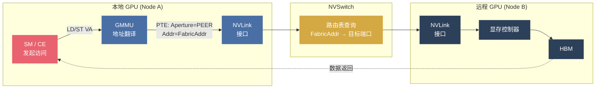
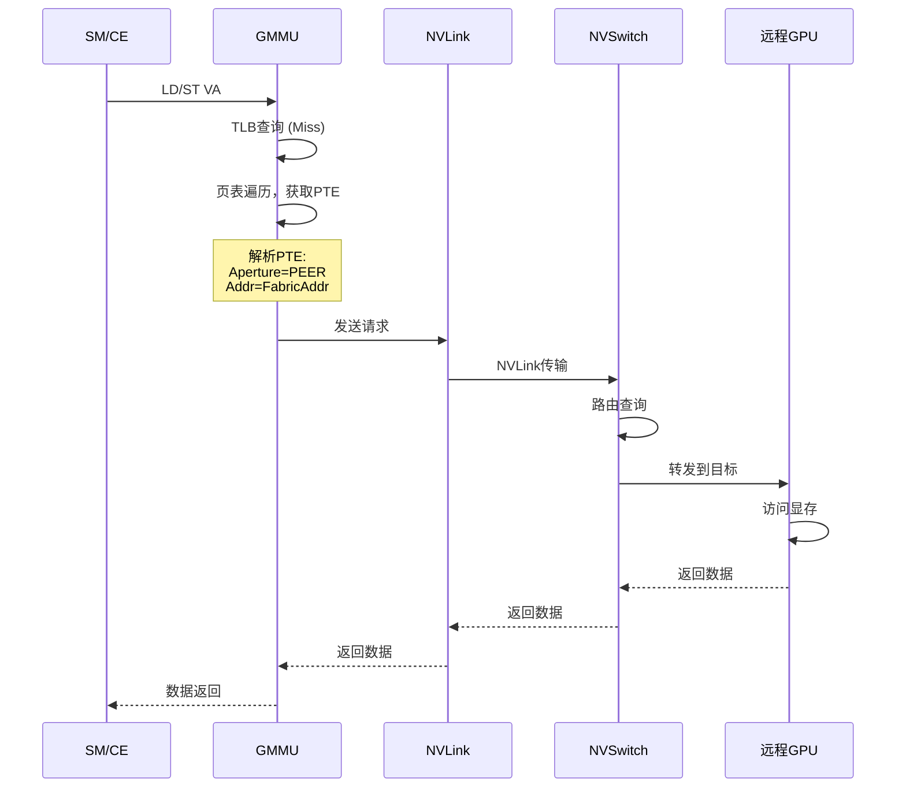
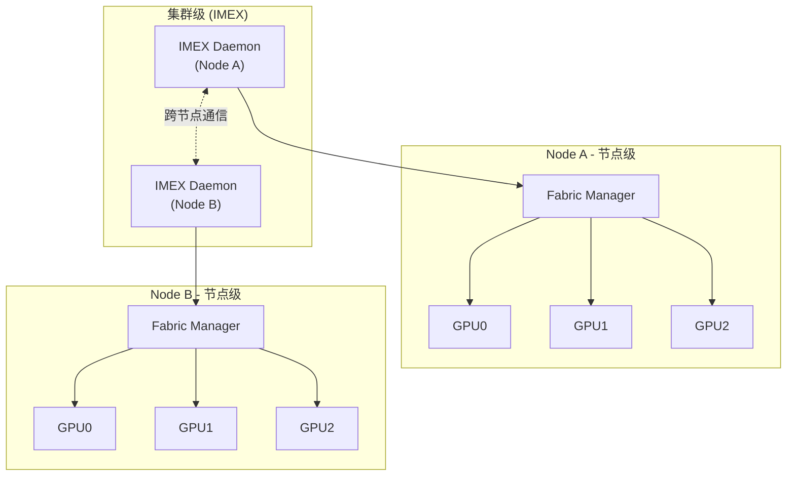
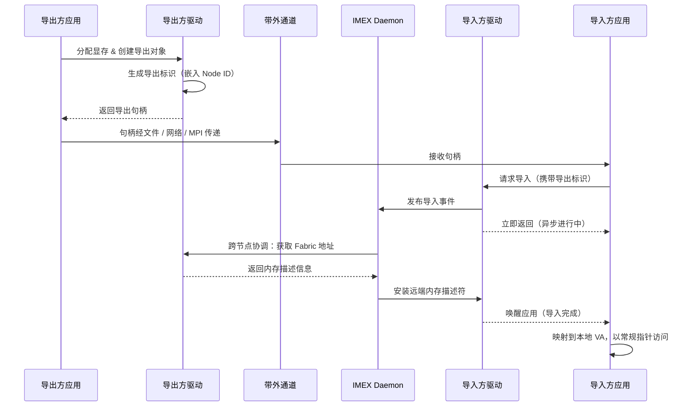

# 软件访存机制

语义一旦被定义下来，下一步的问题就不再是“该承诺什么”，而是“这些承诺究竟靠什么成立”。上一节把远端内存要成为稳定资源所需的几类基本义务已经摆清：操作语义要完整、保序不能失真、地址必须可翻译、协议必须能把这些承诺稳定送到远端。真正进入真实系统之后，这些抽象要求不会停留在一张语义清单上，而会被迫形成一组彼此耦合的工程对象。本节以 `NVIDIA` 的 `NVLink/NVSwitch Fabric` 为例，不是为了把某一家厂商写成标准答案，而是为了把抽象语义压到一套可运行的实现链路上，看清三个更具体的问题：

1. **寻址**——数百颗 GPU 的显存如何被编入一个全局地址空间，使任意一端发出的 Load/Store 都能被路由到正确的远端位置？
2. **通路**——一次跨节点访问请求从 SM 发出到数据返回，端到端经过哪些硬件环节，延迟预算怎么分配？
3. **协调**——节点之间如何发现彼此的显存资源、交换元数据、建立可被软件使用的共享映射？

以下各节依次沿着这三条线展开，最后再回到一个更大的问题：当远端资源真的开始“像本地资源一样被访问”时，系统究竟为这种透明性付出了什么代价，又为什么不得不把自己组织成今天这样的控制面、地址空间和协调机制。

## 寻址体系

在前一层语义讨论里，地址翻译只是“系统必须承担的一项义务”；一旦落到真实实现里，它很快就会变成整个机制链条的起点。在 `NVIDIA` 体系中，这一角色由 **GMMU（Graphics Memory Management Unit）** 承担——它的多级页表和 `PTE` 中的 `Aperture` 字段，决定了每一次访存请求被路由到本地显存、系统内存还是远端 `GPU`。也就是说，统一地址空间并不是一个抽象口号，而是从这里开始第一次被硬件认真地“写进系统”。

### Aperture 字段

GMMU 通过多级页表将虚拟地址翻译为物理地址。对跨节点访问而言，PTE 中最关键的字段是 **Aperture**——它决定了物理地址应该路由到哪个目标。**VIDEO** 指向本地显存（GPU 自身的 HBM），**PEER** 指向远程 GPU 显存（用于 P2P 和 NVSwitch 跨节点访问），**SYS_COH** 和 **SYS_NONCOH** 分别指向 CPU 主机内存的一致性和非一致性路径。

当 Aperture 选择远端访问路径时，GMMU 还需要借助对端标识确定目标 GPU。对于 NVSwitch 场景，物理地址字段中进一步编码了全局 Fabric 地址——这是从单机 P2P 扩展到跨节点访问的关键。不同物理内存类型（本地显存、系统内存、Fabric 单播/多播）与 Aperture 的完整对应关系见核心机制一"地址空间类型"一节。

### 从 P2P 到跨节点

单机 P2P 访问复用了 GMMU 的 Aperture 和对端标识机制，将访问路由到特定 NVLink 端口对应的 GPU。但 P2P 有两个本质局限：**Peer ID 仅 8 个槽位**（无法容纳数百 GPU），且**不含跨节点路由信息**。

跨节点访问的核心思路是在同一套 GMMU/PTE 机制上引入 **Fabric Base Address**：将全局路由信息编码到物理地址中，让 NVSwitch 硬件完成路由决策。

```
单机 P2P：  PTE[Aperture=PEER, PeerIndex=N]  →  NVLink 端口 N  →  GPU_N

跨节点：   PTE[Aperture=PEER, PhysAddr=FabricAddr]  →  NVSwitch 路由
                      │                                  │
          ┌───────────┴───────────┐          ┌─────────────────────┐
          │ FabricAddr 包含       │          │ NVSwitch 路由表：    │
          │  - 目标 GPU 的全局 ID  │          │  FabricBase → Port  │
          │  - 显存偏移            │         └─────────────────────┘
          └───────────────────────┘
```

这就是前文所说“统一地址空间”在 `NVIDIA` 中的具体实现路径。到了这一步可以看到，抽象语义一旦进入系统实现，问题就不再是“有没有地址空间”，而是这个地址空间是否同时承担了路由、隔离、规模扩展和协调入口几重职责。后面的几节会继续沿着这条线展开 `Fabric` 地址空间、协调机制和完整访问路径。


### 全局地址空间

从 P2P 到跨节点的关键跳跃，是引入 Fabric Base Address 将全局路由信息编码到物理地址中。DGX H100 的 8 GPU 共享约 640 GB HBM，NVL72 将其扩展到 72 GPU / ~13.5 TB——Fabric 地址空间必须在这个量级上保证唯一性和可路由性。
#### 构建原则

全局地址空间（Fabric Address Space）需要同时满足四个约束：任意 GPU 的任意显存位置都有全局唯一的地址；NVSwitch 可以从地址中直接提取路由信息而无需查表之外的额外协调；整个方案复用现有的 GMMU/PTE 机制，不需要硬件改动；并且支持节点动态加入或离开。

#### 地址编码与路由

为了承载这些约束，系统引入了几个核心对象。最关键的是 **Fabric Base Address**——由 Fabric Manager 为每个 GPU 分配的全局唯一基址，它把 GPU 在集群中的物理位置编码进了地址本身。**Node ID** 嵌入导出句柄，在跨节点共享时标识内存归属；**Cluster UUID** 用于集群身份识别和隔离；**Clique ID** 则标识一组可以直接 P2P 通信的 GPU，帮助系统区分"直连域"和需要额外路由的场景。

##### Fabric Base Address

**Fabric Base Address** 是跨节点访问的核心——每个 GPU 在加入 Fabric 网络时，由 Fabric Manager 分配一个全局唯一的基地址。其结构按 **高位 → 低位** 依次编码节点/机架信息（路由前缀）、GPU 编号（设备标识）和保留/对齐位。地址示例：`GPU_0@Node_0 = 0x0000_0000_0000_0000`，`GPU_1@Node_0 = 0x0000_0080_0000_0000`（+128 GB 偏移），`GPU_0@Node_1 = 0x0001_0000_0000_0000`（+节点偏移）——相邻 GPU 按 HBM 容量对齐，不同节点按更大的地址段隔离，使 NVSwitch 可以直接从地址高位提取路由前缀。

驱动侧根据连接类型获取 Fabric Base Address：NVLink 直连场景采用直连基址分配方式；NVSwitch 连接场景则采用全局唯一基址分配方式，对于 EGM 等扩展内存使用独立的地址空间。

##### 编码规则

全局 Fabric 地址的计算公式可以概括为：**Fabric Base Address + 本地显存偏移**。地址编码的本质，是将物理位置与路由前缀合并进同一个地址表达，使地址本身携带跨节点路由语义。

> **注意：避免二次编码（Double Encode）**
>
> Fabric 内存描述符的物理地址有时已经预编码了 Fabric Base Address。此时如果再次叠加基址，会破坏地址语义，因此驱动侧需要通过无效标记跳过重复编码。

##### 地址空间类型

驱动侧依据目标位置将地址空间分为四类：**本地显存**（GPU 自身的 HBM/GDDR，经 VIDEO Aperture 路由）、**系统内存**（CPU 主机内存，经 SYS 系列 Aperture 路由）、**Fabric 单播**（跨节点远程显存的点对点访问，经 PEER Aperture + Fabric 地址路由）、**Fabric 多播**（跨节点远程显存的多播访问，经 PEER Aperture + 多播地址路由）。驱动侧在配置 PTE 时根据这四类选择 Aperture：本地显存走本地路径，Fabric 内存走远端路径。

#### 初始化与连通域

地址编码方案定义了"一个地址应该长什么样"，但还没有回答一个前置问题：GPU 如何加入 Fabric 网络并获取自己的地址，以及系统如何识别哪些 GPU 处于同一连通域。

##### Fabric Probe

GPU 通过 **Fabric Probe** 机制加入 Fabric 网络。驱动软件启动后向 Fabric Manager 发起 Probe 请求；Fabric Manager 分配 Fabric Base Address、返回 Cluster UUID、Clique ID 和 Node ID；驱动侧保存这些配置信息后 Probe 完成。整个过程从"未开始"到"进行中"再到"已完成"，如果硬件本身不支持 Fabric 则会停在"不支持"状态。

##### Clique ID

**Clique ID** 标识了一组可以直接进行 P2P 通信的 GPU。在大规模系统中，并非所有 GPU 都能直接互联，Clique ID 帮助系统识别哪些 GPU 属于同一个"直连域"。同一 Clique 内的 GPU 可以通过 NVSwitch 直接通信；跨 Clique 的通信可能需要额外的路由跳数或不同的带宽配置。除连通域标识外，系统通常还会保留与带宽模式相关的附加属性，以便在拓扑变化时协助更新链路配置。


## 访问路径

寻址体系解决了“地址怎么构造”的问题。接下来进入动态视角：当一个 GPU SM 发出一条 Load 或 Store 指令、目标地址落在远端 GPU 的 Fabric 地址段时，请求如何一步步到达远端显存并把数据带回来？在 DGX H100 / NVL72 等系统中，NVLink 单跳延迟约 100ns，经 NVSwitch 的跨节点远端 Load 端到端延迟约 300-500ns。
### 访问路径总览



### PTE 与远程访问

从软件角度看，跨节点访问的关键在于**正确配置 PTE**。驱动软件需要做三件事：确定 Aperture 类型（本地显存走 VIDEO，Fabric 内存走 PEER）；将 Fabric Base 与本地偏移合并写入地址字段，使其携带全局路由语义；设置对端标识，告诉硬件请求应从哪个 NVLink 出口离开本地 GPU。

这里有一个关键洞察：无论是单机 P2P 还是跨节点 Fabric 访问，都走同一类 PEER Aperture——GMMU 硬件并不区分这两种场景，真正决定路由的是物理地址中携带的 Fabric 信息。这意味着跨节点扩展在 PTE 层面几乎是透明的，不需要新的硬件机制。

不同 Aperture 会驱动页表项选择不同的地址字段：系统内存走系统地址，本地显存走本地偏移，远端访问则使用携带 Fabric 语义的地址字段。在缓存策略上，本地访问可以使用更激进的缓存，但跨节点访问通常会关闭激进缓存以降低远端可见性被延迟的风险——TLB hit 时地址翻译本身仅增加数十纳秒，但 TLB miss 引发的页表遍历可能额外增加 200-400ns。映射建立时，系统也会配合执行必要的缓存无效化操作，确保访问尽量看到最新数据。

### 端到端访问时序




## 协调机制

寻址和通路解决了“如何访问”，但还有一个前提：**一个节点怎样知道另一个节点的显存存在，并获取其 Fabric 地址？** 这不是硬件能独立完成的——需要一个软件协调层在节点之间交换元数据。NVIDIA 的方案是两级架构：节点内由 Fabric Manager 管理拓扑和地址分配，跨节点由 IMEX Daemon 协调内存共享。
### 两级协调架构



#### Fabric Manager

**Fabric Manager** 是运行在每个节点上的用户态守护进程。它的核心职责是把本节点内的 GPU 组织成一个可被外部寻址的 Fabric 成员：首先检测节点内所有支持 Fabric 的 GPU，然后为每个 GPU 分配 Fabric Base Address，接着配置 NVSwitch 路由表使地址可达，最后维护整个初始化状态机（未初始化 → 注册中 → 配置完成）。驱动侧会检查 Fabric Manager 是否已注册、是否已完成初始化，并通过专门的管理会话与其交互，以确保节点内地址分配和路由配置已经就绪。

#### IMEX

**IMEX（Import/Export）** 负责跨节点内存共享。完整的端到端流程——从导出方分配显存到导入方完成映射——可以用一张图概括：



几个关键设计点：导出句柄中嵌入了 Node ID，因此导入方驱动可以立即判断目标是本地还是远端；导入操作是**异步**的——驱动先返回、IMEX 在后台协调、完成后通过事件唤醒应用。IMEX 的跨节点协调是控制平面操作，典型完成时间在毫秒量级（受节点间网络延迟和驱动调度影响），远慢于数据平面的亚微秒级远端访存——但由于只在映射建立阶段执行一次，后续所有数据访问都是零拷贝的硬件直通路径。映射完成后，访问方式与本地显存一致。软件接口按**运行时层 → 驱动接口层 → 资源管理层 → 对象层**逐层展开，从高层抽象到底层控制，复杂性逐层下沉。

### 设计权衡

跨节点协调机制的每一处设计都是多目标权衡的结果。

**地址分配**采用静态预分配，好处是 NVSwitch 路由表简单且确定——地址与 GPU 一一对应，路由决策可以在硬件中一步完成。代价是地址空间可能被浪费：一个 GPU 即使只使用了少量显存，其 Fabric 地址段仍被完整保留。动态分配虽然能提高利用率，但引入了跨节点一致性协议的复杂度，目前被认为得不偿失。

**一致性模型**选择最终一致而非强一致，因为跨节点的强一致协议（例如目录式 Snoop）在 μs 级延迟的互联上开销过大。最终一致性配合显式的 Fence/Quiet 同步原语——上一节估算 System Fence 全局排空代价约 1-10μs——已足以覆盖绝大多数 AI 训练中的通信模式。

**故障域**以节点为边界隔离——单节点故障不会传播到其他节点的 Fabric 配置。这使得系统在大规模部署中具备了基本的容错能力，代价是限制了全局共享的灵活性（例如跨节点的细粒度迁移在当前架构下难以实现）。**导入操作**采用异步模型，避免跨节点延迟阻塞应用关键路径，代价是编程模型略微复杂——应用需要处理完成事件而非等待同步返回。

整体来看，这些选择体现了**性能优先、故障隔离、渐进式复杂度**的倾向：在保证基本功能的前提下，尽可能减少跨节点操作的性能开销和故障传播范围。换句话说，这条机制链路想解决的从来不只是“访问能不能打通”，而是“当访问真的打通之后，系统还能不能把复杂度限制在一个可交付、可扩展的范围内”。

## 演进方向

尽管当前架构功能完备，但对实际使用者而言仍有明显摩擦。最直接的是**显式协调的侵入性**——导入/导出需要应用程序显式处理，对已有代码的迁移成本不低；导出句柄还需要带外通道（文件、网络或 MPI）传递，增加了部署复杂度。在**共享粒度**上，当前以 Allocation 为单位而非页级，灵活性受限；映射建立后也难以动态调整，无法适应负载变化。**故障恢复**是另一个短板：节点故障会导致所有相关映射失效，目前缺乏自动恢复机制。

针对这些局限，跨节点内存访问技术正在沿几条轴线演进。**访问模式**从显式导入导出向半透明、乃至全透明 UVM 推进——核心挑战是跨节点一致性协议的复杂度与性能开销之间的平衡。**共享粒度**正在从 Allocation 级向页级共享和细粒度按需迁移发展，但更细的粒度意味着更大的元数据开销和 TLB 压力。**数据放置**有望从静态映射转向动态迁移甚至自适应放置，前提是系统能以足够低的代价预测访问模式。**容错**方面，理想状态是节点故障后自动恢复映射关系，但跨节点状态一致性的维护和恢复延迟仍是开放问题。

值得注意的是，NVIDIA 的实现路径并非唯一答案。AMD 在互联硬件上采用 XGMI + Infinity Fabric 集成式方案，协调层面依赖 PSP 固件在启动阶段按节点分段完成静态地址分配（而非用户态守护进程），编程模型上提供同一 Hive 内隐式 SVM 透明访问（而非显式 Export-Import）。两种方案都把全局路由信息编码到地址中、让硬件完成路由决策，但 NVIDIA 更强调显式控制与超大规模可观测性，AMD 更强调透明访问体验与较低的部署复杂度——这不是"谁更先进"的问题，而是在可扩展性、显式性与部署复杂度之间选择了不同的工程解。

## 小结

回过头看，`NVIDIA` 的跨节点显存访问并没有发明一套全新抽象，而是把前文定义的语义承诺拆解为一组可组合的工程模块：`GMMU` 多级页表加 `Aperture/PeerIndex` 承接地址翻译，`Fabric Base Address` 加 `NVSwitch` 路由表构建统一地址空间，`Fabric Manager` 和 `IMEX Daemon` 分别处理节点内与跨节点协调，最终以 `Export / Import / Map` 三步式接口暴露给应用。贯穿这条路径的设计哲学是**机制复用、协调分离、显式优先**——跨节点扩展在 `PTE` 层面几乎透明，协调层职责正交，共享模型语义清晰但对应用有一定侵入性。

代价同样明确。访问越透明，控制面就越复杂：全局地址空间、节点级/跨节点协调、导入导出句柄和异步事件机制——这些都是为了让远端显存“看起来像本地资源”而必须承受的系统开销。到了这里，工程约束也就真正浮出来了：如果没有这些对象，透明性就站不住；如果这些对象组织得不好，透明性本身又会反过来拖垮系统。为了在大规模部署中保持可控，当前架构接受了静态地址分配、节点级故障域隔离和显式协调的约束。`AMD XGMI` 的对比也印证了同一个判断：不同厂商在显式性与透明性之间会做出截然不同的取舍，这不是“谁更先进”的问题，而是可扩展性、可观测性和部署复杂度之间的工程权衡。

更长期地看，统一内存语义的意义不只是提升单次访问效率，更在于为软件生态提供一个可复用、可迁移、可持续演进的共同承载面。底层语义一旦稳定，上层运行时和框架就能沉淀出可移植的软件资产；反过来，如果语义长期摇摆或过于碎片化，每一代硬件迭代都会迫使生态重新支付适配成本。

但到目前为止，讨论仍然停留在机制层：系统知道怎样让远端资源“可被正确访问”，还不等于知道这些资源“应该被怎样使用”。真正进入更大规模、更长运行时间和更多层级的异构存储之后，问题会从“机制是否成立”继续抬升为“这些机制如何被调度成收益”。下一节将把视角从访存机制拉升到调度策略——在多层级异构存储之间，如何把统一寻址能力转化为实际的 `Goodput` 提升。
