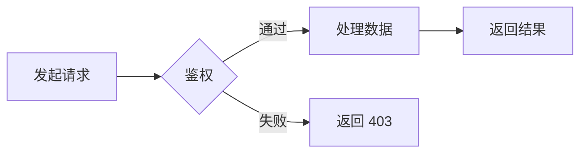

# 如何参与

欢迎参与 **SuperPod 技术白皮书** 的编写与校对。本指南旨在规范文档格式，确保排版风格一致。

如果你更关心参与的背景、意义与边界，请先阅读[为何参与](contributing/industry-participation.md)。

## 项目结构

```bash
.
├── mkdocs.yml          # 站点配置文件
├── requirements.txt    # Python 依赖
├── src/                # 文档源文件
│   ├── assets/         # 静态资源（图片、CSS、JS）
│   ├── 01-architecture/
│   ├── ...
│   └── index.md        # 首页
└── overrides/          # 主题覆盖模板
```

## 常用排版语法

### 标题层级

请严格使用 `#` 表示标题。

**源码：**

````markdown
# 一级标题（通常作为页面 Title）
## 二级标题（章节）
### 三级标题（小节）
#### 四级标题
````

**渲染结果：**

> （由于在文档中实际渲染大标题会破坏目录结构，此处仅作源码展示。请确保层级嵌套正确。）

### 文本样式

**源码：**

````markdown
- **加粗**：Bold
- *斜体*：Italic
- ~~删除线~~：Strike
- `行内代码`：Inline Code
- ==高亮文本==：Highlight
- ^上标^：m^2^
- ~下标~：H~2~O
````

**渲染结果：**

- **加粗**：Bold
- *斜体*：Italic
- ~~删除线~~：Strike
- `行内代码`：Inline Code
- ==高亮文本==：Highlight
- ^上标^：m^2^
- ~下标~：H~2~O

### 列表

**源码：**

````markdown
1. 有序列表项 1
2. 有序列表项 2
    - 无序子列表 A
    - 无序子列表 B
````

**渲染结果：**

1. 有序列表项 1
2. 有序列表项 2
    - 无序子列表 A
    - 无序子列表 B

### 引用与提示块 (Admonitions)

提示块是 Material 主题的特色功能，用于强调内容。

**源码：**

````markdown
> 普通引用块

!!! note "说明"
    这是一个 **Note** 类型提示块，用于补充说明。

!!! tip "技巧"
    这是一个 **Tip** 类型提示块，用于分享最佳实践。

!!! warning "警告"
    这是一个 **Warning** 类型提示块，用于警示风险。
````

**渲染结果：**

> 普通引用块

!!! note "说明"
    这是一个 **Note** 类型提示块，用于补充说明。

!!! tip "技巧"
    这是一个 **Tip** 类型提示块，用于分享最佳实践。

!!! warning "警告"
    这是一个 **Warning** 类型提示块，用于警示风险。

### 脚注 (Footnotes)

脚注用于添加补充说明或引用来源。定义可以放在文档的任意位置，通常建议放在文末。

**源码：**

````markdown
正文中引用脚注[^demo1]。也可以引用另一个[^demo2]。

...（文档的其他内容）...

<!-- 通常放在文档末尾 -->
[^demo1]: 这是第一个脚注的详细内容。
[^demo2]: 这是第二个脚注，支持 **Markdown** 格式。
````

**渲染结果：**

正文中引用脚注[^demo1]。也可以引用另一个[^demo2]。

> （请滚动到本页面最底部查看实际生成的脚注内容与跳转效果）

[^demo1]: 这是第一个脚注的详细内容。
[^demo2]: 这是第二个脚注，支持 **Markdown** 格式。


## 代码块

请务必指定语言以启用语法高亮。

**源码：**

````markdown
```python title="example.py" hl_lines="2"
def hello():
    print("Hello, SuperPod!") #这一行被高亮
```
````

**渲染结果：**

```python title="example.py" hl_lines="2"
def hello():
    print("Hello, SuperPod!") #这一行被高亮
```

## 图表绘制

### Mermaid 流程图

使用 `mermaid` 代码块绘制流程图、时序图等。并使用 `/// caption` 添加题注。

**源码：**

````markdown

/// caption
图 1：Mermaid 流程图示例
///
````

**渲染结果：**


/// caption
图 1：Mermaid 流程图示例
///

### Vega-Lite 数据可视化

本项目支持嵌入 Vega-Lite JSON 规范来渲染交互式图表。

**源码：**

````markdown
```_vegalite_//此处需要删除前缀与后缀下划线
{
  "$schema": "https://vega.github.io/schema/vega-lite/v5.json",
  "description": "A simple bar chart with embedded data.",
  "width": "container",
  "height": 200,
  "data": {
    "values": [
      {"a": "A", "b": 28}, {"a": "B", "b": 55}, {"a": "C", "b": 43},
      {"a": "D", "b": 91}, {"a": "E", "b": 81}, {"a": "F", "b": 53},
      {"a": "G", "b": 19}, {"a": "H", "b": 87}, {"a": "I", "b": 52}
    ]
  },
  "mark": "bar",
  "encoding": {
    "x": {"field": "a", "type": "nominal", "axis": {"labelAngle": 0}},
    "y": {"field": "b", "type": "quantitative"}
  }
}
```
/// caption
图 2：Vega-Lite 柱状图示例
///
````

**渲染结果：**

```vegalite
{
  "$schema": "https://vega.github.io/schema/vega-lite/v5.json",
  "description": "A simple bar chart with embedded data.",
  "width": "container",
  "height": 200,
  "data": {
    "values": [
      {"a": "A", "b": 28}, {"a": "B", "b": 55}, {"a": "C", "b": 43},
      {"a": "D", "b": 91}, {"a": "E", "b": 81}, {"a": "F", "b": 53},
      {"a": "G", "b": 19}, {"a": "H", "b": 87}, {"a": "I", "b": 52}
    ]
  },
  "mark": "bar",
  "encoding": {
    "x": {"field": "a", "type": "nominal", "axis": {"labelAngle": 0}},
    "y": {"field": "b", "type": "quantitative"}
  }
}
```
/// caption
图 2：Vega-Lite 柱状图示例
///

## 图片与附件

**源码：**

````markdown

/// caption
图 3：图片题注示例
///
````
